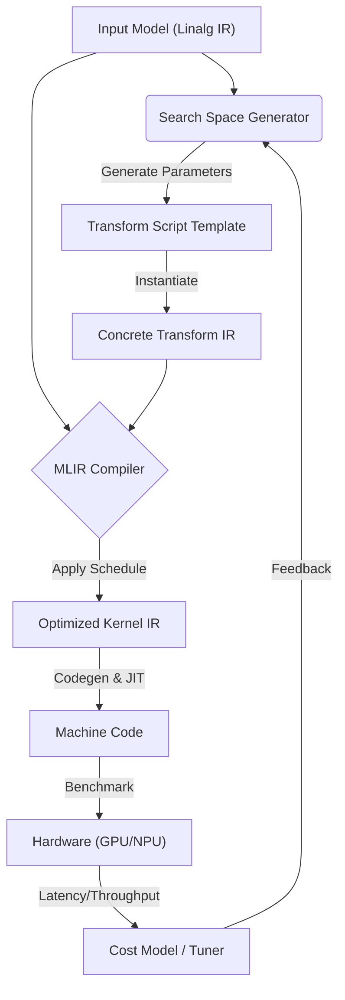

> **扩展阅读**：本指南是对《AI 编译器融合技术系统化分类》第 8.3 节“自动调优与调度分离”的深度展开。

## 1. 核心理念：调度与计算分离

在传统 AI 编译器（如 TVM v1）中，调度逻辑往往硬编码在 C++ 代码中。而在 MLIR 生态中，**Transform Dialect** 的引入实现了一个革命性的转变：**将调度逻辑（Schedule）变成了一段可编译、可修改的 IR 脚本。**

自动调优的本质，就是**搜索最优的 Transform IR 脚本参数**。

*   **Compute IR (Linalg)**: 描述“算什么” (e.g., `matmul(A, B) -> C`)。
*   **Schedule IR (Transform)**: 描述“怎么算” (e.g., `tile(32, 32)`, `vectorize`, `bufferize`)。
*   **Auto-tuner**: 一个外部驱动程序（通常是 Python），负责生成无数个 Schedule IR 变体，并在硬件上测量性能。

---

## 2. 系统架构设计

一个成熟的 MLIR 自动调优系统通常包含以下闭环：



---

## 3. 搜索空间定义 (Search Space)

搜索空间是调优的核心。针对不同硬件，我们需要调优的参数截然不同。

### 3.1 通用参数
*   **Fusion Strategy**: 是否融合某个 Element-wise 算子？
*   **Vector Size**: 向量化长度 (128, 256, 512 bit)。

### 3.2 GPU 专用搜索空间 (NVIDIA)
GPU 的核心在于**并行度映射**和**存储层级**。

| 参数名 | 说明 | 典型取值范围 |
| :--- | :--- | :--- |
| **Tile Size (Grid)** | 映射到 Block 的分块大小 | `{32, 64, 128, 256}` |
| **Tile Size (Thread)** | 映射到 Warp/Thread 的分块大小 | `{4, 8, 16, 32}` |
| **Unroll Factor** | 循环展开因子 | `{1, 2, 4, 8}` |
| **Num Stages** | 软件流水线级数 (Shared Memory Pipeline) | `{2, 3, 4, 5}` |
| **Mapping Strategy** | 线程映射方式 (Warp, Linear, Blocked) | `Enum` |

### 3.3 NPU 专用搜索空间 (Ascend)
NPU 的核心在于 **Unified Buffer (UB) 利用率**和**分形格式对齐**。

| 参数名 | 说明 | 典型取值范围 |
| :--- | :--- | :--- |
| **Block Tile Size** | L1/L0 分块，必须对齐到 16x16 (Fractal) | `{32, 64, 128, 256} % 16 == 0` |
| **UB Tile Size** | 切分到 UB 的大小，**受限于 UB 容量** | `< 256KB` (需计算 Live Size) |
| **Double Buffer** | 是否开启双缓冲 (Ping-Pong) | `Bool` (开启则 UB 空间减半) |
| **Core Mapping** | 多核 (AICORE) 映射策略 | `Block Distribution` |

---

## 4. 实战：构建 MLIR Transform 模板

我们不直接编写 Transform IR，而是编写**带有占位符的模板**。

### 场景：矩阵乘法 (MatMul) 调优

#### 4.1 模板定义 (MLIR + Python String Interpolation)

```python
# 这是一个 Python 字符串模板，用于生成 Transform IR
transform_template = """
transform.sequence failures(propagate) {
^bb1(%arg1: !transform.any_op):
  // 1. 匹配目标算子
  %matmul = transform.structured.match ops{["linalg.matmul"]} in %arg1

  // 2. 第一级分块 (Block/Core Level) -> 占位符 ${TILE_L1_M}, ${TILE_L1_N}
  %tiled_l1, %loops_l1:3 = transform.structured.tile %matmul 
                           [${TILE_L1_M}, ${TILE_L1_N}, ${TILE_L1_K}]

  // 3. 将外层循环映射到硬件并行
  // GPU -> BlockIdx, NPU -> AICore Cluster
  transform.structured.map_to_processors %loops_l1 [...]

  // 4. 第二级分块 (Register/UB Level) -> 占位符 ${TILE_L2_M}, ...
  %tiled_l2, %loops_l2:3 = transform.structured.tile %tiled_l1 
                           [${TILE_L2_M}, ${TILE_L2_N}, ${TILE_L2_K}]

  // 5. 硬件特定的后处理 (Padding/Vectorize/Bufferize)
  ${HARDWARE_SPECIFIC_Strategy}
}
"""
```

#### 4.2 针对 GPU 的实例化策略

对于 NVIDIA GPU，我们需要填充 pipeline 和 async copy 策略。

```python
gpu_strategy = """
  // 映射到 Thread
  transform.structured.map_to_processors %loops_l2 {processors = ["thread_x", "thread_y"]}
  
  // 启用 Async Copy (Global -> Shared)
  transform.structured.fuse_into_containing_op %tiled_l2
  
  // 软件流水线 (Software Pipelining)
  // num_stages 是关键调优参数
  transform.structured.pipeline_shared_memory_copies %loops_l1 
      depth(${NUM_STAGES})
"""
```

#### 4.3 针对 Ascend NPU 的实例化策略

对于 Ascend NPU，重点在于 bufferization 和 UB 管理。

```python
npu_strategy = """
  // 显式内存提升到 UB (Unified Buffer)
  // 这里不映射到 Thread，而是映射到 Vector Unit 的循环
  transform.structured.pad %tiled_l2 ...
  
  // 关键：针对 UB 大小进行 Bufferize，如果启用双缓冲，内存空间减半
  transform.bufferization.one_shot_bufferize layout("fractal")
  
  // 插入 NPU 特有的 DMA 指令 (DataCopy)
  transform.ascend.emit_dma_copy ...
"""
```

---

## 5. 自动调优循环实现 (The Tuning Loop)

这一部分通常由 Python 编写，利用 `iree-compiler` 或 `mlir-opt` 的 Python Bindings。

### 5.1 生成候选集 (Generator)

```python
import itertools

def generate_candidates(target="gpu"):
    candidates = []
    
    # 定义搜索网格
    if target == "gpu":
        tile_sizes = [64, 128, 256]
        stages = [2, 3, 4]
        unroll = [4, 8]
        
        for t, s, u in itertools.product(tile_sizes, stages, unroll):
            # 剪枝：如果 Tile 太大导致 Shared Memory 溢出，直接跳过
            if t * t * 4 > 48 * 1024: continue 
            candidates.append({"TILE_L1_M": t, "NUM_STAGES": s, ...})
            
    elif target == "npu":
        # NPU 必须对齐 16 (Fractal format requirements)
        ub_tiles = [32, 64, 128] # KB
        
        for ub in ub_tiles:
            # 剪枝：检查 UB 容量 (假设 UB=256KB)
            if ub * 1024 > 256000: continue
            candidates.append({"TILE_L2_M": ub, ...})
            
    return candidates
```

### 5.2 编译与评估 (Runner)

```python
def benchmark(ir_module, transform_script):
    # 1. 组合 IR
    full_ir = ir_module + transform_script
    
    # 2. 编译 (Lowering)
    # 调用 mlir-opt 执行 transform dialect 解释器
    try:
        binary = compile_to_binary(full_ir)
    except CompilationError:
        return float('inf') # 编译失败（如资源溢出），代价无穷大

    # 3. 运行 (Execution)
    # 在真实硬件上跑 100 次取平均耗时
    latency = run_on_device(binary, warmup=10, steps=100)
    return latency
```

---

## 6. 高级优化：基于机器学习的代价模型

全空间搜索（Exhaustive Search）太慢了。为了加速，我们可以引入 **Learned Cost Model**。

### 6.1 数据集构建
*   **Feature**: 提取 IR 特征（FLOPs, I/O 字节, Tile Size, Loop Depth）。
*   **Label**: 实际运行的 Latency。

### 6.2 训练与预测
使用 XGBoost 或 LightGBM：

```python
# 训练阶段
model.fit(X=ir_features + tuning_params, y=latency)

# 调优阶段
# 不再运行 run_on_device，而是直接预测
predicted_latency = model.predict(candidate_params)
# 仅对预测性能最好的 Top-10 候选者进行真实硬件验证
top_candidates = sort(candidates, key=predicted_latency)[:10]
```

---

## 总结：GPU vs NPU 调优关注点对照表

| 关注维度 | **GPU (NVIDIA)** | **Ascend NPU (Huawei)** |
| :--- | :--- | :--- |
| **并行粒度** | Thread Block & Warp | Cube Core & Vector Core |
| **关键内存** | Shared Memory (用户可控) | Unified Buffer (UB) (极度受限) |
| **数据布局** | Row/Col Major (Coalesced Access) | Fractal Format (ZnZ, NC1HWC0) |
| **流水线** | Async Copy (Cp.Async) | Double Buffering (Ping-Pong) |
| **失败主因** | Register Spilling (寄存器溢出) | UB Overflow (UB 空间不足) |

通过 MLIR 的 **Transform Dialect**，我们能够用一套统一的基础设施（Infrastructure），仅仅通过更换生成的**变换脚本（Script）**，就能够同时适配和优化 GPU 与 NPU，这正是编译器技术发展的最新前沿。
