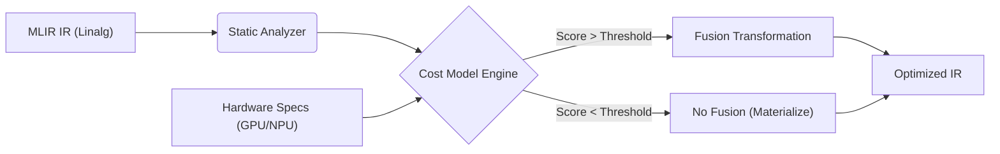

## 1. 背景与动机

在 AI 编译器中，**算子融合（Operator Fusion）** 是提升性能的关键手段，旨在通过将多个算子合并为一个内核（Kernel）来减少全局内存（HBM/DDR）的读写次数。

然而，融合并非总是正收益的。盲目融合可能导致严重的副作用：

*   **GPU 端**：导致**寄存器溢出（Register Spilling）**，活跃变量过多迫使数据溢出到 Local Memory，导致性能雪崩。
*   **Ascend NPU 端**：导致**统一缓冲区（Unified Buffer, UB）溢出**，或者引入昂贵的**格式转换（Format Cast）**开销。

因此，现代编译器（如 IREE, XLA, Torch-MLIR）摒弃了传统的贪心规则，转而采用**代价模型（Cost Model）**来定量评估融合的收益与风险，从而做出全局最优决策。

---

## 2. 决策系统架构

基于 MLIR 的代价模型决策流包含三个核心组件：**静态分析器**、**硬件感知代价函数**和**变换执行引擎**。



### 特征提取 (Feature Extraction)

我们首先编写一个 Analysis Pass，从 `linalg.generic` 层面提取算子的关键特征：

```cpp
struct OpStats {
  int64_t compute_ops;      // FLOPs
  int64_t read_bytes;       // 输入数据量
  int64_t write_bytes;      // 输出数据量
  int64_t live_tensor_size; // 活跃 Tensor 大小 (用于 NPU UB 计算)
  bool has_complex_access;  // 是否包含 Transpose/Gather (破坏合并访问)
  TargetType target;        // 目标硬件: GPU, Ascend, CPU
};
```

---

## 3. 硬件差异化代价模型 (The Math)

代价模型的核心在于针对不同硬件架构定义不同的**判决公式**。

### 3.1 GPU 专用模型：以寄存器压力为核心

GPU 的瓶颈通常在于**寄存器堆（Register File）**的容量。如果融合后的 Kernel 需要的寄存器超过硬件限制（如 NVIDIA A100 每个线程最多 255 个，但为了保持 Occupancy 通常限制在 64-128 个），性能会急剧下降。

**判决逻辑**：

$$
\text{Cost}_{gpu} = \alpha \cdot \text{RegPressure} + \beta \cdot \text{CoalescingPenalty} - \gamma \cdot \text{BandwidthSaved}
$$

*   **RegPressure**: 估算输入、输出及中间变量的活跃数量。
*   **CoalescingPenalty**: 如果融合引入了非连续内存访问（如 Transpose），给予高惩罚。

### 3.2 Ascend NPU 专用模型：以 UB 容量与格式为核心

简单介绍下NPU AICORE架构模型：

> 1.  **存储层级 (Memory Hierarchy)**：
>     *   **Global Memory (DDR/HBM)**：极大，极慢。
>     *   **Unified Buffer (UB)**：片上高速缓存（类似 GPU Shared Memory），但**容量严格受限**（通常在 256KB 左右，视具体芯片代际而定）。这是 Vector Unit 的主战场。
>     *   **L1/L0 Buffer**：Cube Unit (矩阵运算) 的专用缓存。
> 2.  **计算单元分离 (Compute Separation)**：
>     *   **Cube Unit**：负责矩阵乘（GEMM）、卷积。要求输入/输出为特定的**分形格式 (Fractal Format, e.g., 5D ZnZ)**。
>     *   **Vector Unit**：负责 Element-wise（Add, ReLU）、Reduction。通常处理连续或特定对齐的数据。

AICORE 的架构特点是显式管理的存储层级（Global -> L1 -> UB）。融合的硬约束是 **Unified Buffer (UB)** 的容量（通常约 256KB）。此外，**Cube（矩阵）**与 **Vector（向量）**单元的数据格式不兼容也是关键考量。

**判决逻辑**：
$$
\text{Constraint}_{npu} : \text{Size}_{live} \times \text{DoubleBufferFactor} \le \text{UB\_Capacity}
$$

$$
\text{Cost}_{npu} = \text{FormatCastOverhead} - \text{DMASaved}
$$

*   **UB Constraint**: 必须保证融合后的所有中间数据能塞进 UB。如果开启双缓冲（Ping-Pong），需求翻倍。
*   **FormatCast**: 如果 Cube 算子（分形格式 `ZnZ`）与 Vector 算子（线性格式 `NCHW`）融合，且 Vector 算子不支持分形格式（如 LayerNorm Reduce），则需要插入昂贵的 `TransData`，这通常是负收益。

---

## 4. 融合决策算法实现

以下是一个简化的 C++ 伪代码，展示了如何根据 Target 分发决策逻辑。

```cpp
enum FusionDecision { FUSE, NO_FUSE };

FusionDecision shouldFuse(OpStats producer, OpStats consumer, HardwareSpecs hw) {
  
  // === 公共收益计算 ===
  // 融合收益：省去了 Producer 写回和 Consumer 读取的带宽
  double memory_saved = producer.write_bytes + consumer.read_bytes_from_producer;
  
  // === 分支 1: NVIDIA GPU 策略 ===
  if (hw.type == GPU) {
    // 1. 寄存器压力检查
    int est_regs = (producer.inputs.size() + consumer.outputs.size()) * 4; // 简化估算
    if (est_regs > hw.gpu_max_registers_per_thread) return NO_FUSE;

    // 2. 访存模式检查
    // 如果 Consumer 包含 Transpose，会导致非合并访问 (Uncoalesced Access)
    if (consumer.has_complex_access) return NO_FUSE;
    
    return FUSE;
  }

  // === 分支 2: Ascend NPU 策略 ===
  else if (hw.type == ASCEND) {
    // 1. UB 容量硬约束
    int64_t tile_size = estimateOptimalTileSize(producer);
    int64_t ub_usage = (producer.outputs + consumer.temps) * tile_size;
    
    // 考虑到双缓冲 (Double Buffering)，UB 空间减半
    if (ub_usage * 2 > hw.npu_ub_capacity) return NO_FUSE;

    // 2. 格式兼容性检查 (Cube-Vector Fusion)
    if (producer.is_cube_op && consumer.is_vector_op) {
      // 只有 Element-wise (如 ReLU) 可以无痛处理分形格式
      // 复杂的 Reduce/Reshape 需要 TransData，拒绝融合
      if (!isElementWise(consumer)) return NO_FUSE;
    }
    
    return FUSE;
  }

  return FUSE; // 默认策略
}
```

---

## 5. 在 MLIR Transform Dialect 中集成

在 MLIR 的现代化流程中，我们不再硬编码上述 C++ 逻辑，而是将其封装为 **Transform Dialect** 的扩展操作。这允许我们在不重新编译编译器的情况下调整策略。

**定义自定义 Transform Op：**
`transform.cost_model.check_fusion`

**Transform IR 脚本示例：**

```cpp
transform.sequence failures(propagate) {
^bb1(%root: !transform.any_op):
  
  // 1. 匹配所有 MatMul 算子作为生产者
  %producers = transform.structured.match ops{["linalg.matmul"]} in %root
  
  // 2. 遍历并决策
  transform.foreach %producers : !transform.any_op {
    ^bb2(%producer: !transform.any_op):
      
      // 3. 调用针对特定硬件的代价模型
      // 参数：UB 限制 240KB, GPU 寄存器限制 128
      %candidates = transform.cost_model.filter_fusable_consumers %producer
                    { 
                      target = "ascend_910b",
                      ub_limit_bytes = 245760,
                      reg_limit = 128 
                    }
      
      // 4. 对通过 Cost Model 筛选的消费者执行融合
      transform.structured.fuse_into_containing_op %candidates ...
  }
}
```

---

## 6. 典型案例分析 (Case Studies)

### 案例 A: MatMul + Transpose (GPU)

*   **场景**：矩阵乘后立即转置。
*   **分析**：
    *   MatMul 产生结果通常在寄存器中。
    *   Transpose 要求改变写入 Global Memory 的地址模式（Row -> Col）。
    *   这会导致 **非合并内存访问 (Uncoalesced Memory Access)**，带宽利用率可能降至 1/10。
*   **Cost Model 决策**：**拒绝融合**。让 MatMul 先高效写回，再启动一个专门优化过的 Transpose Kernel。

### 案例 B: Conv2D + LayerNorm (Ascend NPU)

*   **场景**：卷积（Cube）后接 LayerNorm（Vector Reduce）。
*   **分析**：
    *   Conv2D 输出为 5D 分形格式 (`NC1HWC0`)，存储在 L0/UB。
    *   LayerNorm 需要对 Channel 维度做 Reduce。
    *   在分形格式上做 Reduce极其复杂且低效，必须先执行 `TransData` 转回线性格式。
*   **Cost Model 决策**：**拒绝融合**。除非 Vector 单元有特殊的硬件指令支持分形 Reduce。

### 案例 C: Add + Mul + ReLU (Ascend NPU)

*   **场景**：纯向量运算链。
*   **分析**：
    *   所有数据均在 UB 中流转。
    *   无格式转换，无核间同步。
*   **Cost Model 决策**：**激进融合**。只要 UB 不溢出，尽可能多地融合算子，减少 DMA 搬运。

---

## 7. 总结

实现代价模型驱动的融合，本质上是将**体系结构知识**编码到编译器的**决策函数**中。

| 维度           | **NVIDIA GPU**               | **Ascend NPU**                |
| :------------- | :--------------------------- | :---------------------------- |
| **首要瓶颈**   | Register File (寄存器堆)     | Unified Buffer (UB)           |
| **次要瓶颈**   | Shared Memory / Warps        | Cube/Vector 格式转换          |
| **负收益来源** | Spilling / Memory Divergence | UB Overflow / Synchronization |
| **融合策略**   | 重视合并访问，控制活跃变量   | 重视 UB 驻留，避免格式 Cast   |

通过 MLIR 的基础设施，我们可以构建一套统一的框架，仅需替换底层的 Cost Function 插件，即可适配多种 AI 芯片架构。
