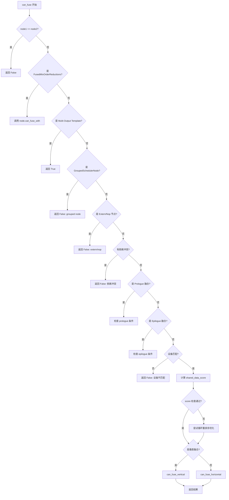
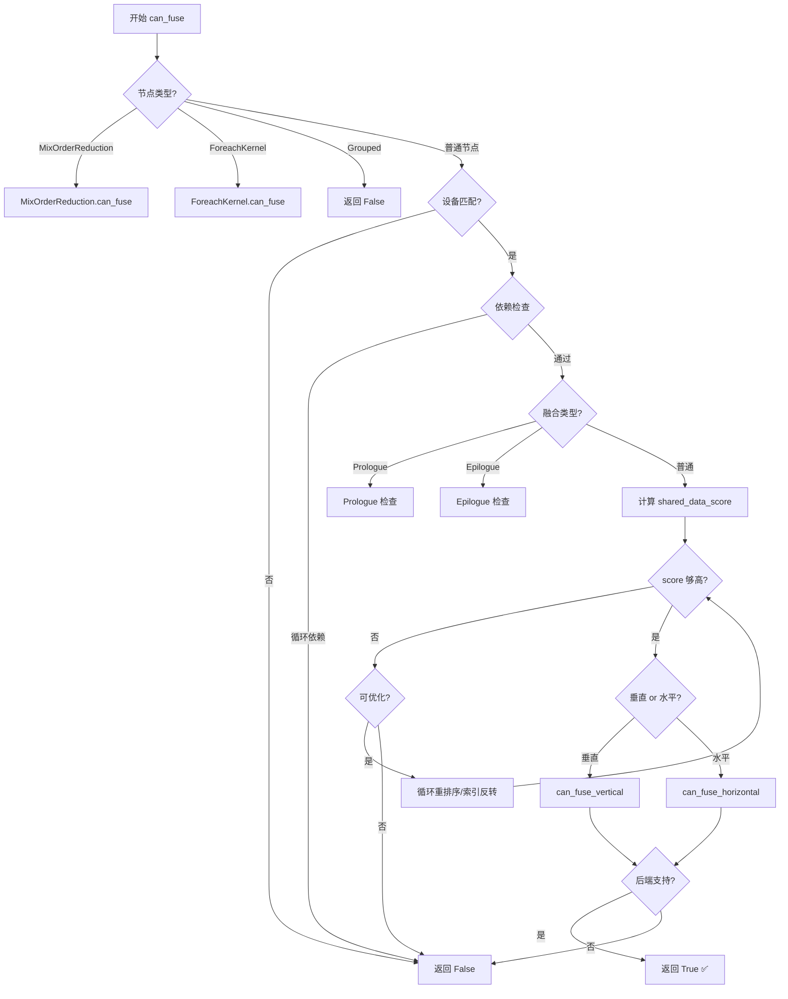

> 本文深入剖析 PyTorch Inductor 编译器中算子融合（Operator Fusion）的核心决策流程 `can_fuse`，详细解析融合条件检查、特殊融合类型、优化策略等关键实现。

---

## 目录

1. [流程概述](#流程概述)
2. [融合决策架构](#融合决策架构)
3. [主入口：Scheduler.can_fuse](#主入口schedulercan_fuse)
4. [垂直融合检查](#垂直融合检查)
5. [水平融合检查](#水平融合检查)
6. [特殊融合类型](#特殊融合类型)
7. [辅助函数详解](#辅助函数详解)
8. [实际案例分析](#实际案例分析)
9. [性能优化技巧](#性能优化技巧)
10. [总结与最佳实践](#总结与最佳实践)

---

## 流程概述

### 什么是 can_fuse

`can_fuse` 是 PyTorch Inductor 调度器中的核心决策函数，负责判断两个计算节点是否可以融合为单一内核。融合的目标是：

- ✅ **减少内核启动开销**：减少 GPU kernel 启动次数
- ✅ **降低内存访问**：避免中间结果写回全局内存
- ✅ **提高缓存利用率**：增加数据重用
- ✅ **改善并行度**：更好地利用硬件资源

### 融合决策的三个层次

```
┌─────────────────────────────────────────┐
│  Level 1: 节点类型特定检查               │
│  - MixOrderReduction.can_fuse           │
│  - ForeachKernelSchedulerNode.can_fuse  │
│  - GroupedSchedulerNode.can_fuse        │
└─────────────────────────────────────────┘
              ↓
┌─────────────────────────────────────────┐
│  Level 2: 通用调度器检查                 │
│  - Scheduler.can_fuse (主入口)          │
│  - 设备匹配、依赖检查、模板融合等        │
└─────────────────────────────────────────┘
              ↓
┌─────────────────────────────────────────┐
│  Level 3: 后端特定检查                   │
│  - BaseScheduling.can_fuse_vertical     │
│  - BaseScheduling.can_fuse_horizontal   │
│  - TritonScheduling 实现                │
└─────────────────────────────────────────┘
```

### 整体调用链路

```python
# 最外层：融合迭代循环
fuse_nodes()
  └─> fuse_nodes_once()  # 单轮融合
      └─> get_possible_fusions()  # 生成候选
          └─> can_fuse()  # 检查是否可融合
              ├─> can_fuse_vertical()  # 垂直融合检查
              └─> can_fuse_horizontal()  # 水平融合检查
```

---

## 融合决策架构

### 核心数据结构

#### WhyNoFuse（调试辅助类）

```python
class WhyNoFuse:
    """记录无法融合的原因，用于调试和日志"""
    name1: str  # 节点1名称
    name2: str  # 节点2名称
    reason: str  # 无法融合的原因
    args: tuple[Any, ...]  # 格式化参数

    def __call__(self, reason: str, *args: Any) -> None:
        """记录失败原因并输出到日志"""
        self.reason = reason
        self.args = args
        fusion_log.debug(self)

    def __str__(self) -> str:
        return f"cannot fuse {self.name1} with {self.name2}: " + (
            self.reason % self.args
        )
```

**使用示例**：
```python
why = WhyNoFuse(node1, node2)
if device1 != device2:
    why("device mismatch (%s vs %s)", device1, device2)
    return False
```

#### 融合类型枚举

```python
# 垂直融合（Producer-Consumer）
node1 → node2  # node2 消费 node1 的输出

# 水平融合（Sibling）
node1 ┐
      ├─> 融合
node2 ┘  # node1 和 node2 没有直接依赖关系

# Prologue 融合
pointwise_node → template_node  # pointwise 融合到模板前

# Epilogue 融合
template_node → pointwise_node  # pointwise 融合到模板后

# Mix-order reduction 融合
row_reduction ┐
              ├─> 混合顺序归约融合
col_reduction ┘
```

---

## 主入口：Scheduler.can_fuse

### 函数签名

```python
def can_fuse(
    self,
    node1: BaseSchedulerNode,
    node2: BaseSchedulerNode,
    can_reorder: bool = False,  # 是否允许循环重排序
    allow_mix_order_reduction: bool = True,  # 是否允许混合顺序归约
) -> bool:
    """
    判断是否可以将 node1 和 node2 融合为单一节点

    Returns:
        True: 可以融合
        False: 不可以融合（原因记录在 WhyNoFuse 中）
    """
```

### 检查流程图



### 详细检查步骤

#### 步骤 1：基础过滤

```python
# 位置：scheduler.py:5035-5036
if node1 is node2:
    return False
```

**原因**：节点不能和自己融合。

---

#### 步骤 2：特殊节点类型处理

```python
# 位置：scheduler.py:5038-5043
if isinstance(node1, FusedMixOrderReductions):
    return node1.can_fuse_with(node2)
if isinstance(node2, FusedMixOrderReductions):
    # 不融合东西到 FusedMixOrderReductions 之前
    return False
```

**FusedMixOrderReductions** 有自己的融合逻辑，稍后详述。

---

#### 步骤 3：Multi-Output Template 检查

```python
# 位置：scheduler.py:5047-5050
if node1.is_template() and self.get_backend(
    node1.get_device()
).can_fuse_multi_outputs_template(node1, node2):
    return True
```

**Multi-Output Template** 是一种特殊的模板节点，有多个输出。如果后端支持，可以直接融合。

---

#### 步骤 4：Grouped Node 检查

```python
# 位置：scheduler.py:5052-5056
if isinstance(node1, GroupedSchedulerNode) or isinstance(
    node2, GroupedSchedulerNode
):
    why("grouped node must not be fused with other nodes")
    return False
```

**GroupedSchedulerNode** 不参与融合，它们已经被分组在一起调度。

---

#### 步骤 5：Extern/Nop 节点检查

```python
# 位置：scheduler.py:5057-5068
if (
    isinstance(node1, (ExternKernelSchedulerNode, NopKernelSchedulerNode))
    and not node1.is_template()
):
    why("node1 is extern or nop")
    return False
if (
    isinstance(node2, (ExternKernelSchedulerNode, NopKernelSchedulerNode))
    and not node2.is_template()
):
    why("node2 is extern or nop")
    return False
```

**外部内核**（如 cuBLAS、cuDNN）通常不能融合，除非它们是模板节点。

---

#### 步骤 6：依赖关系检查

```python
# 位置：scheduler.py:5070-5072
if node2.get_operation_names() & node1.ancestors:
    why("node1 must go before node2")
    return False
```

**关键约束**：如果 node1 依赖于 node2 的输出，则不能融合（会创建循环依赖）。

---

#### 步骤 7：Prologue 融合检查

```python
# 位置：scheduler.py:5074-5130
if node2.is_template():
    # Prologue fusion: 将 pointwise 节点融合到模板节点之前

    if not config.prologue_fusion:
        why("prologue fusion turned off")
        return False

    if node1.is_reduction() or node1.is_template():
        why("prologue fusion only supported for pointwise nodes")
        return False

    template = node2.get_template_node_or_throw()
    if not isinstance(template, ir.TritonTemplateBuffer):
        why("prologue fusion only supported for TritonTemplates")
        return False

    # 检查 prologue 节点是否可以融合到模板的允许输入中
    allowed_prologue_inps = template.get_allowed_prologue_inps()
    unsupported_prologue_args = (
        OrderedSet(inp.get_name() for inp in template.inputs)
        - allowed_prologue_inps
    )

    if node1.get_buffer_names() & unsupported_prologue_args:
        why("prologue fusion not implemented for kernel for these inputs")
        return False

    # 检查别名和突变
    if node1.has_aliasing_or_mutation() or node2.has_aliasing_or_mutation():
        why("template prologue can only fuse functional pointwise nodes")
        return False

    # 检查所有中间节点只有一个使用者
    prologue_nodes = node1.get_nodes()
    for node in prologue_nodes[:-1]:
        node_outs = node.get_outputs()
        for out in node_outs:
            if not all(user.node in prologue_nodes for user in out.users):
                why("template prologue can only fuse nodes with a single use")
                return False

    # 最后一个节点必须只被模板使用
    template_snodes = (
        [node2]
        if not isinstance(node2, FusedSchedulerNode)
        else [n for n in node2.snodes if n.is_template()]
    )
    template_snode = template_snodes[0]

    if not (
        len(prologue_nodes[-1].outputs) == 1
        and len(prologue_nodes[-1].outputs[0].users) == 1
        and prologue_nodes[-1].outputs[0].users[0].node is template_snode
    ):
        why("template prologue can only fuse nodes with a single use into template")
        return False

    # 启发式检查：避免不必要的基准测试
    if not self.check_prologue_fusion_heuristics_fusable(node1, node2, why):
        return False
```

**Prologue 融合示例**：
```python
# 原始
x = input.to(dtype=float16)  # pointwise
y = matmul_template(x, weight)  # template

# 融合后
y = matmul_template_with_cast(input, weight)  # 在模板内部执行 cast
```

---

#### 步骤 8：Epilogue 融合检查

```python
# 位置：scheduler.py:5132-5138
if node1.is_template() and (
    node2.has_aliasing_or_mutation()
    or node2.is_reduction()
    or not config.epilogue_fusion
):
    why("template epilogue not satisfied")
    return False
```

**Epilogue 融合条件**：
- ✅ node2 必须是 pointwise 操作
- ✅ node2 不能有别名或突变
- ✅ 配置允许 epilogue 融合

**Epilogue 融合示例**：
```python
# 原始
x = matmul_template(a, b)  # template
y = relu(x)  # pointwise

# 融合后
y = matmul_template_with_relu(a, b)  # 在模板内部执行 relu
```

---

#### 步骤 9：显式禁用融合检查

```python
# 位置：scheduler.py:5140-5144
if (node1.get_buffer_names() & V.graph.no_fuse_buffer_names) or (
    node2.get_buffer_names() & V.graph.no_fuse_buffer_names
):
    why("fusion for buffer explicit disabled")
    return False
```

用户可以通过 `V.graph.no_fuse_buffer_names` 显式禁用某些缓冲区的融合。

---

#### 步骤 10：设备匹配检查

```python
# 位置：scheduler.py:5145-5150
device = node1.get_device()
device2 = node2.get_device()
if device != device2:
    why("device mismatch (%s vs %s)", device, device2)
    return False
```

**必要条件**：两个节点必须在同一设备上。

---

#### 步骤 11：共享数据得分计算

```python
# 位置：scheduler.py:5152-5155
shared_data_score = self.score_fusion_memory(
    node1, node2, allow_mix_order_reduction=allow_mix_order_reduction
)
assert isinstance(shared_data_score, int)
```

**核心指标**：`shared_data_score` 估算融合后可以节省的内存访问量（字节数或元素数）。

---

#### 步骤 12：循环重排序优化

```python
# 位置：scheduler.py:5157-5164
if (
    can_reorder
    and shared_data_score < config.score_fusion_memory_threshold
    and config.loop_ordering_after_fusion
):
    new_shared_data_score = self.shared_data_after_reordering_loop(node1, node2)
    if new_shared_data_score >= 0:
        shared_data_score = new_shared_data_score
```

如果初始得分不理想，尝试重排序循环来改善内存访问模式。

---

#### 步骤 13：维度扩展优化

```python
# 位置：scheduler.py:5166-5172
if config.expand_dimension_for_pointwise_nodes and (
    expand_analysis := self.get_expand_dim_for_pointwise_nodes(node1, node2)
):
    (expand_dim, smaller_node, expand_size) = expand_analysis
    smaller_node.expand_dimension_for_pointwise_node(expand_dim, expand_size)
    shared_data_score = self.score_fusion_memory(node1, node2)
    assert isinstance(shared_data_score, int)
```

对于 pointwise 节点，如果维度不匹配，尝试扩展较小节点的维度。

---

#### 步骤 14：索引反转优化

```python
# 位置：scheduler.py:5174-5182
if (
    config.loop_index_inversion_in_fusion
    and shared_data_score < config.score_fusion_memory_threshold
):
    new_shared_data_score = self.shared_data_after_inverting_indexing(
        node1, node2
    )
    if new_shared_data_score >= 0:
        shared_data_score = new_shared_data_score
```

通过反转索引顺序来改善内存访问模式。

---

#### 步骤 15：外部融合决策接口

```python
# 位置：scheduler.py:5192-5193
if not V.choices.can_fuse(self, node1, node2, shared_data_score):
    return False
```

允许外部策略（通过 `V.choices`）否决融合决策。

---

#### 步骤 16：垂直 vs 水平融合

```python
# 位置：scheduler.py:5195-5205
if node1.get_operation_names() & node2.ancestors:
    # node2 依赖 node1 输出 => 垂直融合
    return (
        self.can_fuse_vertical(node1, node2)
        and V.choices.can_fuse_vertical(self, node1, node2, shared_data_score)
        and self.get_backend(device).can_fuse_vertical(node1, node2)
    )
else:
    # 节点之间无依赖，但可能有共同读取 => 水平融合
    return V.choices.can_fuse_horizontal(
        self, node1, node2, shared_data_score
    ) and self.get_backend(device).can_fuse_horizontal(node1, node2)
```

**关键判断**：根据节点间的依赖关系选择融合方向。

---

## 垂直融合检查

### can_fuse_vertical 详解

```python
def can_fuse_vertical(
    self, node1: BaseSchedulerNode, node2: BaseSchedulerNode
) -> bool:
    """
    检查是否可以将消费者（node2）融合到生产者（node1）中

    融合条件：
    - node2 的所有读取要么匹配 node1 的写入
    - 要么可以在融合节点之前调度
    """
```

### 检查流程

#### 1. 收集未满足的依赖

```python
# 位置：scheduler.py:5219-5225
remaining_deps_by_name: dict[str, list[Dep]] = defaultdict(list)

for dep in node2.unmet_dependencies:
    name = self.mutation_renames.get(dep.name, dep.name)
    if isinstance(dep, WeakDep) and self.fusable_weak_dep(dep, node1, node2):
        continue  # 弱依赖可以融合
    remaining_deps_by_name[name].append(dep)
```

**WeakDep（弱依赖）**：仅用于排序约束，不是真正的数据依赖。

---

#### 2. 匹配读写依赖

```python
# 位置：scheduler.py:5227-5236
for cd in node1.read_writes.writes:
    if not isinstance(cd, MemoryDep):
        continue
    remaining = remaining_deps_by_name.get(
        self.mutation_renames.get(cd.name, cd.name)
    )
    if remaining:
        for rd in remaining:
            if self.fusable_read_and_write(rd, cd):
                remaining.remove(rd)  # 匹配成功，移除依赖
```

**关键函数**：`fusable_read_and_write` 检查读写是否可以融合。

---

#### 3. 检查剩余依赖

```python
# 位置：scheduler.py:5238-5249
remaining_deps = OrderedSet(
    dep.name
    for dep in itertools.chain.from_iterable(remaining_deps_by_name.values())
)

if remaining_deps & node1_buf_names:
    # MemoryDeps 不匹配，读取同一缓冲区的不同位置
    why("memory deps did not match")
    return False
```

**示例不匹配情况**：
```python
# node1 写入 foo[x]
# node2 读取 foo[x + 1]  ❌ 索引不匹配
```

---

#### 4. 检查中间节点

```python
# 位置：scheduler.py:5251-5256
node1_op_names = node1.get_operation_names()
for name in remaining_deps:
    op_name = self.name_to_buf[name].defining_op_name()
    if node1_op_names & self.name_to_fused_node[op_name].ancestors:
        why("intermediate nodes between node1 & node2")
        return False
```

**不允许情况**：
```
node1 → intermediate → node2
         ↓
        node2 也依赖 intermediate
```

如果有中间节点依赖于 node1，则不能融合。

---

### fusable_read_and_write 详解

```python
def fusable_read_and_write(self, read: Dep, write: MemoryDep) -> bool:
    """检查读写依赖是否可以融合"""

    if isinstance(read, MemoryDep):
        read_name = self.mutation_renames.get(read.name, read.name)

        # 1. 名称必须匹配
        if read_name != write.name:
            return False

        # 2. 不能有间接索引（临时符号）
        if (
            free_symbol_is_type(read.index, SymT.TMP)
            or free_symbol_is_type(write.index, SymT.TMP)
        ):
            return False

        # 3. 循环重排序后可能需要归一化
        if config.loop_ordering_after_fusion and read.num_vars != write.num_vars:
            read = read.normalize()
            write = write.normalize()

        # 4. 索引和大小必须匹配（允许广播）
        return (
            read.index == write.index
            and len(read.size) >= len(write.size)
            and read.size[: len(write.size)] == write.size
        )

    elif isinstance(read, StarDep):
        # StarDep 表示完整缓冲区访问
        read_name = self.mutation_renames.get(read.name, read.name)
        write_name = self.mutation_renames.get(write.name, write.name)
        return (
            read.mode == write.mode
            and write.mode is not None
            and read_name == write_name
        )

    return False
```

**MemoryDep** 示例：
```python
# 写入：buf[i, j]  => MemoryDep("buf", index=(i, j), size=(M, N))
# 读取：buf[i, j]  => MemoryDep("buf", index=(i, j), size=(M, N))
# 可以融合 ✅

# 写入：buf[i]     => MemoryDep("buf", index=(i,), size=(M,))
# 读取：buf[i, j]  => MemoryDep("buf", index=(i, j), size=(M, N))
# 可以融合（广播）✅
```

---

### fusable_weak_dep 详解

```python
def fusable_weak_dep(
    self, weak_dep: WeakDep, node1: BaseSchedulerNode, node2: BaseSchedulerNode
) -> bool:
    """检查弱依赖是否可以融合"""

    # 1. 弱依赖的缓冲区必须在 node1 中
    if weak_dep.name not in node1.get_buffer_names():
        return False

    # 2. 融合操作必须是原地操作
    # 即：相同索引被读取后立即突变
    mutating_writes = [
        write
        for write in node2.read_writes.writes
        if write.name == weak_dep.mutating_buf
    ]
    if len(mutating_writes) != 1:
        return False

    write = mutating_writes[0]
    if isinstance(write, StarDep):
        return False

    # 3. 检查读写索引是否相同
    real_name = self.mutation_real_name[weak_dep.mutating_buf]
    for reading_node in relevant_reading_nodes:
        relevant_reads = [
            read
            for read in reading_node.read_writes.reads
            if read.name == real_name
        ]
        if not all(
            isinstance(read, MemoryDep)
            and read.index == write.index
            and read.size == write.size
            for read in relevant_reads
        ):
            return False

    return True
```

**WeakDep 使用场景**：
```python
# 原地操作
x[i] = x[i] + 1  # 读取 x[i] 后立即写回 x[i]
# WeakDep 确保读取在写入之前，但允许融合
```

---

## 水平融合检查

### can_fuse_horizontal 详解

水平融合的检查主要由后端实现。基础调度器只检查通用条件，具体融合策略由后端决定。

```python
# BaseScheduling 中的抽象方法
def can_fuse_horizontal(
    self, node1: BaseSchedulerNode, node2: BaseSchedulerNode
) -> bool:
    """
    检查 node1 和 node2 是否可以水平融合

    水平融合：两个节点没有直接依赖关系，但可能有共同的输入
    """
    raise NotImplementedError
```

### Triton 后端实现（示例）

虽然代码中 `can_fuse_horizontal` 是抽象的，但我们可以从调用上下文推断检查逻辑：

```python
# 水平融合条件（一般）：
# 1. 两个节点在同一设备
# 2. 有共同的输入（shared_data_score > 0）
# 3. 迭代维度兼容（可以合并循环）
# 4. 没有资源冲突（共享内存、寄存器等）
```

**示例**：
```python
# 可以水平融合
a = relu(x)
b = tanh(x)  # 共享输入 x
# 融合后：a, b = fused_relu_tanh(x)

# 不能水平融合
a = reduce_sum(x, dim=0)  # 归约操作
b = relu(x)               # pointwise 操作
# 归约和 pointwise 通常不水平融合
```

---

## 特殊融合类型

### 1. MixOrderReduction（混合顺序归约融合）

#### 概述

混合顺序归约融合允许将具有不同归约维度的两个归约操作融合到单一内核中。

**典型场景**：
```python
# 行归约
row_sum = x.sum(dim=1)  # shape: [M, N] → [M]

# 列归约
col_sum = x.sum(dim=0)  # shape: [M, N] → [N]

# 融合后：一次加载 x，同时计算两个归约
row_sum, col_sum = fused_reduction(x)
```

#### can_fuse 检查

```python
@classmethod
def can_fuse(cls, node1: BaseSchedulerNode, node2: BaseSchedulerNode) -> bool:
    """检查是否可以进行混合顺序归约融合"""
```

##### 检查 1：配置启用

```python
# 位置：scheduler.py:237-242
if not config.triton.mix_order_reduction:
    return False

if V.graph.cpp_wrapper:
    return False  # C++ wrapper 不支持
```

---

##### 检查 2：设备和后端

```python
# 位置：scheduler.py:244-251
if not node1.is_gpu() or not node2.is_gpu():
    return False

device_type = node1.get_device().type
if (
    device_type not in ("cuda", "xpu")
    or get_current_backend(device_type) != "triton"
):
    return False
```

**要求**：必须在 GPU 上使用 Triton 后端。

---

##### 检查 3：都是归约操作

```python
# 位置：scheduler.py:252-253
if not node1.is_reduction() or not node2.is_reduction():
    return False
```

---

##### 检查 4：无生产者-消费者关系

```python
# 位置：scheduler.py:255-259
if (node1.ancestors & node2.get_operation_names()) or (
    node2.ancestors & node1.get_operation_names()
):
    # 两个归约之间没有生产者/消费者关系
    return False
```

**要求**：两个归约必须是独立的（兄弟节点）。

---

##### 检查 5：混合归约顺序

```python
# 位置：scheduler.py:261-263
if not cls.has_mix_reduction_orders(node1, node2):
    return False
```

**核心检查**：一个是行归约，另一个是列归约。

---

##### 检查 6：共同缓冲区访问

```python
# 位置：scheduler.py:265-268
common_reads = MixOrderReduction.get_common_read(node1, node2)
if len(common_reads) == 0:
    return False
```

**要求**：两个归约必须读取相同的输入缓冲区。

---

##### 检查 7：工作负载大小阈值

```python
# 位置：scheduler.py:270-289
g1 = cls.get_numel_rnumel(node1)
nrow = sympy.Max(g1[0], g1[1])
ncol = sympy.Min(g1[0], g1[1])

# 总大小阈值：5MB
size_thres = 5 * 2**20
if not V.graph.sizevars.evaluate_expr(sympy.Ge(nrow * ncol, size_thres)):
    return False

# 行数必须 >= 列数 * 2
if not V.graph.sizevars.evaluate_expr(sympy.Ge(nrow, ncol * 2)):
    return False

# 行数阈值：>= 4096
if not V.graph.sizevars.evaluate_expr(sympy.Ge(nrow, 4096)):
    return False
```

**原因**：
- 小工作负载可以完全缓存在 L2，融合收益不明显
- 需要足够的行来分摊归约开销

---

##### 检查 8：连续访问

```python
# 位置：scheduler.py:297-317
contiguous_node, other_node = (
    (node1, node2)
    if V.graph.sizevars.evaluate_expr(sympy.Eq(g1[1], ncol))
    else (node2, node1)
)

# 检查连续节点的所有读取是否都是连续的
if not all(
    cls.is_contiguous_load(dep.name, contiguous_node)
    for dep in contiguous_node.read_writes.reads
):
    return False
```

**要求**：至少一个归约必须连续访问输入（改善缓存性能）。

---

##### 检查 9：持久化归约提示

```python
# 位置：scheduler.py:319-329
if any(
    subnode.node.data.reduction_hint
    not in (ReductionHint.INNER, ReductionHint.DEFAULT)
    for subnode in contiguous_node.get_nodes()
    if subnode.is_reduction()
):
    return False
```

**要求**：必须生成持久化归约（persistent reduction）内核。

---

##### 检查 10：归约维度大小限制

```python
# 位置：scheduler.py:331-335
if not V.graph.sizevars.statically_known_leq(ncol, 1024 * 16):
    return False
```

**原因**：归约维度太大会导致无法生成持久化归约。

---

##### 检查 11：归约类型

```python
# 位置：scheduler.py:337-348
out = all(
    subnode.node.get_reduction_type()
    in {"sum", "prod"}
    for subnode in other_node.get_nodes()
    if subnode.is_reduction()
)
return out
```

**支持的归约类型**：目前只支持 sum 和 prod。

---

#### 性能收益

**示例基准测试**：
```python
# 独立执行
row_sum = x.sum(dim=1)  # 读取 x: M×N 字节
col_sum = x.sum(dim=0)  # 再次读取 x: M×N 字节
# 总内存访问：2×M×N 字节

# 融合执行
row_sum, col_sum = fused_reduction(x)  # 读取 x: M×N 字节
# 总内存访问：M×N 字节
# 节省：50% 内存访问
```

---

### 2. ForeachKernelSchedulerNode 融合

#### 概述

`ForeachKernelSchedulerNode` 表示一组没有数据依赖、可以并行执行的节点。

**示例**：
```python
# 批量 ReLU 操作
for i in range(N):
    output[i] = relu(input[i])

# 创建 ForeachKernel
foreach_kernel([relu(input[0]), relu(input[1]), ..., relu(input[N-1])])
```

#### can_fuse 检查

```python
@classmethod
def can_fuse(cls, producer: BaseSchedulerNode, consumer: BaseSchedulerNode) -> bool:
    why = WhyNoFuse(producer, consumer)
```

##### 情况 1：foreach + foreach

```python
# 位置：scheduler.py:2204-2213
if producer.is_foreach() and consumer.is_foreach():
    producer = typing.cast(ForeachKernelSchedulerNode, producer)
    consumer = typing.cast(ForeachKernelSchedulerNode, consumer)

    # 必须长度相同
    foreach_match = len(producer.snodes) == len(consumer.snodes)
    if not foreach_match:
        why("foreach do not have same length")
        return False

    # 逐个检查子节点是否可以融合
    return all(
        producer.scheduler.can_fuse(l, r)
        for l, r in zip(producer.snodes, consumer.snodes)
    )
```

**示例**：
```python
# producer: [relu(x[0]), relu(x[1]), relu(x[2])]
# consumer: [sigmoid(y[0]), sigmoid(y[1]), sigmoid(y[2])]
# 如果 y[i] = relu(x[i])，则可以融合
```

---

##### 情况 2：普通节点 + foreach（消费者）

```python
# 位置：scheduler.py:2214-2227
elif consumer.is_foreach():
    if producer.is_reduction():
        why("candidate producer is a reduction, foreach ops cannot be fused with reductions")
        return False

    consumer = typing.cast(ForeachKernelSchedulerNode, consumer)
    consumer_subnode = consumer.get_consumer_subnode_for(producer)

    if consumer_subnode is not None:
        # 只融合消费 producer 的特定子节点
        return consumer.scheduler.can_fuse(producer, consumer_subnode)

    why("candidate producer is not dep of any foreach consumer")
    return False
```

**示例**：
```python
# producer: x = some_op()
# consumer: foreach([relu(x), sigmoid(x), tanh(x)])
# 可以融合 producer 到每个使用 x 的子节点
```

---

##### 情况 3：foreach + 普通节点（生产者）

```python
# 位置：scheduler.py:2229-2242
elif producer.is_foreach():
    if consumer.is_reduction():
        why("candidate consumer is a reduction, foreach ops cannot be fused with reductions")
        return False

    producer = typing.cast(ForeachKernelSchedulerNode, producer)
    producer_subnode = producer.get_producer_subnode_for(consumer)

    if producer_subnode is not None:
        # 只融合生产 consumer 输入的特定子节点
        return producer.scheduler.can_fuse(producer_subnode, consumer)

    why("candidate consumer has no dep in any foreach producer")
    return False
```

**示例**：
```python
# producer: foreach([op1(), op2(), op3()])
# consumer: y = reduce_sum([result1, result2, result3])
# 可以融合生产 consumer 输入的子节点
```

---

#### 融合限制

```python
# ❌ 不能融合 foreach 和归约
foreach_ops + reduction  # 不支持

# ✅ 可以融合 foreach 和 pointwise
foreach_ops + pointwise  # 支持
```

---

### 3. GroupedSchedulerNode

#### 概述

`GroupedSchedulerNode` 表示必须一起调度但不融合的节点组。

#### can_fuse 检查

```python
@classmethod
def can_fuse(cls, producer: BaseSchedulerNode, consumer: BaseSchedulerNode) -> bool:
    # GroupedSchedulerNode 不能与其他节点融合
    return False
```

**简单明了**：分组节点不参与融合。

---

### 4. Multi-Output Template 融合

#### 概述

Multi-Output Template 是一种特殊的模板节点，有多个输出缓冲区。

#### can_fuse_multi_outputs_template 检查

```python
def can_fuse_multi_outputs_template(
    self, node1: BaseSchedulerNode, node2: BaseSchedulerNode
) -> bool:
    """
    检查 node1 是否是 Multi-Output Template
    node2 是否是其输出之一
    """
    # 基础实现返回 False
    # 后端可以重写以支持
    return False
```

**使用场景**：某些操作天然有多个输出，如 `torch.topk` 返回值和索引。

---

## 辅助函数详解

### 1. score_fusion_memory

#### 功能

计算融合的内存访问得分，估算融合后可以节省的内存操作量。

#### 实现

```python
def score_fusion_memory(
    self,
    node1: BaseSchedulerNode,
    node2: BaseSchedulerNode,
    count_bytes: bool = True,  # True: 计算字节数, False: 计算元素数
    return_is_mix_order_reduction: bool = False,
    allow_mix_order_reduction: bool = True,
) -> int | tuple[int, bool]:
    """
    返回融合得分（越高越好）
    """
```

##### 步骤 1：检查混合顺序归约

```python
# 位置：scheduler.py:5368-5374
if allow_mix_order_reduction and MixOrderReduction.can_fuse(node1, node2):
    # 混合顺序归约有特殊计分
    score = MixOrderReduction.get_fusion_score(node1, node2)
    return _construct_return_value(score, True)
```

---

##### 步骤 2：优化 - 遍历较小集合

```python
# 位置：scheduler.py:5376-5392
node1_dep_len = len(node1.read_writes.reads) + len(node1.read_writes.writes)
node2_dep_len = len(node2.read_writes.reads) + len(node2.read_writes.writes)

# 如果一个节点的依赖远多于另一个，遍历较小集合
if min(node1_dep_len, node2_dep_len) * 4 < max(node1_dep_len, node2_dep_len):
    if node1_dep_len > node2_dep_len:
        node1, node2 = node2, node1

    deps = [
        dep
        for dep in node1.read_writes.reads | node1.read_writes.writes
        if dep in node2.read_writes.reads or dep in node2.read_writes.writes
    ]

    return _construct_return_value(
        sum(self.dep_size_hint(dep, count_bytes) for dep in deps), False
    )
```

**性能优化**：当依赖数量差距很大时，遍历小集合并查找是否在大集合中。

---

##### 步骤 3：计算共同内存依赖

```python
# 位置：scheduler.py:5394-5399
common_memory_deps = (node1.read_writes.reads | node1.read_writes.writes) & (
    node2.read_writes.reads | node2.read_writes.writes
)

return _construct_return_value(
    sum(self.dep_size_hint(dep) for dep in common_memory_deps), False
)
```

**计算逻辑**：
```python
# node1 reads: {A, B, C}, writes: {D}
# node2 reads: {B, C}, writes: {E}
# common_memory_deps: {B, C}
# score = size(B) + size(C)
```

---

#### 示例

```python
# 场景 1：高得分（应该融合）
a = x + y  # 读取 x, y; 写入 a
b = a * 2  # 读取 a; 写入 b
# common_memory_deps: {a}
# score: size(a)  # 高分，融合可以消除 a 的内存访问

# 场景 2：低得分（可能不融合）
a = x + 1  # 读取 x; 写入 a
b = y + 1  # 读取 y; 写入 b
# common_memory_deps: {}
# score: 0  # 低分，融合没有内存收益
```

---

### 2. will_fusion_create_cycle

#### 功能

检查融合是否会创建循环依赖。

#### 实现

```python
def will_fusion_create_cycle(
    self, node1: BaseSchedulerNode, node2: BaseSchedulerNode
) -> bool:
    """
    查找是否存在从 node1 到 node2（或反之）的路径
    这些路径是由其他融合间接引入的
    """
```

##### 核心思想

只有融合节点可以引入新的祖先关系，因此只需检查融合节点。

```python
# 位置：scheduler.py:4417-4424
combined_names = (
    node1.get_operation_names()._dict.keys()
    | node2.get_operation_names()._dict.keys()
)
combined_ancestors = (
    node1.ancestors._dict.keys() | node2.ancestors._dict.keys()
) - combined_names

cycle = any(found_path(self.name_to_fused_node[n]) for n in combined_ancestors)
```

##### 递归搜索

```python
# 位置：scheduler.py:4393-4414
def found_path(node: BaseSchedulerNode) -> bool:
    if isinstance(node, FusedSchedulerNode) and node not in visited:
        visited.add(node)

        if node.get_operation_names().issubset(combined_ancestors):
            # 所有融合输出都在祖先中，不会引入新路径
            return False
        else:
            # 继续 DFS 搜索新引入的祖先
            return bool(combined_names & node.ancestors) or any(
                found_path(self.name_to_fused_node[n])
                for n in node.ancestors - combined_ancestors
            )
    return False
```

##### 示例

```python
# 场景：不会创建循环
A → B → C
D → E

# 融合 A 和 D：OK
# 融合 B 和 E：OK

# 场景：会创建循环
A → B
B → C
C (间接) → A (通过之前的融合)

# 融合 A 和 C：❌ 会创建循环
```

---

### 3. get_possible_fusions

#### 功能

生成所有可能的融合候选对，并按优先级排序。

#### 实现流程

##### 步骤 1：按缓冲区分组

```python
# 位置：scheduler.py:4358-4365
buffer_names_grouping = collections.defaultdict(list)
for node in nodes:
    if self.unfusable_node(node):
        continue
    for buf in node.used_buffer_names():
        buffer_names_grouping[buf].append(node)

for node_grouping in buffer_names_grouping.values():
    check_all_pairs(node_grouping)
```

**原理**：使用相同缓冲区的节点更可能有融合机会。

---

##### 步骤 2：检查所有配对

```python
# 位置：scheduler.py:4338-4356
def check_all_pairs(nodes: list[BaseSchedulerNode]) -> None:
    for node1_index, node1 in enumerate(nodes):
        for node2 in nodes[
            node1_index + 1 : node1_index + 1 + config.max_fusion_buffer_group_pairwise_attempts
        ]:
            key = (node1, node2)
            if key in seen:
                continue
            seen.add(key)

            if self.can_fuse(node1, node2, is_reorder_round):
                possible_fusions.append(key)
            elif (node2.is_template() or node2.is_foreach()) and self.can_fuse(
                node2, node1, is_reorder_round
            ):
                # foreach 和 epilogue 融合有顺序依赖
                possible_fusions.append((node2, node1))
```

**优化**：限制每个节点检查的配对数量（`max_fusion_buffer_group_pairwise_attempts`）。

---

##### 步骤 3：激进融合模式

```python
# 位置：scheduler.py:4367-4374
if config.aggressive_fusion:
    group_grouping = collections.defaultdict(list)
    for node in nodes:
        group = getattr(node, "group", None)
        if group:
            group_grouping[group].append(node)
    for node_grouping in group_grouping.values():
        check_all_pairs(node_grouping)
```

**激进模式**：额外检查同一设备和迭代组的节点。

---

##### 步骤 4：按优先级和得分排序

```python
# 位置：scheduler.py:4376-4380
possible_fusions = self.get_possible_fusions_with_highest_priority(
    possible_fusions
)
possible_fusions.sort(key=self.score_fusion_key, reverse=True)
```

**排序策略**：
1. 先按后端优先级分组
2. 在最高优先级组内按融合得分排序（得分越高越优先）

---

### 4. check_prologue_fusion_heuristics_fusable

#### 功能

启发式检查，避免基准测试可预测的低效 prologue 融合。

#### 实现

```python
def check_prologue_fusion_heuristics_fusable(
    self,
    prologue_node: BaseSchedulerNode,
    template_node: BaseSchedulerNode,
    why: WhyNoFuse,
) -> bool:
    """
    启发式规则避免不必要的融合尝试
    """
```

##### 检查 1：量化操作特殊处理

```python
# 位置：scheduler.py:4877-4878
if prologue_node.get_operation_names() <= V.graph.invoke_quant_ops:
    return True  # 量化操作更激进融合
```

---

##### 检查 2：内存访问量检查

```python
# 位置：scheduler.py:4880-4892
read_bytes = prologue_node.get_read_buffer_sizes()
write_bytes = prologue_node.get_write_buffer_sizes()

# 融合应该减少内存访问，而不是增加
BYTES_THRESHOLD_MULTIPLIER = 1.1
if read_bytes > (write_bytes * BYTES_THRESHOLD_MULTIPLIER):
    why("prologue fusion will not increase amount of bytes read in kernel")
    return False
```

**原理**：
```python
# 好的融合
prologue: read 100 bytes, write 10 bytes  # gather 操作
# 融合后：在模板内读取 10 bytes ✅

# 坏的融合
prologue: read 100 bytes, write 100 bytes  # element-wise 操作
# 融合后：在模板内读取 100 bytes ❌ 可能增加 cache miss
```

---

##### 检查 3：避免填充操作

```python
# 位置：scheduler.py:4899-4910
origins = tuple(
    e.target
    for n in prologue_node.get_nodes()
    if n.node is not None
    for e in n.node.get_origins()
    if e.op == "call_function"
)

if origins == (torch.ops.aten.constant_pad_nd.default,):
    why("prologue fusion will not increase attempt to fuse in padding bc it increases unaligned reads")
    return False
```

**原因**：填充操作会增加非对齐读取，降低内存访问效率。

---

##### 检查 4：低精度浮点检查

```python
# 位置：scheduler.py:4912-4924
def low_prec_fp(dtype: torch.dtype) -> bool:
    return dtype.itemsize <= 2 and dtype.is_floating_point

if (
    low_prec_fp(template_node.get_template_node_or_throw().dtype)
    and not prologue_node.can_codegen_in_low_precision()
):
    why("prologue fusion will not increase bc will upcast to higher precision")
    return False
```

**原因**：
```python
# 模板使用 float16
# prologue 需要 float32 计算
# 融合后：在模板内部用 float32 计算，然后 cast 到 float16
# 可能降低性能 ❌
```

---

## 实际案例分析

### 案例 1：简单 Pointwise 垂直融合

#### 代码

```python
a = x + 1
b = a * 2
```

#### 融合分析

**节点信息**：
```python
node1: SchedulerNode
  - operation: add
  - reads: {x}
  - writes: {a}
  - is_reduction: False
  - is_template: False

node2: SchedulerNode
  - operation: mul
  - reads: {a}
  - writes: {b}
  - is_reduction: False
  - is_template: False
```

**can_fuse 检查流程**：

1. **基础过滤** ✅
   ```python
   node1 != node2  # 不是同一节点
   ```

2. **特殊节点类型** ✅
   ```python
   not isinstance(node1, FusedMixOrderReductions)
   not isinstance(node1, GroupedSchedulerNode)
   not isinstance(node1, ExternKernelSchedulerNode)
   ```

3. **依赖关系** ✅
   ```python
   node2.get_operation_names() & node1.ancestors == {}
   # node2 不依赖于 node1 的祖先
   ```

4. **设备匹配** ✅
   ```python
   node1.get_device() == node2.get_device()  # 都在 cuda:0
   ```

5. **共享数据得分** ✅
   ```python
   # node2 读取 a, node1 写入 a
   common_memory_deps = {a}
   shared_data_score = size(a)  # 高分
   ```

6. **垂直融合检查** ✅
   ```python
   node1.get_operation_names() & node2.ancestors == {add}
   # node2 依赖 node1 => 垂直融合

   can_fuse_vertical(node1, node2):
     # node2 的依赖: {a}
     # node1 的写入: {a}
     # 匹配成功 ✅
   ```

**结论**：✅ 可以融合

**融合后代码**：
```python
def fused_kernel(x):
    a = x + 1
    b = a * 2
    return b
```

---

### 案例 2：混合顺序归约融合

#### 代码

```python
# shape: [4096, 4096]
row_sum = x.sum(dim=1)  # [4096]
col_sum = x.sum(dim=0)  # [4096]
```

#### 融合分析

**节点信息**：
```python
node1: SchedulerNode (row reduction)
  - operation: reduce_sum
  - reads: {x}
  - writes: {row_sum}
  - is_reduction: True
  - reduction_dim: 1

node2: SchedulerNode (col reduction)
  - operation: reduce_sum
  - reads: {x}
  - writes: {col_sum}
  - is_reduction: True
  - reduction_dim: 0
```

**MixOrderReduction.can_fuse 检查**：

1. **配置启用** ✅
   ```python
   config.triton.mix_order_reduction == True
   ```

2. **设备和后端** ✅
   ```python
   device_type == "cuda"
   backend == "triton"
   ```

3. **都是归约** ✅
   ```python
   node1.is_reduction() and node2.is_reduction()
   ```

4. **无依赖关系** ✅
   ```python
   node1.ancestors & node2.get_operation_names() == {}
   node2.ancestors & node1.get_operation_names() == {}
   ```

5. **混合归约顺序** ✅
   ```python
   has_mix_reduction_orders(node1, node2) == True
   # node1: dim=1, node2: dim=0
   ```

6. **共同读取** ✅
   ```python
   common_reads = {x}
   ```

7. **大小阈值** ✅
   ```python
   nrow * ncol = 4096 * 4096 = 16MB > 5MB
   nrow = 4096 >= ncol * 2 = 4096 * 2  # ❌ 刚好不满足
   ```

**注意**：此例中 nrow == ncol，不满足 `nrow >= ncol * 2` 条件。

**修正示例**：
```python
# shape: [8192, 2048]
row_sum = x.sum(dim=1)  # [8192]
col_sum = x.sum(dim=0)  # [2048]

# 现在：
nrow = 8192
ncol = 2048
nrow >= ncol * 2  # 8192 >= 4096 ✅
```

**结论**：✅ 可以融合（修正后）

**融合后伪代码**：
```python
def fused_mix_order_reduction(x):
    row_sum = torch.zeros(nrow)
    col_sum = torch.zeros(ncol)

    for i in range(nrow):
        for j in range(ncol):
            val = x[i, j]  # 只加载一次
            row_sum[i] += val
            col_sum[j] += val

    return row_sum, col_sum
```

---

### 案例 3：Prologue 融合

#### 代码

```python
x_fp16 = x.to(dtype=torch.float16)
y = torch.matmul(x_fp16, weight)
```

#### 融合分析

**节点信息**：
```python
node1: SchedulerNode (cast)
  - operation: to(float16)
  - reads: {x}
  - writes: {x_fp16}
  - is_template: False
  - is_reduction: False

node2: TemplateSchedulerNode (matmul)
  - operation: matmul_template
  - reads: {x_fp16, weight}
  - writes: {y}
  - is_template: True
```

**can_fuse 检查（Prologue 路径）**：

1. **Prologue 启用** ✅
   ```python
   config.prologue_fusion == True
   ```

2. **节点类型** ✅
   ```python
   node2.is_template() == True
   not node1.is_reduction()
   not node1.is_template()
   ```

3. **模板类型** ✅
   ```python
   isinstance(template, ir.TritonTemplateBuffer)
   ```

4. **允许的输入** ✅
   ```python
   allowed_prologue_inps = template.get_allowed_prologue_inps()
   # 通常包括 matmul 的第一个输入
   "x_fp16" in allowed_prologue_inps
   ```

5. **无别名/突变** ✅
   ```python
   not node1.has_aliasing_or_mutation()
   not node2.has_aliasing_or_mutation()
   ```

6. **单一使用者** ✅
   ```python
   len(node1.outputs[0].users) == 1
   node1.outputs[0].users[0].node == node2
   ```

7. **启发式检查** ✅
   ```python
   read_bytes = sizeof(x)  # float32
   write_bytes = sizeof(x_fp16)  # float16
   # read_bytes > write_bytes ✅ (gather 模式)
   ```

**结论**：✅ 可以融合

**融合后效果**：
```python
# 原始：两个 kernel
kernel1: x_fp16 = cast_fp32_to_fp16(x)
kernel2: y = matmul(x_fp16, weight)

# 融合后：一个 kernel
kernel_fused: y = matmul_with_prologue_cast(x, weight)
# 在 matmul kernel 内部读取 x 时直接 cast 到 fp16
```

---

### 案例 4：不能融合的场景

#### 场景 4.1：设备不匹配

```python
a = x.cuda() + 1  # node1: cuda:0
b = y.cpu() + 1   # node2: cpu
```

**can_fuse 检查**：
```python
device1 = cuda:0
device2 = cpu
device1 != device2  # ❌
why("device mismatch (cuda:0 vs cpu)")
return False
```

---

#### 场景 4.2：循环依赖

```python
# 假设通过之前的融合创建了间接依赖
A → B (已融合)
C → A (已融合)

# 现在尝试融合 B 和 C
B 依赖 A, A 依赖 C, C 依赖 B  # 循环!
```

**will_fusion_create_cycle 检查**：
```python
combined_ancestors = {A}
found_path(A):  # A 是融合节点
  A.ancestors = {C}
  C.get_operation_names() & {B, C}  # C 在其中
  return True  # 找到路径!

return True  # ❌ 会创建循环
```

---

#### 场景 4.3：内存依赖不匹配

```python
a[i] = x[i]
b[i] = a[i + 1]  # 读取不同位置
```

**can_fuse_vertical 检查**：
```python
# node2 读取：MemoryDep("a", index=i+1)
# node1 写入：MemoryDep("a", index=i)
fusable_read_and_write(read, write):
  read.index != write.index  # i+1 != i
  return False  # ❌

# 剩余依赖中仍有 "a"
remaining_deps & node1_buf_names = {"a"}
why("memory deps did not match")
return False
```

---

## 性能优化技巧

### 1. 减少 can_fuse 调用次数

#### 策略 1：早期过滤

```python
# 在 get_possible_fusions 中
if self.unfusable_node(node):
    continue  # 跳过明显无法融合的节点
```

**unfusable_node 示例**：
```python
def unfusable_node(self, node: BaseSchedulerNode) -> bool:
    return (
        isinstance(node, NopKernelSchedulerNode) or
        (isinstance(node, ExternKernelSchedulerNode) and not node.is_template())
    )
```

---

#### 策略 2：限制配对数量

```python
# 配置项
config.max_fusion_buffer_group_pairwise_attempts = 64

# 每个节点最多检查 64 个后续节点
for node2 in nodes[
    node1_index + 1 : node1_index + 1 + 64
]:
    ...
```

---

### 2. 优化 score_fusion_memory

#### 策略 1：遍历较小集合

```python
if min(node1_dep_len, node2_dep_len) * 4 < max(node1_dep_len, node2_dep_len):
    if node1_dep_len > node2_dep_len:
        node1, node2 = node2, node1  # 交换，遍历小集合
```

**效果**：
```python
# 不优化：O(m * n)，m >> n
# 优化后：O(n * log(m))  # 假设集合查找是 O(log m)
```

---

#### 策略 2：缓存依赖大小

```python
@cache_on_self
def dep_size_hint(self, dep: Dep, count_bytes: bool = True) -> int:
    return V.graph.get_dep_size_hint(dep, count_bytes)
```

**效果**：避免重复计算相同依赖的大小。

---

### 3. 循环检测优化

#### 策略：只检查融合节点

```python
def found_path(node: BaseSchedulerNode) -> bool:
    # 只有融合节点可以引入新祖先
    if isinstance(node, FusedSchedulerNode) and node not in visited:
        ...
    return False
```

**原理**：
- 普通节点的祖先关系在创建时就确定
- 只有融合节点会合并多个节点的祖先
- 大大减少需要检查的节点数量

---

### 4. 异步编译和基准测试

#### 策略：并行编译候选

```python
# 在 fuse_nodes_once 中
pending_fusions: dict[BaseSchedulerNode, tuple[Callable, ...]] = {}

# 启动异步编译
speedup = self.speedup_by_fusion(node1, node2)
if callable(speedup):  # 返回 callable 表示需要异步基准测试
    pending_fusions[node1] = (speedup, node1, node2)
    continue  # 不阻塞，继续处理其他融合

# 后续统一等待结果
for is_speedup_fn, node1, node2 in pending_fusions.values():
    if is_speedup_fn():  # 现在才等待
        fuse_two_nodes(node1, node2)
```

**效果**：多个融合候选可以并行编译和基准测试。

---

### 5. 配置调优

#### 关键配置项

```python
# 融合得分阈值
config.score_fusion_memory_threshold = 1024
# 低于此值的融合不会尝试（除非有其他优化）

# 激进融合模式
config.aggressive_fusion = True
# 额外检查同一设备组的所有节点对

# Prologue/Epilogue 融合
config.prologue_fusion = True
config.epilogue_fusion = True

# 循环重排序
config.loop_ordering_after_fusion = True
# 融合后自动重排序循环以改善性能

# 混合顺序归约
config.triton.mix_order_reduction = True
```

---

## 总结与最佳实践

### 核心要点

1. **多层次检查架构**
   ```
   节点特定 → 通用调度器 → 后端特定
   ```

2. **融合类型**
   - 垂直融合（Producer-Consumer）
   - 水平融合（Sibling）
   - Prologue/Epilogue 融合
   - 混合顺序归约融合

3. **关键检查**
   - 设备匹配
   - 依赖关系（无循环）
   - 内存访问模式匹配
   - 共享数据得分

4. **性能优化**
   - 早期过滤
   - 异步编译
   - 缓存重用
   - 启发式规则

---

### 融合决策流程图总结



---

### 最佳实践

#### 1. 编写融合友好的代码

```python
# ✅ 好：连续的 pointwise 操作
a = x + 1
b = a * 2
c = b.relu()
# 可以全部融合到一个 kernel

# ❌ 差：穿插归约操作
a = x + 1
b = a.sum()  # 归约，打断融合
c = a * 2
# a+1 和 a*2 无法融合（被 sum 隔开）
```

---

#### 2. 注意内存访问模式

```python
# ✅ 好：相同索引
a[i, j] = x[i, j] + 1
b[i, j] = a[i, j] * 2
# 可以融合

# ❌ 差：不同索引
a[i, j] = x[i, j] + 1
b[i, j] = a[i+1, j] * 2
# 无法融合（索引不匹配）
```

---

#### 3. 利用模板融合

```python
# ✅ Prologue 融合
x_fp16 = x.to(torch.float16)  # 可以融合到 matmul
y = matmul(x_fp16, weight)

# ✅ Epilogue 融合
y = matmul(x, weight)
z = y.relu()  # 可以融合到 matmul
```

---

#### 4. 合理使用混合顺序归约

```python
# ✅ 适合混合顺序归约
# 大矩阵，行数 >> 列数
x = torch.randn(16384, 2048)
row_sum = x.sum(dim=1)
col_sum = x.sum(dim=0)
# 可以融合，显著减少内存访问

# ❌ 不适合
# 小矩阵或方阵
x = torch.randn(512, 512)
# 融合收益不明显
```

---

#### 5. 调试融合失败

```python
# 启用融合日志
import logging
logging.getLogger("torch._inductor.scheduler.fusion").setLevel(logging.DEBUG)

# 运行代码
model = torch.compile(model)
output = model(input)

# 查看日志
# "cannot fuse node1 with node2: device mismatch (cuda:0 vs cpu)"
```

---

### 进阶主题

#### 1. 自定义融合策略

通过 `V.choices` 接口自定义融合决策：

```python
class CustomFusionPolicy:
    def can_fuse(self, scheduler, node1, node2, shared_data_score):
        # 自定义逻辑
        if my_custom_condition(node1, node2):
            return True
        return shared_data_score > my_threshold

    def score_fusion(self, scheduler, node1, node2):
        # 自定义得分
        return my_custom_score(node1, node2)
```

---

#### 2. 后端特定优化

实现自定义后端的融合逻辑：

```python
class MyBackend(BaseScheduling):
    def can_fuse_vertical(self, node1, node2):
        # 后端特定的垂直融合检查
        if my_backend_supports(node1, node2):
            return True
        return False

    def can_fuse_horizontal(self, node1, node2):
        # 后端特定的水平融合检查
        ...
```

---

#### 3. 性能分析

使用 PyTorch Profiler 分析融合效果：

```python
with torch.profiler.profile() as prof:
    output = compiled_model(input)

print(prof.key_averages().table(sort_by="cuda_time_total"))
# 查看 kernel 数量和执行时间
```

---

### 参考文献

- **源码**: `torch/_inductor/scheduler.py`
- **相关文件**:
  - `torch/_inductor/dependencies.py` - 依赖分析
  - `torch/_inductor/ir.py` - 中间表示
  - `torch/_inductor/codegen/triton.py` - Triton 后端
- **测试**: `test/inductor/test_inductor_scheduler.py`

---

## 附录：常见问题

### Q1: 为什么我的两个操作没有融合？

**A**: 检查以下几点：
1. 查看融合日志（`fusion_log`）找到失败原因
2. 确认设备匹配
3. 检查是否有循环依赖
4. 验证 `shared_data_score` 是否足够高
5. 确认节点类型支持融合

---

### Q2: 如何提高融合率？

**A**: 尝试以下方法：
1. 启用 `config.aggressive_fusion`
2. 降低 `config.score_fusion_memory_threshold`
3. 启用 `config.loop_ordering_after_fusion`
4. 使用连续的 pointwise 操作
5. 避免不必要的 `.contiguous()` 调用

---

### Q3: 混合顺序归约融合何时有效？

**A**: 满足以下条件时最有效：
1. 矩阵足够大（> 5MB）
2. 行数显著大于列数（>= 2倍）
3. 行数 >= 4096
4. 使用 sum 或 prod 归约
5. 连续访问内存

---

### Q4: Prologue/Epilogue 融合的限制？

**A**:
- **Prologue**: 只支持 pointwise 节点融合到 Triton 模板
- **Epilogue**: 只支持 pointwise 节点，不能有别名或突变
- 都需要满足启发式检查（内存访问模式）

---

### Q5: 如何调试循环依赖问题？

**A**:
```python
# 启用调试日志
import os
os.environ["TORCH_LOGS"] = "fusion"

# 查找循环依赖的调用栈
# "will create cycle" 消息会显示涉及的节点
```
