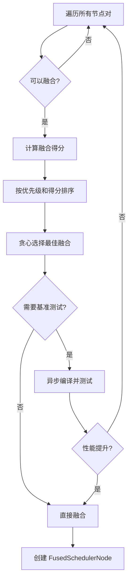

> 本文详细解析 PyTorch 2.x Inductor 编译器的核心调度模块 `torch/_inductor/scheduler.py`，深入探讨其架构设计、算子融合策略、内存优化技术等关键实现。

---

## 目录

1. [模块概述](#模块概述)
2. [核心架构](#核心架构)
3. [主要类详解](#主要类详解)
4. [关键算法](#关键算法)
5. [优化技术](#优化技术)
6. [模块交互](#模块交互)
7. [总结与展望](#总结与展望)

---

## 模块概述

### 基本信息

- **文件路径**: `torch/_inductor/scheduler.py`
- **代码规模**: 约 6656 行
- **主要职责**:
  - 操作调度与内核生成
  - 算子融合优化
  - 内存分配管理
  - 计算图分区

### 设计目标

Scheduler 模块是 PyTorch Inductor 编译器的核心，负责将中间表示（IR）转换为高效的可执行代码。其核心目标包括：

1. **性能优化**: 通过算子融合减少内核启动开销和内存访问
2. **内存效率**: 优化内存分配，降低峰值内存使用
3. **硬件适配**: 支持多种后端（Triton、SIMD、CUDAGraph）
4. **可扩展性**: 提供灵活的融合策略和优化pass

---

## 核心架构

### 整体流程

```
IR Nodes (from lowering)
    ↓
create_scheduler_node()
    ↓
[SchedulerNode, ExternKernelSchedulerNode, ...]
    ↓
compute_dependencies()
    ↓
topological_sort_schedule()
    ↓
dead_node_elimination()
    ↓
create_foreach_nodes()
    ↓
fuse_nodes() (多轮迭代)
    ↓
[FusedSchedulerNode, SchedulerNode, ...]
    ↓
merge_loops()
    ↓
reorder_for_peak_memory() (可选)
    ↓
reorder_for_compute_comm_overlap() (可选)
    ↓
graph_partition()
    ↓
codegen()
    ↓
[生成的 Python/Triton/C++ 代码]
```

### 日志系统

模块使用多个专用日志记录器，方便调试和性能分析：

```python
log                      # 主日志
fusion_log               # 融合决策日志
loop_ordering_log        # 循环重排序日志
compute_dependencies_log # 依赖计算日志
```

---

## 主要类详解

### 1. BaseSchedulerNode（基础调度器节点）

所有调度器节点的抽象基类。

#### 核心属性

```python
ancestors: Set[str]              # 祖先节点集合
group: Tuple[torch.device, ...]  # 设备和迭代分组
unmet_dependencies: Set[Dep]     # 未满足的依赖
read_writes: Dependencies        # 读写依赖
outputs: List[SchedulerBuffer]   # 输出缓冲区
min_order/max_order: int         # 调度位置约束
```

#### 关键方法

##### `set_read_writes()`
设置读写依赖关系，分析节点的内存访问模式。

##### `prune_deps()`
移除已满足的依赖，优化调度效率。

```python
unmet_dependencies = {
    dep for dep in unmet_dependencies
    if dep.name not in available_buffer_names
}
```

##### `get_estimated_runtime()`
估算节点运行时间（毫秒），用于计算-通信重叠优化。

**估算逻辑**：
```python
# 对于集合通信：使用 NCCL 估算
# 对于计算操作：
runtime = max(compute_time, transfer_time)
compute_time = (flops / gpu_flops) * 1e9  # 纳秒
transfer_time = bytes_accessed / gpu_memory_bandwidth  # 纳秒
```

##### `estimate_flops()`
估算浮点操作数，支持性能分析。

---

### 2. SchedulerNode（标准调度器节点）

封装 ComputedBuffer 或 TemplateBuffer 的标准节点。

#### 核心功能

##### 循环重排序
```python
def apply_new_loop_order(new_order):
    """应用新的循环顺序优化内存访问"""
    # 1. 重排序 LoopBody 的迭代变量
    # 2. 更新 sizes
    # 3. 刷新依赖关系
    # 4. 清除缓存
```

**应用场景**: 当融合的两个节点内存访问模式不匹配时，通过重排序循环改善缓存局部性。

##### 原地更新
```python
def can_inplace(input_buf):
    """检查是否可以原地更新缓冲区"""
    # 条件：
    # 1. 启用 inplace_buffers 配置
    # 2. 后端支持原地操作
    # 3. 输入缓冲区只有一个使用者
    # 4. 读写索引相同
    # 5. 缓冲区大小匹配
```

---

### 3. FusedSchedulerNode（融合调度器节点）

表示多个节点融合后的虚拟节点。

#### 核心属性
```python
snodes: List[BaseSchedulerNode]  # 被融合的子节点列表
```

#### 融合方法

```python
@staticmethod
def fuse(node1, node2):
    """静态方法，融合两个节点"""
    # 1. 创建 FusedSchedulerNode
    # 2. 合并依赖关系
    # 3. 维护拓扑排序
    # 4. 支持嵌套融合
```

#### 融合规则

- ✅ 维护所有子节点的并集依赖
- ✅ 保持拓扑排序顺序
- ✅ 支持嵌套融合（FusedNode 可以继续融合）

---

### 4. MixOrderReduction（混合顺序归约）

处理不同维度的混合顺序归约融合。

#### 融合场景

```python
# 示例：同时融合行归约和列归约
row_reduce = reduce(tensor, dim=1)  # 行归约
col_reduce = reduce(tensor, dim=0)  # 列归约
# 可以融合到单一内核中
```

#### 融合条件

```python
def can_fuse(node1, node2):
    """检查是否可以进行混合顺序归约融合"""
    return (
        both_are_reductions(node1, node2) and
        on_gpu(node1, node2) and
        using_triton_backend() and
        opposite_reduction_order() and
        has_common_buffer_access() and
        meets_size_threshold()
    )
```

#### 性能优势

- **减少内存访问**: 共享输入数据的加载
- **提高缓存利用**: 一次加载多次使用
- **降低内核开销**: 减少内核启动次数

---

### 5. ForeachKernelSchedulerNode（并行节点组）

表示可以并行执行的节点集合。

#### 特点

- 节点之间无数据依赖
- 可以批量处理相似操作
- 支持自定义分区算法和自动调优

#### 融合逻辑

```python
# Case 1: foreach + foreach
# 逐个融合对应的子节点

# Case 2: foreach + 普通节点
# 只融合消费/生产的特定子节点

# Case 3: foreach + 归约节点
# 不支持融合
```

#### 应用场景

```python
# 批量处理多个独立的小内核
for i in range(N):
    output[i] = relu(input[i] + bias[i])
# 可以创建 ForeachKernel 一次性处理
```

---

### 6. GroupedSchedulerNode（分组调度节点）

表示必须连续执行的节点组，但不融合为单一内核。

#### 与 FusedSchedulerNode 的区别

| 特性 | FusedSchedulerNode | GroupedSchedulerNode |
|------|-------------------|---------------------|
| 内核数量 | 单一内核 | 多个独立内核 |
| 执行方式 | 融合执行 | 连续执行，不允许插入 |
| 内存共享 | 寄存器/共享内存 | 全局内存 |
| 适用场景 | 算子融合 | 临时分组、通信重叠 |

---

### 7. Scheduler（主调度器类）

整个调度系统的核心控制器。

#### 初始化流程

```python
def __init__(self, nodes):
    # 1. 创建 SchedulerNode 对象
    self._create_scheduler_nodes(nodes)

    # 2. 计算依赖关系
    self.compute_dependencies()

    # 3. 拓扑排序
    self.topological_sort_schedule()

    # 4. 死代码消除
    self.dead_node_elimination()

    # 5. 计算祖先关系
    self.compute_ancestors()

    # 6. 创建 foreach 节点
    self.create_foreach_nodes()

    # 7. 融合节点（多轮迭代）
    self.fuse_nodes()

    # 8. 循环合并
    self.merge_loops()

    # 9. 峰值内存优化
    if config.reorder_for_peak_memory:
        self.reorder_for_peak_memory()

    # 10. 通信计算重叠优化
    if config.reorder_for_compute_comm_overlap:
        self.reorder_for_compute_comm_overlap()

    # 11. 图分区
    if config.graph_partition:
        self.graph_partition()

    # 12. 计算最后使用
    self.compute_last_usage()
```

#### 核心数据结构

```python
self.nodes: List[BaseSchedulerNode]
# 调度节点列表

self.name_to_node: Dict[str, BaseSchedulerNode]
# 名称到节点的映射

self.name_to_buf: Dict[str, SchedulerBuffer]
# 名称到缓冲区的映射

self.name_to_fused_node: Dict[str, BaseSchedulerNode]
# 融合后的节点映射

self.mutation_renames: Dict[str, str]
# 突变重命名映射

self.mutation_real_name: Dict[str, str]
# 真实名称映射
```

#### 依赖计算（compute_dependencies）

```python
def compute_dependencies(self):
    """计算节点间的依赖关系"""

    # 1. 别名处理
    # 具有别名关系的缓冲区共享用户列表

    # 2. 突变依赖
    # 突变操作必须在所有读者之后执行

    # 3. unbacked symbols
    # 处理动态形状符号的依赖

    # 4. 输出依赖
    # 确保输出不被死代码消除
```

---

### 8. BaseScheduling（后端基类）

定义后端（Triton、SIMD 等）必须实现的接口。

#### 核心抽象方法

```python
class BaseScheduling:
    def can_fuse_vertical(self, node1, node2) -> bool:
        """垂直融合检查（消费者-生产者）"""
        raise NotImplementedError

    def can_fuse_horizontal(self, node1, node2) -> bool:
        """水平融合检查（并行操作）"""
        raise NotImplementedError

    def fuse(self, node1, node2) -> FusedSchedulerNode:
        """执行融合"""
        raise NotImplementedError

    def group_fn(self, sizes) -> Tuple:
        """迭代维度分组"""
        raise NotImplementedError

    def codegen_template(self, template_node):
        """模板代码生成"""
        raise NotImplementedError

    def codegen_node(self, node):
        """节点代码生成"""
        raise NotImplementedError

    def benchmark_fused_nodes(self, nodes) -> float:
        """基准测试融合节点"""
        raise NotImplementedError
```

---

## 关键算法

### 1. 融合算法

#### 多轮融合迭代

```python
def fuse_nodes(self):
    """多轮迭代融合节点"""
    for iteration in range(10):
        old_len = len(self.nodes)
        self.nodes = self.fuse_nodes_once(self.nodes)

        if len(self.nodes) == old_len:
            # 没有新的融合发生，退出
            break
```

#### 融合决策流程



#### 融合优先级

```python
def score_fusion_key(nodes):
    """为融合候选对生成排序键"""
    # 1. 后端优先级（Triton > SIMD）
    # 2. 内存访问得分（共享数据越多越好）
    # 3. 融合类型（vertical > horizontal）
    return (backend_priority, memory_score, fusion_type)
```

#### 融合条件检查

```python
def can_fuse(node1, node2):
    """判断两个节点是否可以融合"""

    # 1. 设备匹配
    if node1.device != node2.device:
        return False

    # 2. 依赖关系（不能创建循环）
    if will_create_cycle(node1, node2):
        return False

    # 3. 节点类型
    if is_extern_or_nop(node1) or is_extern_or_nop(node2):
        return False

    # 4. 共享数据得分
    score = score_fusion_memory(node1, node2)
    if score < threshold:
        return False

    # 5. 后端特定条件
    if is_vertical_fusion(node1, node2):
        return backend.can_fuse_vertical(node1, node2)
    else:
        return backend.can_fuse_horizontal(node1, node2)
```

---

### 2. 循环重排序策略

#### 目标

优化内存访问模式，提高缓存局部性。

#### 启发式算法

```python
def pick_loop_order(stride_lengths, sizes, priority_idx=None):
    """启发式决定循环迭代顺序"""

    # 1. 将大小为 1 的维度移到最后
    # 减少无效迭代

    # 2. 优先内层循环有较小步长
    # 改善缓存局部性，连续访问内存

    # 3. 支持优先节点
    # 某些节点的访问模式更重要

    return optimized_order
```

#### 示例

```python
# 原始循环顺序 [i, j, k]
# stride_lengths = [[64, 8, 1], ...]  # k 维度步长最小
# 优化后顺序 [i, j, k]  # k 在内层，连续访问
```

#### 融合后重排序

```python
def reorder_loops_after_fusion(node1, node2):
    """融合后重排序循环"""

    if not config.loop_ordering_after_fusion:
        return

    # 计算当前共享数据得分
    current_score = score_fusion_memory(node1, node2)

    # 如果得分不理想，尝试重排序
    if current_score < threshold:
        new_order = decide_new_loop_order(node1, node2)
        new_score = estimate_score_after_reorder(new_order)

        if new_score > current_score:
            apply_new_loop_order(new_order)
```

---

### 3. 依赖拓扑排序

#### 算法实现

```python
def topological_sort_schedule(nodes):
    """深度优先搜索拓扑排序"""
    seen = set()
    result = []
    name_to_node = {n.get_name(): n for n in nodes}

    def visit(node):
        if node.get_name() in seen:
            return
        seen.add(node.get_name())

        # 递归访问所有依赖
        for dep in node.unmet_dependencies:
            if dep.name in name_to_node:
                visit(name_to_node[dep.name])

        result.append(node)

    # 从所有节点开始遍历
    for node in nodes:
        visit(node)

    return result
```

#### 时间复杂度

- **时间**: O(V + E)，其中 V 是节点数，E 是依赖边数
- **空间**: O(V)

---

### 4. 循环检测算法

#### 目的

防止融合创建循环依赖。

#### 算法

```python
def will_fusion_create_cycle(node1, node2):
    """检测融合是否会创建循环"""

    # 融合后的节点名称集合
    combined_names = node1.get_names() | node2.get_names()

    # 融合后的祖先集合（排除自身）
    combined_ancestors = (
        (node1.ancestors | node2.ancestors) - combined_names
    )

    # 检查是否存在从祖先到融合节点的新路径
    for ancestor_name in combined_ancestors:
        if has_path_to_fused_node(ancestor_name, combined_names):
            return True  # 会创建循环

    return False
```

#### 关键洞察

只有融合节点可能引入新的祖先关系，普通依赖不会创建循环。

---

### 5. 峰值内存优化

#### 策略

```python
def reorder_for_peak_memory(self):
    """重排序节点以最小化峰值内存"""

    # 1. 计算内存生命周期
    timeline = compute_memory_timeline(self.nodes)

    # 2. 分析每个调度点的内存使用
    peak_usage = {}
    for step, nodes_at_step in enumerate(timeline):
        peak_usage[step] = sum(
            buf.size for buf in live_buffers(nodes_at_step)
        )

    # 3. 重排序节点
    # 优先调度可以释放大量内存的节点
    self.nodes = reorder_to_minimize_peak(self.nodes, peak_usage)
```

#### 启发式

- **早释放**: 优先执行可以释放大缓冲区的节点
- **延迟分配**: 延迟分配大缓冲区
- **内存重用**: 优先融合可以共享内存的节点

---

### 6. 计算-通信重叠优化

#### 策略

```python
def reorder_for_compute_comm_overlap(self):
    """重排序使计算与通信重叠"""

    # 1. 识别集合通信操作
    comm_ops = [n for n in self.nodes if is_collective(n)]

    # 2. 估算每个操作的运行时间
    for node in self.nodes:
        node.runtime = estimate_runtime(node)

    # 3. 重排序
    # 在通信期间安排独立的计算任务
    self.nodes = overlap_compute_and_comm(
        self.nodes, comm_ops
    )
```

#### 运行时估算

```python
def estimate_runtime(node):
    """估算节点运行时间"""

    if is_collective(node):
        # 使用 NCCL 公式估算
        return estimate_nccl_runtime(node)

    # 计算限制
    compute_time = node.flops / GPU_PEAK_FLOPS

    # 内存带宽限制
    memory_time = node.bytes_accessed / GPU_MEMORY_BANDWIDTH

    # 取两者最大值
    return max(compute_time, memory_time)
```

---

### 7. 图分区算法

#### 目的

将图分割为多个分区，每个分区可以使用 CUDAGraph 优化。

#### 分区触发条件

```python
def should_partition(node):
    """判断节点是否应该触发分区"""
    return (
        is_cudagraph_unsafe(node) or      # CPU fallback
        has_dynamic_shape(node) or        # 动态形状
        has_random_op(node) or            # RNG 操作
        has_data_dependent_control(node)  # 数据依赖控制流
    )
```

#### 分区算法

```python
def graph_partition(self):
    """将节点分割为图分区"""
    partitions = []
    current_partition = []

    for node in self.nodes:
        if should_partition(node):
            # 保存当前分区
            if current_partition:
                partitions.append(current_partition)

            # 单独的分区（不安全操作）
            partitions.append([node])

            # 开始新分区
            current_partition = []
        else:
            current_partition.append(node)

    # 保存最后一个分区
    if current_partition:
        partitions.append(current_partition)

    return partitions
```

---

## 优化技术

### 1. 算子融合

#### 垂直融合（Producer-Consumer）

```python
# 示例
a = relu(x)
b = sigmoid(a)  # 消费 a

# 融合后
def fused_kernel(x):
    return sigmoid(relu(x))
```

**优势**:
- ✅ 消除中间缓冲区
- ✅ 减少内存读写
- ✅ 提高寄存器重用

#### 水平融合（Sibling）

```python
# 示例
a = relu(x)
b = sigmoid(y)  # 独立操作

# 融合后
def fused_kernel(x, y):
    return relu(x), sigmoid(y)
```

**优势**:
- ✅ 减少内核启动开销
- ✅ 提高 GPU 利用率
- ✅ 共享内核配置成本

---

### 2. 内存优化技术

#### 原地更新（In-place Update）

```python
# 原始
temp = relu(x)
y = temp + 1

# 优化后（原地）
y = relu(x)  # 直接写入 y
y = y + 1    # 原地更新
```

**条件**:
- 输入缓冲区只有一个使用者
- 读写索引相同
- 缓冲区大小匹配

#### 内存别名（Aliasing）

```python
# view 操作创建别名
y = x.view(new_shape)  # y 和 x 共享内存
```

**处理**:
- 共享用户列表
- 统一生命周期管理

---

### 3. 缓存优化

#### 循环重排序

```python
# 优化前：列主序访问（缓存不友好）
for i in range(M):
    for j in range(N):
        y[i] += x[i, j]

# 优化后：行主序访问（缓存友好）
for i in range(M):
    for j in range(N):
        y[i] += x[i, j]  # 连续访问 x
```

#### 缓存装饰器

```python
@cache_on_self
def expensive_computation(self):
    """缓存昂贵的计算结果"""
    # 只计算一次，后续调用直接返回缓存
    return heavy_analysis()
```

---

### 4. 编译优化

#### 异步编译

```python
# 并行编译多个融合候选
futures = []
for candidate in fusion_candidates:
    future = async_compile(candidate)
    futures.append(future)

# 等待最快的完成
best = await_fastest(futures)
```

#### 基准测试驱动融合

```python
def should_fuse_with_benchmark(node1, node2):
    """基于实际性能决定是否融合"""

    # 编译独立版本
    time_separate = benchmark([node1, node2])

    # 编译融合版本
    fused = fuse(node1, node2)
    time_fused = benchmark([fused])

    # 只有性能提升才融合
    return time_fused < time_separate * 0.95
```

---

### 5. ComboKernel（组合内核）

#### 概念

将多个独立的小内核批量处理，减少启动开销。

#### 示例

```python
# 原始：启动 N 次内核
for i in range(N):
    kernel_relu(input[i], output[i])

# 优化：启动 1 次组合内核
combo_kernel_relu(inputs, outputs, N)
```

#### 分区策略

```python
def create_combo_kernel(nodes):
    """创建组合内核"""

    # 1. 检查节点是否独立
    if has_dependencies(nodes):
        return None

    # 2. 分组相似操作
    groups = group_by_operation_type(nodes)

    # 3. 基准测试
    for group in groups:
        if benchmark_shows_speedup(group):
            yield create_foreach_node(group)
```

---

### 6. 特殊融合技术

#### Mix-Order Reduction Fusion

```python
# 示例：同时计算行和列归约
row_sum = x.sum(dim=1)  # 行归约
col_sum = x.sum(dim=0)  # 列归约

# 融合后：一次加载 x，计算两个归约
def fused_reduction(x):
    row_sum = torch.zeros(M)
    col_sum = torch.zeros(N)
    for i in range(M):
        for j in range(N):
            val = x[i, j]  # 只加载一次
            row_sum[i] += val
            col_sum[j] += val
    return row_sum, col_sum
```

**优势**:
- 减少 50% 的内存访问
- 提高缓存利用率
- 适用于归约密集的工作负载

---

## 模块交互

### 与 IR 模块

```
torch/_inductor/ir.py
    ↓
provides: Operation, ComputedBuffer, TemplateBuffer
    ↓
torch/_inductor/scheduler.py
    ↓
wraps into: SchedulerNode
```

**交互方式**:
- 调用 IR 节点的方法获取元数据
- 提取读写依赖
- 查询设备、形状、数据类型

---

### 与 Dependencies 模块

```
torch/_inductor/dependencies.py
    ↓
provides: Dep, MemoryDep, WeakDep, StarDep
    ↓
torch/_inductor/scheduler.py
    ↓
uses: extract_read_writes(), rename(), merge()
```

**依赖类型**:
- **Dep**: 强依赖（数据流）
- **WeakDep**: 弱依赖（仅排序）
- **MemoryDep**: 内存依赖（别名、突变）
- **StarDep**: 通配符依赖

---

### 与 Codegen 模块

```
torch/_inductor/scheduler.py
    ↓
calls: backend.codegen_node()
    ↓
torch/_inductor/codegen/
    ├── triton.py (TritonScheduling)
    ├── simd.py (SIMDScheduling)
    └── wrapper.py (WrapperCodegen)
```

**后端接口**:
- `can_fuse_vertical()` / `can_fuse_horizontal()`
- `fuse()`
- `codegen_template()` / `codegen_node()`
- `benchmark_fused_nodes()`

---

### 与 Memory 模块

```
torch/_inductor/memory.py
    ↓
provides: MemoryPlanningInfo
    ↓
torch/_inductor/scheduler.py
    ↓
uses: reorder_for_peak_memory()
```

**功能**:
- 内存生命周期分析
- 峰值内存计算
- 内存重用策略

---

### 与 Comm 模块

```
torch/_inductor/comms.py
    ↓
provides: communication analysis
    ↓
torch/_inductor/scheduler.py
    ↓
uses: reorder_for_compute_comm_overlap()
```

**优化**:
- 通信顺序优化
- 计算通信重叠
- NCCL 运行时估算

---

### 与 Config 模块

```python
# 主要配置项
config.aggressive_fusion           # 激进融合
config.triton.mix_order_reduction  # 混合顺序归约
config.loop_ordering_after_fusion  # 融合后循环重排序
config.reorder_for_peak_memory     # 峰值内存优化
config.combo_kernels               # 组合内核
config.graph_partition             # 图分区
config.triton.cudagraphs           # CUDAGraph 支持
```

---

## 设计模式

### 1. 访问者模式（Visitor Pattern）

不同节点类型有不同的代码生成方法：

```python
if isinstance(node, TemplateBuffer):
    backend.codegen_template(node)
elif isinstance(node, ExternKernel):
    node.codegen_extern_call()
elif isinstance(node, ForeachKernelSchedulerNode):
    backend.codegen_combo_kernel(node)
elif isinstance(node, FusedMixOrderReductions):
    backend.codegen_mix_order_reduction(node)
else:
    backend.codegen_node(node)
```

---

### 2. 策略模式（Strategy Pattern）

`BaseScheduling` 定义后端接口，不同后端实现不同策略：

```python
class TritonScheduling(BaseScheduling):
    def can_fuse_vertical(self, node1, node2):
        # Triton 特定的融合策略
        ...

class SIMDScheduling(BaseScheduling):
    def can_fuse_vertical(self, node1, node2):
        # SIMD 特定的融合策略
        ...
```

---

### 3. 组合模式（Composite Pattern）

`FusedSchedulerNode` 组合多个子节点：

```python
class FusedSchedulerNode(BaseSchedulerNode):
    def __init__(self, snodes: List[BaseSchedulerNode]):
        self.snodes = snodes  # 可以递归包含 FusedSchedulerNode

    def get_nodes(self):
        # 递归展开所有子节点
        result = []
        for snode in self.snodes:
            if isinstance(snode, FusedSchedulerNode):
                result.extend(snode.get_nodes())
            else:
                result.append(snode)
        return result
```

---

### 4. 工厂模式（Factory Pattern）

```python
def create_scheduler_node(node):
    """根据 IR 节点类型创建对应的 SchedulerNode"""
    if isinstance(node, ComputedBuffer):
        return SchedulerNode(node)
    elif isinstance(node, ExternKernel):
        return ExternKernelSchedulerNode(node)
    elif isinstance(node, TemplateBuffer):
        return SchedulerNode(node)
    else:
        raise ValueError(f"Unknown node type: {type(node)}")
```

---

### 5. 模板方法模式（Template Method Pattern）

融合流程固定，具体融合条件可扩展：

```python
def fuse_nodes_once(nodes):
    """模板方法：融合流程"""
    # 1. 生成候选（固定）
    candidates = generate_fusion_candidates(nodes)

    # 2. 过滤候选（可扩展）
    valid = filter_valid_fusions(candidates)

    # 3. 排序候选（可扩展）
    sorted_candidates = sort_by_priority(valid)

    # 4. 执行融合（固定）
    return apply_fusions(sorted_candidates, nodes)
```

---

## 性能考虑

### 1. 缓存优化

```python
@cache_on_self
def get_read_writes(self):
    """缓存读写分析结果"""
    # 昂贵的计算只执行一次
    return extract_read_writes(self.node)
```

---

### 2. 早期剪枝

```python
def generate_fusion_candidates(nodes):
    """生成融合候选时早期过滤"""
    candidates = []
    for i, node1 in enumerate(nodes):
        for node2 in nodes[i+1:]:
            # 早期检查，避免无效组合
            if quick_check(node1, node2):
                candidates.append((node1, node2))
    return candidates
```

---

### 3. 并行编译

```python
# 异步编译多个候选
with ThreadPoolExecutor() as executor:
    futures = {
        executor.submit(compile_fusion, c): c
        for c in candidates
    }

    for future in as_completed(futures):
        result = future.result()
        if result.is_better():
            best = result
```

---

### 4. 启发式搜索

避免指数级搜索空间：

```python
# ❌ 指数级：尝试所有可能的融合组合
# O(2^n)

# ✅ 贪心：每次选择最佳融合
# O(n^2 * log n)
```

---

### 5. 延迟求值

```python
# 只在需要时编译和基准测试
if needs_benchmark(fusion_candidate):
    time = benchmark(fusion_candidate)
    if time > threshold:
        skip(fusion_candidate)
```

---

## 参考资源

- **源码**: `torch/_inductor/scheduler.py`
- **测试**: `test/inductor/test_inductor_scheduler.py`
- **文档**: PyTorch 2.0 Compilation API
- **论文**: TorchInductor: A Compiler Backend for PyTorch 2.0
