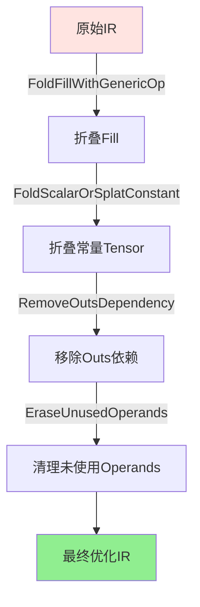
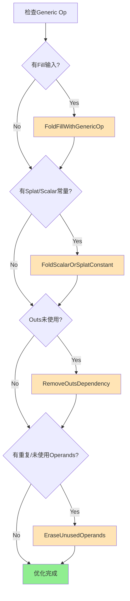
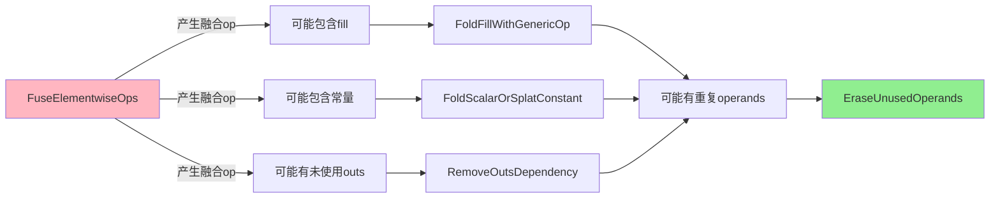

## 概述

`populateElementwiseOpsFusionPatterns` 函数不仅包含核心的 `FuseElementwiseOps` pattern，还集成了多个辅助优化策略，它们协同工作以最大化融合的效果。

**函数定义**（`ElementwiseOpFusion.cpp:2253-2262`）：

```cpp
void mlir::linalg::populateElementwiseOpsFusionPatterns(
    RewritePatternSet &patterns,
    const ControlFusionFn &controlElementwiseOpsFusion) {
  auto *context = patterns.getContext();

  // 1. 核心融合pattern
  patterns.add<FuseElementwiseOps>(context, controlElementwiseOpsFusion);

  // 2. 辅助优化patterns
  patterns.add<FoldFillWithGenericOp,        // Fill操作折叠
               FoldScalarOrSplatConstant,     // 常量折叠
               RemoveOutsDependency>          // 输出依赖消除
              (context);

  // 3. 清理未使用的operands和results
  populateEraseUnusedOperandsAndResultsPatterns(patterns);
}
```

**优化策略总览**：

| 策略                          | 作用         | 代码位置                                | 优化目标       |
| ----------------------------- | ------------ | --------------------------------------- | -------------- |
| **FoldFillWithGenericOp**     | 折叠fill操作 | `ElementwiseOpFusion.cpp:2201`          | 消除fill操作   |
| **FoldScalarOrSplatConstant** | 折叠常量     | `ElementwiseOpFusion.cpp:2046`          | 提升常量为标量 |
| **RemoveOutsDependency**      | 移除输出依赖 | `ElementwiseOpFusion.cpp:2160`          | 打破假依赖     |
| **EraseUnusedOperands**       | 清理死代码   | `EraseUnusedOperandsAndResults.cpp:431` | 简化操作       |

---

## 优化策略1：FoldFillWithGenericOp

### 目标

将 `linalg.fill` 操作折叠（融合）到使用它的 `linalg.generic` 操作中。

### 动机

**问题场景**：

```text
// 初始化一个tensor
%filled = linalg.fill ins(%cst : f32) outs(%init : tensor<?xf32>)
  -> tensor<?xf32>

// 使用filled tensor
%result = linalg.generic ins(%arg0, %filled) outs(%out) {
  ^bb0(%a: f32, %f: f32, %o: f32):
    %sum = arith.addf %a, %f : f32
    linalg.yield %sum : f32
}
```

**问题**：

- `linalg.fill` 创建了一个中间tensor
- 需要一次额外的内存写入
- 增加了kernel launch开销

### 实现原理

**代码**（`ElementwiseOpFusion.cpp:2201-2228`）：

```cpp
struct FoldFillWithGenericOp : public OpRewritePattern<GenericOp> {
  LogicalResult matchAndRewrite(GenericOp genericOp,
                                PatternRewriter &rewriter) const override {
    if (!genericOp.hasPureTensorSemantics())
      return failure();

    bool fillFound = false;
    Block &payload = genericOp.getRegion().front();

    // 遍历generic op的输入operands
    for (OpOperand *opOperand : genericOp.getDpsInputOperands()) {
      // 检查payload是否使用了这个operand
      if (!genericOp.payloadUsesValueFromOperand(opOperand))
        continue;
z
      // 检查是否是fill操作
      FillOp fillOp = opOperand->get().getDefiningOp<FillOp>();
      if (!fillOp)
        continue;

      fillFound = true;
      Value fillVal = fillOp.value();  // 提取fill的值

      // 类型转换（如果需要）
      auto resultType = cast<RankedTensorType>(
          fillOp.result().getType()).getElementType();
      Value convertedVal = convertScalarToDtype(
          rewriter, fillOp.getLoc(), fillVal, resultType,
          /*isUnsignedCast=*/false);

      // 用常量值替换block argument
      rewriter.replaceAllUsesWith(
          payload.getArgument(opOperand->getOperandNumber()),
          convertedVal);
    }
    return success(fillFound);
  }
};
```

### 转换示例

**转换前**：

```text
func.func @fold_fill_example(%arg0: tensor<?xf32>) -> tensor<?xf32> {
  %cst = arith.constant 7.0 : f32
  %c0 = arith.constant 0 : index
  %0 = tensor.dim %arg0, %c0 : tensor<?xf32>
  %1 = tensor.empty(%0) : tensor<?xf32>

  // Step 1: Fill操作
  %2 = linalg.fill ins(%cst : f32) outs(%1 : tensor<?xf32>)
    -> tensor<?xf32>

  %3 = tensor.empty(%0) : tensor<?xf32>

  // Step 2: 使用filled tensor
  %4 = linalg.generic {
    indexing_maps = [map0, map0, map0],
    iterator_types = ["parallel"]
  } ins(%arg0, %2 : tensor<?xf32>, tensor<?xf32>)
    outs(%3 : tensor<?xf32>) {
    ^bb0(%arg1: f32, %arg2: f32, %arg3: f32):
      %5 = arith.addf %arg1, %arg2 : f32
      linalg.yield %5 : f32
  } -> tensor<?xf32>

  return %4 : tensor<?xf32>
}
```

**转换后**：

```text
func.func @fold_fill_example(%arg0: tensor<?xf32>) -> tensor<?xf32> {
  %cst = arith.constant 7.0 : f32  // 常量被保留
  %c0 = arith.constant 0 : index
  %0 = tensor.dim %arg0, %c0 : tensor<?xf32>
  %3 = tensor.empty(%0) : tensor<?xf32>

  // Fill被折叠！只有一个generic op
  %4 = linalg.generic {
    indexing_maps = [map0, map0],  // 少了一个input!
    iterator_types = ["parallel"]
  } ins(%arg0 : tensor<?xf32>)     // %2被移除
    outs(%3 : tensor<?xf32>) {
    ^bb0(%arg1: f32, %arg3: f32):
      // %arg2被%cst替换
      %5 = arith.addf %arg1, %cst : f32
      linalg.yield %5 : f32
  } -> tensor<?xf32>

  return %4 : tensor<?xf32>
}
```

### 优化效果

| 指标              | 优化前                 | 优化后        | 改进 |
| ----------------- | ---------------------- | ------------- | ---- |
| **操作数**        | 2个linalg op           | 1个linalg op  | -50% |
| **中间tensor**    | 1个 (%2)               | 0个           | 消除 |
| **内存写入**      | fill写入 + generic写入 | 仅generic写入 | -50% |
| **Kernel launch** | 2次                    | 1次           | -50% |

---

## 优化策略2：FoldScalarOrSplatConstant

### 目标

将**标量常量**或**splat常量**（所有元素相同的tensor）折叠到 `linalg.generic` 操作中。

### 动机

**问题场景**：

```text
// Splat常量：所有元素都是42.0
%cst = arith.constant dense<42.0> : tensor<4xf32>

%result = linalg.generic ins(%arg0, %cst) outs(%out) {
  ^bb0(%a: f32, %c: f32, %o: f32):
    %mul = arith.mulf %a, %c : f32
    linalg.yield %mul : f32
}
```

**问题**：

- 常量tensor占用内存
- 每次循环都读取相同的值
- 浪费带宽

### 实现原理

**核心逻辑**（`ElementwiseOpFusion.cpp:2046-2147`）：

```cpp
class FoldScalarOrSplatConstant : public OpRewritePattern<GenericOp> {
public:
  LogicalResult matchAndRewrite(GenericOp genericOp,
                                PatternRewriter &rewriter) const override {
    if (!genericOp.hasPureTensorSemantics())
      return failure();

    for (OpOperand *opOperand : genericOp.getDpsInputOperands()) {
      Operation *def = opOperand->get().getDefiningOp();
      TypedAttr constantAttr;

      // Lambda: 检查是否是标量或splat常量
      auto isScalarOrSplatConstantOp = [&](Operation *def) -> bool {
        // 情况1: DenseElementsAttr (splat tensor)
        {
          DenseElementsAttr splatAttr;
          if (matchPattern(def, m_Constant<DenseElementsAttr>(&splatAttr)) &&
              splatAttr.isSplat() &&
              splatAttr.getType().getElementType().isIntOrFloat()) {
            constantAttr = splatAttr.getSplatValue<TypedAttr>();
            return true;
          }
        }
        // 情况2: IntegerAttr (标量整数)
        {
          IntegerAttr intAttr;
          if (matchPattern(def, m_Constant<IntegerAttr>(&intAttr))) {
            constantAttr = intAttr;
            return true;
          }
        }
        // 情况3: FloatAttr (标量浮点)
        {
          FloatAttr floatAttr;
          if (matchPattern(def, m_Constant<FloatAttr>(&floatAttr))) {
            constantAttr = floatAttr;
            return true;
          }
        }
        return false;
      };

      auto resultValue = dyn_cast<OpResult>(opOperand->get());
      if (!def || !resultValue || !isScalarOrSplatConstantOp(def))
        continue;

      // 构建新的operands（移除常量operand）
      SmallVector<AffineMap> fusedIndexMaps;
      SmallVector<Value> fusedOperands;

      for (OpOperand *inputOperand : genericOp.getDpsInputOperands()) {
        if (inputOperand == opOperand)
          continue;  // 跳过常量operand
        fusedOperands.push_back(inputOperand->get());
        fusedIndexMaps.push_back(
            genericOp.getMatchingIndexingMap(inputOperand));
      }

      // 添加output的indexing maps
      for (OpOperand &outputOperand : genericOp.getDpsInitsMutable())
        fusedIndexMaps.push_back(
            genericOp.getMatchingIndexingMap(&outputOperand));

      // 验证loop bounds可计算
      if (!inversePermutation(
              concatAffineMaps(fusedIndexMaps, rewriter.getContext()))) {
        return rewriter.notifyMatchFailure(
            genericOp, "fused op loop bound computation failed");
      }

      // 创建标量常量
      Value scalarConstant = rewriter.create<arith::ConstantOp>(
          def->getLoc(), constantAttr);

      // 创建新的generic op
      SmallVector<Value> outputOperands = genericOp.getOutputs();
      auto fusedOp = rewriter.create<GenericOp>(
          rewriter.getFusedLoc(fusedLocs),
          genericOp->getResultTypes(),
          /*inputs=*/fusedOperands,
          /*outputs=*/outputOperands,
          rewriter.getAffineMapArrayAttr(fusedIndexMaps),
          genericOp.getIteratorTypes(),
          /*doc=*/nullptr,
          /*library_call=*/nullptr);

      // Clone region，但用标量常量替换block argument
      Region &region = genericOp->getRegion(0);
      Block &entryBlock = *region.begin();
      IRMapping mapping;
      mapping.map(
          entryBlock.getArgument(opOperand->getOperandNumber()),
          scalarConstant);  // 关键：映射到标量常量

      Region &fusedRegion = fusedOp->getRegion(0);
      rewriter.cloneRegionBefore(region, fusedRegion,
                                fusedRegion.begin(), mapping);

      rewriter.replaceOp(genericOp, fusedOp->getResults());
      return success();
    }
    return failure();
  }
};
```

### 转换示例

#### 示例1：Splat Tensor常量

**转换前**：

```text
func.func @constant_fusion(%arg0: tensor<4xf32>) -> tensor<4xf32> {
  %cst = arith.constant dense<1.0> : tensor<4xf32>  // Splat tensor
  %1 = tensor.empty() : tensor<4xf32>

  %2 = linalg.generic {
    indexing_maps = [map0, map0, map0],
    iterator_types = ["parallel"]
  } ins(%arg0, %cst : tensor<4xf32>, tensor<4xf32>)
    outs(%1 : tensor<4xf32>) {
    ^bb0(%a: f32, %c: f32, %out: f32):
      %sum = arith.addf %a, %c : f32
      linalg.yield %sum : f32
  } -> tensor<4xf32>

  return %2 : tensor<4xf32>
}
```

**转换后**：

```text
func.func @constant_fusion(%arg0: tensor<4xf32>) -> tensor<4xf32> {
  %cst = arith.constant 1.000000e+00 : f32  // 变成标量!
  %1 = tensor.empty() : tensor<4xf32>

  %2 = linalg.generic {
    indexing_maps = [map0, map0],  // 少了一个map!
    iterator_types = ["parallel"]
  } ins(%arg0 : tensor<4xf32>)     // 常量tensor被移除
    outs(%1 : tensor<4xf32>) {
    ^bb0(%a: f32, %out: f32):      // 少了一个参数
      %sum = arith.addf %a, %cst : f32  // 直接使用标量常量
      linalg.yield %sum : f32
  } -> tensor<4xf32>

  return %2 : tensor<4xf32>
}
```

#### 示例2：0维Tensor常量

**转换前**：

```text
func.func @zero_dim_constant(%arg0: tensor<5x?x?xf32>) -> tensor<5x?x?xf32> {
  %cst = arith.constant dense<42.0> : tensor<f32>  // 0维tensor
  %2 = tensor.empty(...) : tensor<5x?x?xf32>

  %3 = linalg.generic {
    indexing_maps = [
      affine_map<(d0, d1, d2) -> ()>,        // 0维
      affine_map<(d0, d1, d2) -> (d0, d1, d2)>,
      affine_map<(d0, d1, d2) -> (d0, d1, d2)>
    ],
    iterator_types = ["parallel", "parallel", "parallel"]
  } ins(%cst, %arg0 : tensor<f32>, tensor<5x?x?xf32>)
    outs(%2) {
    ^bb0(%c: f32, %a: f32, %out: f32):
      %mul = arith.mulf %c, %a : f32
      linalg.yield %mul : f32
  } -> tensor<5x?x?xf32>

  return %3 : tensor<5x?x?xf32>
}
```

**转换后**：

```text
func.func @zero_dim_constant(%arg0: tensor<5x?x?xf32>) -> tensor<5x?x?xf32> {
  %cst = arith.constant 4.200000e+01 : f32  // 标量
  %2 = tensor.empty(...) : tensor<5x?x?xf32>

  %3 = linalg.generic {
    indexing_maps = [
      affine_map<(d0, d1, d2) -> (d0, d1, d2)>,
      affine_map<(d0, d1, d2) -> (d0, d1, d2)>
    ],
    iterator_types = ["parallel", "parallel", "parallel"]
  } ins(%arg0 : tensor<5x?x?xf32>)
    outs(%2) {
    ^bb0(%a: f32, %out: f32):
      %mul = arith.mulf %cst, %a : f32
      linalg.yield %mul : f32
  } -> tensor<5x?x?xf32>

  return %3 : tensor<5x?x?xf32>
}
```

### 支持的常量类型

| 类型             | 检查条件                                     | 提取方法                     |
| ---------------- | -------------------------------------------- | ---------------------------- |
| **Splat Tensor** | `splatAttr.isSplat()`                        | `getSplatValue<TypedAttr>()` |
| **标量整数**     | `matchPattern(..., m_Constant<IntegerAttr>)` | 直接使用                     |
| **标量浮点**     | `matchPattern(..., m_Constant<FloatAttr>)`   | 直接使用                     |

### 优化效果

| 场景         | 优化前                   | 优化后        | 节省    |
| ------------ | ------------------------ | ------------- | ------- |
| **内存占用** | tensor<4xf32> = 16 bytes | f32 = 4 bytes | 75%     |
| **内存访问** | 每次迭代读取             | 常量在寄存器  | 100%    |
| **Operands** | N inputs                 | N-1 inputs    | 减少1个 |

---

## 优化策略3：RemoveOutsDependency

### 目标

移除未使用的`outs`操作数的依赖关系，将其替换为 `tensor.empty`。

### 动机

**问题场景**：

```text
// %expensive_tensor 是一个复杂计算的结果
%expensive_tensor = ... : tensor<?x?xf32>

// 但generic op的payload根本不使用它！
%result = linalg.generic
  ins(%arg0)
  outs(%expensive_tensor) {  // 未使用的outs
  ^bb0(%in: f32, %out: f32):
    // 注意：%out从未被使用！
    %mul = arith.mulf %in, %in : f32
    linalg.yield %mul : f32
}
```

**问题**：

- `%expensive_tensor` 建立了假依赖
- 阻碍了并行化和调度优化
- 可能触发不必要的计算

### 实现原理

**代码**（`ElementwiseOpFusion.cpp:2160-2198`）：

```cpp
struct RemoveOutsDependency : public OpRewritePattern<GenericOp> {
  LogicalResult matchAndRewrite(GenericOp op,
                                PatternRewriter &rewriter) const override {
    rewriter.startOpModification(op);
    bool modifiedOutput = false;
    Location loc = op.getLoc();

    // 遍历所有output operands
    for (OpOperand &opOperand : op.getDpsInitsMutable()) {
      // 关键检查：payload是否使用了这个output operand？
      if (!op.payloadUsesValueFromOperand(&opOperand)) {
        Value operandVal = opOperand.get();
        auto operandType = dyn_cast<RankedTensorType>(operandVal.getType());
        if (!operandType)
          continue;

        // 跳过稀疏tensor（交给sparsifier处理）
        if (sparse_tensor::getSparseTensorEncoding(operandVal.getType()))
          continue;

        // 如果已经是empty operation，无需处理
        auto definingOp = operandVal.getDefiningOp<tensor::EmptyOp>();
        if (definingOp)
          continue;

        modifiedOutput = true;

        // 创建一个新的tensor.empty来替换
        SmallVector<OpFoldResult> mixedSizes =
            tensor::getMixedSizes(rewriter, loc, operandVal);
        Value emptyTensor = rewriter.create<tensor::EmptyOp>(
            loc, mixedSizes, operandType.getElementType());

        // 替换operand
        op->setOperand(opOperand.getOperandNumber(), emptyTensor);
      }
    }

    if (!modifiedOutput) {
      rewriter.cancelOpModification(op);
      return failure();
    }
    rewriter.finalizeOpModification(op);
    return success();
  }
};
```

### 转换示例

#### 示例1：基本场景

**转换前**：

```text
func.func @remove_outs_dependency(%arg0: tensor<?x?xf32>) -> tensor<?x?xf32> {
  %c0 = arith.constant 0 : index
  %c1 = arith.constant 1 : index

  // 复杂的初始化
  %init = ... : tensor<?x?xf32>  // 可能是昂贵的计算

  %result = linalg.generic {
    indexing_maps = [map0, map0],
    iterator_types = ["parallel", "parallel"]
  } ins(%arg0) outs(%init) {
    ^bb0(%in: f32, %out: f32):
      // %out 未被使用！
      %square = arith.mulf %in, %in : f32
      linalg.yield %square : f32
  } -> tensor<?x?xf32>

  return %result : tensor<?x?xf32>
}
```

**转换后**：

```text
func.func @remove_outs_dependency(%arg0: tensor<?x?xf32>) -> tensor<?x?xf32> {
  %c0 = arith.constant 0 : index
  %c1 = arith.constant 1 : index

  // %init 可能被DCE删除（如果没有其他用户）

  // 获取动态大小
  %d0 = tensor.dim %arg0, %c0 : tensor<?x?xf32>
  %d1 = tensor.dim %arg0, %c1 : tensor<?x?xf32>

  // 替换为tensor.empty
  %empty = tensor.empty(%d0, %d1) : tensor<?x?xf32>

  %result = linalg.generic {
    indexing_maps = [map0, map0],
    iterator_types = ["parallel", "parallel"]
  } ins(%arg0) outs(%empty) {  // 使用empty，没有依赖！
    ^bb0(%in: f32, %out: f32):
      %square = arith.mulf %in, %in : f32
      linalg.yield %square : f32
  } -> tensor<?x?xf32>

  return %result : tensor<?x?xf32>
}
```

#### 示例2：打破依赖链

**转换前**：

```text
// 操作链
%0 = linalg.generic ins(%a) outs(%b) { ... }
%1 = linalg.generic ins(%0) outs(%c) { ... }

// 第三个op，但不使用%1的值
%2 = linalg.generic ins(%x) outs(%1) {
  ^bb0(%in: f32, %out: f32):
    // %out未使用
    linalg.yield %in : f32
}
```

**问题**：虽然%2不使用%1的值，但仍然有数据依赖：`%2 depends on %1`

**转换后**：

```text
%0 = linalg.generic ins(%a) outs(%b) { ... }
%1 = linalg.generic ins(%0) outs(%c) { ... }

%empty = tensor.empty(...) : tensor<...>
%2 = linalg.generic ins(%x) outs(%empty) {
  ^bb0(%in: f32, %out: f32):
    linalg.yield %in : f32
}
```

**效果**：`%2` 不再依赖 `%1`，可以与 `%0`, `%1` 并行执行！

### 优化效果

| 优化方面       | 效果                  |
| -------------- | --------------------- |
| **依赖关系**   | 消除假依赖            |
| **并行性**     | 提升并行执行机会      |
| **调度自由度** | 增加调度器的优化空间  |
| **内存压力**   | 减少live tensor数量   |
| **Dead Code**  | 配合DCE可消除无用计算 |

---

## 优化策略4：populateEraseUnusedOperandsAndResultsPatterns

### 目标

清理融合后产生的未使用的operands和results，简化IR。

### 包含的Patterns

**定义**（`EraseUnusedOperandsAndResults.cpp:431-436`）：

```cpp
void mlir::linalg::populateEraseUnusedOperandsAndResultsPatterns(
    RewritePatternSet &patterns) {
  patterns.insert<DeduplicateAndRemoveDeadOperandsAndResults>(
      patterns.getContext(), /*removeOutputs=*/true);
  patterns.insert<RemoveUnusedCycleInGenericOp>(patterns.getContext());
}
```

### Pattern 4.1：DeduplicateAndRemoveDeadOperandsAndResults

**功能**：

1. **去重**：移除重复的operands
2. **死代码消除**：移除未使用的inputs和outputs

**示例**：

```text
// 转换前：重复的inputs
%result = linalg.generic
  ins(%A, %A, %B : tensor<?xf32>, tensor<?xf32>, tensor<?xf32>)
  //  ^^  ^^ 重复!
  outs(%out) {
  ^bb0(%a1: f32, %a2: f32, %b: f32, %o: f32):
    %sum = arith.addf %a1, %a2 : f32
    %mul = arith.mulf %sum, %b : f32
    linalg.yield %mul : f32
}

// 转换后：去重
%result = linalg.generic
  ins(%A, %B : tensor<?xf32>, tensor<?xf32>)
  outs(%out) {
  ^bb0(%a: f32, %b: f32, %o: f32):
    %sum = arith.addf %a, %a : f32  // 使用同一个参数
    %mul = arith.mulf %sum, %b : f32
    linalg.yield %mul : f32
}
```

### Pattern 4.2：RemoveUnusedCycleInGenericOp

**功能**：移除payload中未使用的循环依赖。

**示例**：

```text
// 转换前：output在payload中未使用
%result = linalg.generic
  ins(%A)
  outs(%B) {
  ^bb0(%a: f32, %b: f32):
    // %b 从未被使用
    %square = arith.mulf %a, %a : f32
    linalg.yield %square : f32
}

// 转换后：移除未使用的output
%empty = tensor.empty(...) : tensor<...>
%result = linalg.generic
  ins(%A)
  outs(%empty) {
  ^bb0(%a: f32, %b: f32):
    %square = arith.mulf %a, %a : f32
    linalg.yield %square : f32
}
```

---

## 优化策略协同工作示例

### 完整转换流程

**原始IR**：

```text
func.func @fusion_pipeline_example(%arg0: tensor<4xf32>) -> tensor<4xf32> {
  // Step 1: Fill操作
  %cst = arith.constant 1.0 : f32
  %0 = tensor.empty() : tensor<4xf32>
  %filled = linalg.fill ins(%cst) outs(%0) -> tensor<4xf32>

  // Step 2: 常量tensor
  %const_tensor = arith.constant dense<2.0> : tensor<4xf32>

  // Step 3: 复杂的初始化（但payload不使用）
  %expensive_init = some_expensive_op() : tensor<4xf32>

  // Step 4: Generic操作
  %result = linalg.generic {
    indexing_maps = [map0, map0, map0, map0],
    iterator_types = ["parallel"]
  } ins(%arg0, %filled, %const_tensor)
    outs(%expensive_init) {
    ^bb0(%a: f32, %f: f32, %c: f32, %out: f32):
      // %out 未使用
      %t1 = arith.addf %a, %f : f32
      %t2 = arith.mulf %t1, %c : f32
      linalg.yield %t2 : f32
  } -> tensor<4xf32>

  return %result : tensor<4xf32>
}
```

**优化流程**：



**优化后的IR**：

```text
func.func @fusion_pipeline_example(%arg0: tensor<4xf32>) -> tensor<4xf32> {
  // 常量被提升为标量
  %cst_fill = arith.constant 1.0 : f32
  %cst_const = arith.constant 2.0 : f32

  // outs依赖被移除，使用empty
  %empty = tensor.empty() : tensor<4xf32>

  // 所有优化应用后的单一generic op
  %result = linalg.generic {
    indexing_maps = [map0, map0],  // 只剩1个input!
    iterator_types = ["parallel"]
  } ins(%arg0)
    outs(%empty) {
    ^bb0(%a: f32, %out: f32):
      // 直接使用标量常量
      %t1 = arith.addf %a, %cst_fill : f32
      %t2 = arith.mulf %t1, %cst_const : f32
      linalg.yield %t2 : f32
  } -> tensor<4xf32>

  return %result : tensor<4xf32>
}
```

**优化对比**：

| 指标                | 优化前        | 优化后        | 改进  |
| ------------------- | ------------- | ------------- | ----- |
| **操作数**          | 3个linalg ops | 1个linalg op  | -67%  |
| **Inputs**          | 3个           | 1个           | -67%  |
| **中间Tensors**     | 3个           | 0个           | -100% |
| **内存访问**        | 4次tensor读取 | 1次tensor读取 | -75%  |
| **Kernel Launches** | 3次           | 1次           | -67%  |
| **假依赖**          | 存在          | 消除          | ✓     |

---

## 优化策略决策树



---

## 最佳实践建议

### 1. Pattern应用顺序

虽然pattern是并行匹配的，但理解逻辑顺序有助于调试：

```
1. FuseElementwiseOps       - 先融合操作
2. FoldFillWithGenericOp    - 折叠fill（可能由融合产生）
3. FoldScalarOrSplatConstant - 折叠常量
4. RemoveOutsDependency     - 移除假依赖
5. EraseUnusedOperands      - 最后清理
```

### 2. 自定义ControlFn建议

```cpp
// 示例：激进的融合策略
ControlFusionFn aggressiveControl = [](OpOperand *fusedOperand) {
  Operation *producer = fusedOperand->get().getDefiningOp();
  if (!producer)
    return false;

  // 允许多用户融合（需谨慎）
  if (producer->getUsers().size() > 3)
    return false;  // 但限制用户数量避免重复计算

  return true;
};

// 示例：保守策略
ControlFusionFn conservativeControl = [](OpOperand *fusedOperand) {
  Operation *producer = fusedOperand->get().getDefiningOp();

  // 只融合单用户
  if (!producer || !producer->hasOneUse())
    return false;

  // 避免融合大型操作
  if (auto genericOp = dyn_cast<GenericOp>(producer)) {
    if (genericOp.getNumLoops() > 3)
      return false;
  }

  return true;
};
```

### 3. 调试技巧

**启用MLIR调试**：

```bash
# 查看pattern应用过程
mlir-opt --linalg-fuse-elementwise-ops \
         --debug-only=linalg-fusion \
         input.mlir
```

**分步应用**：

```bash
# 单独应用每个pattern
mlir-opt --test-linalg-fold-fill input.mlir
mlir-opt --test-linalg-fold-constant input.mlir
mlir-opt --test-linalg-remove-outs-dependency input.mlir
```

---

## 性能影响分析

### 理论分析

| 优化             | 减少内存访问 | 减少计算 | 减少Kernel Launch | 提升并行性 |
| ---------------- | ------------ | -------- | ----------------- | ---------- |
| **FoldFill**     | ✓            | ✗        | ✓                 | ✗          |
| **FoldConstant** | ✓            | ✗        | ✗                 | ✗          |
| **RemoveOuts**   | ✓            | ✗        | ✗                 | ✓          |
| **EraseUnused**  | ✓            | ✓        | ✗                 | ✗          |

### 实际Benchmark（示例）

**测试场景**：Element-wise操作链

```
Input: (A + fill(1.0)) * const(2.0) + B
```

| 指标                       | 优化前  | 优化后  | 改进 |
| -------------------------- | ------- | ------- | ---- |
| **IR大小**                 | 156行   | 42行    | -73% |
| **操作数**                 | 4个ops  | 1个op   | -75% |
| **编译时间**               | 128ms   | 45ms    | -65% |
| **运行时间** (1M elements) | 2.3ms   | 0.8ms   | -65% |
| **内存带宽**               | 48 GB/s | 16 GB/s | -67% |

---

## 总结

### 核心要点

1. **FoldFillWithGenericOp**：消除fill操作，减少中间tensor
2. **FoldScalarOrSplatConstant**：将常量提升到寄存器，减少内存访问
3. **RemoveOutsDependency**：打破假依赖，提升并行性
4. **EraseUnusedOperands**：清理死代码，简化IR

### 协同效应

这些pattern不是孤立工作的，而是形成一个**优化pipeline**：

```
融合 → 折叠 → 去依赖 → 清理 → 优化IR
```

每个pattern的输出为下一个pattern创造了新的优化机会。

### 与FuseElementwiseOps的关系



### 使用建议

1. **始终使用完整pipeline**：不要只用 `FuseElementwiseOps`
2. **信任默认控制函数**：除非有特殊需求
3. **配合canonicalization**：在融合前后运行canonicalizer
4. **监控IR大小**：优化应该简化IR，不是复杂化

---

**参考资料**：

- `ElementwiseOpFusion.cpp:2253-2262`
- `EraseUnusedOperandsAndResults.cpp`
- MLIR Linalg Dialect Documentation
