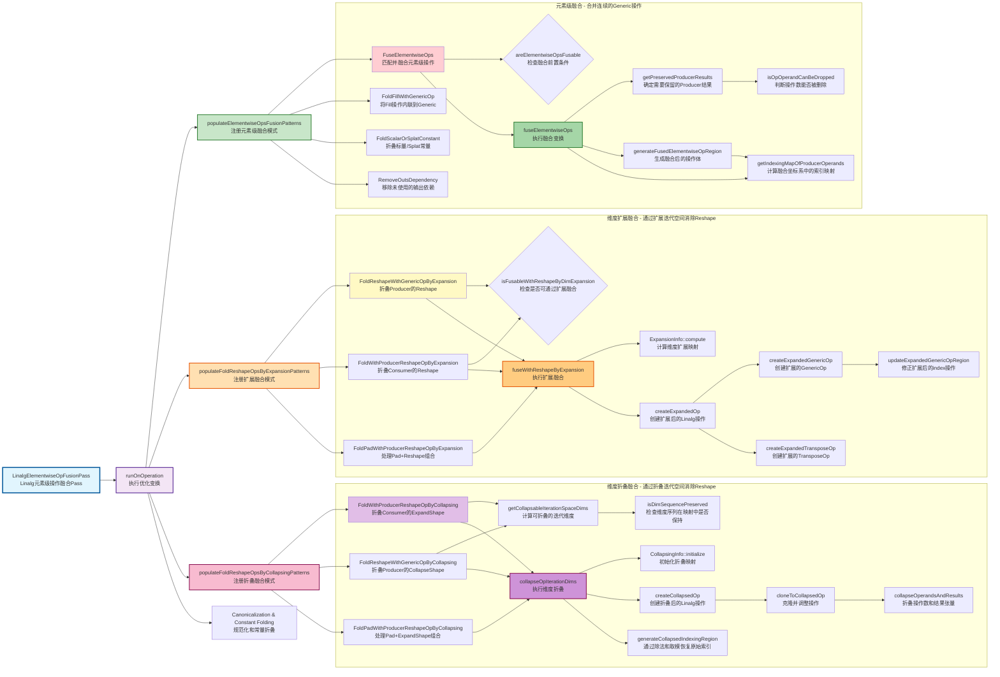

``` shell
./mlir-opt -h | grep linalg
```

通过此命令可以查看MLIR中关于linalg的所有Pass，本篇主要分析：`linalg-fuse-elementwise-ops`（[基于llvm 21.1.8版本](https://github.com/llvm/llvm-project/tree/llvmorg-21.1.8)）。

## 1. 介绍

### 1.1 代码介绍

`linalg-fuse-elementwise-ops`是 Linalg 中关于 Elementwise 类算子融合的优化 Pass。从源代码中全文检索此关键字，在`mlir/include/mlir/Dialect/Linalg/Passes.td:73`中找到了`LinalgElementwiseOpFusionPass`定义。定义非常简单，只声明了依赖的三种方言，如下：


继续检索`LinalgElementwiseOpFusionPass`关键字，在`mlir/lib/Dialect/Linalg/Transforms/ElementwiseOpFusion.cpp:2284`中找到了具体实现，代码如下：


该类继承自`LinalgElementwiseOpFusionPassBase`类，跳转进去后发现是使用 `mlir-tblgen`工具生成的代码，如下：


该类最重要的作用是实现了Pass机制中的虚函数`runOnOperation`，也就是该优化的核心功能，见上图中红框部分`populate`关键词开头的几个函数。

### 1.2 Pass核心流程图



## 2 重点功能分析

###  [【MLIR】Linalg中ElementwiseOpFusion的优化模式技术分析（一）](https://notlate.cn/blog/mlirlinalg-elementwiseopfusion-analysis)

### [【MLIR】Linalg中ElementwiseOpFusion的优化模式技术分析（二）](https://notlate.cn/blog/mlirlinalg-elementwiseopfusion-analysis-2)

### [【MLIR】Linalg中ElementwiseOpFusion的优化模式技术分析（三）](https://www.cnblogs.com/notlate-cn/articles/19500691)
