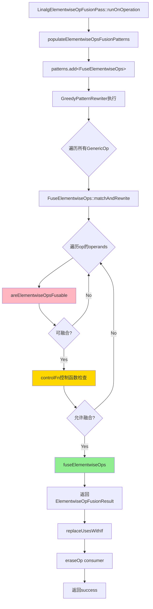
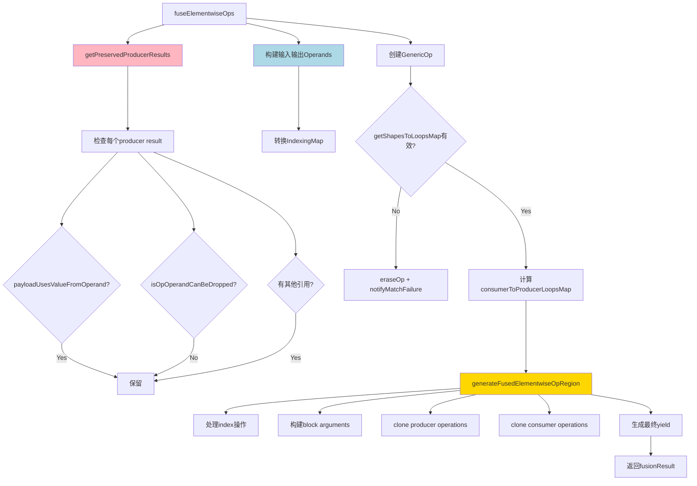
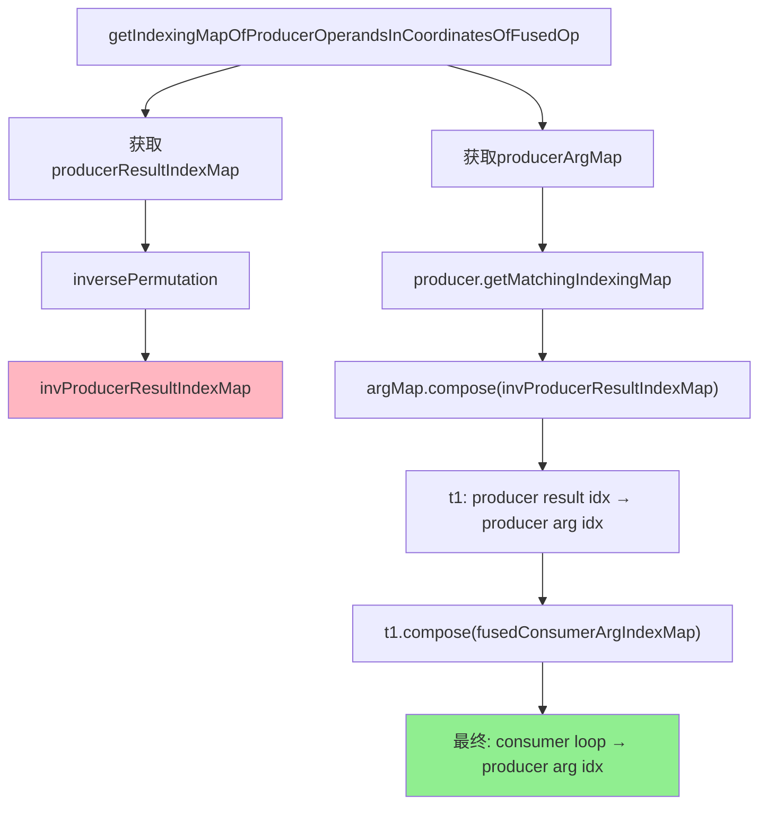
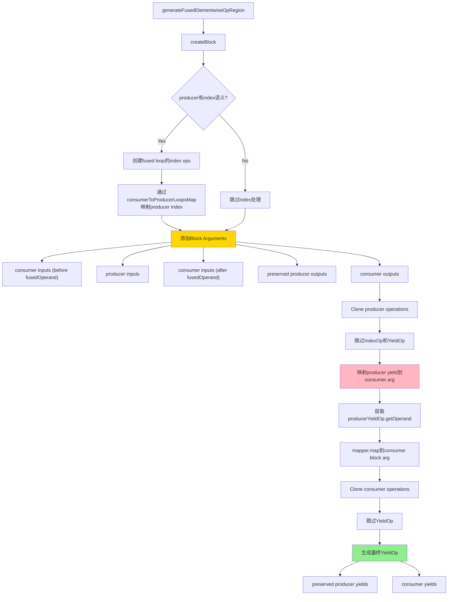

## 1 引言

在编译器优化中，**算子融合**（Operator Fusion）是一项关键技术，它通过合并多个连续的计算操作来减少中间结果的materialization，从而降低内存带宽需求并提升缓存利用率。MLIR的Linalg方言提供了强大的算子融合能力，其中`ElementwiseOpFusion.cpp`实现了element-wise操作的融合优化。

本文将深入剖析MLIR中`FuseElementwiseOps`的实现原理，包括完整的调用链、融合条件检查、算法实现细节以及丰富的测试用例。

### 1.1 为什么需要算子融合？

考虑以下计算：`result = (A + B) * C`

**未融合的实现**：

```text
%temp = linalg.generic ins(%A, %B) {  // 写入temp到内存
  %sum = arith.addf %a, %b
  linalg.yield %sum
}
%result = linalg.generic ins(%temp, %C) {  // 从内存读取temp
  %mul = arith.mulf %t, %c
  linalg.yield %mul
}
```

- 需要分配中间tensor `%temp`
- 两次内存往返：写入temp，再读取temp

**融合后的实现**：

```text
%result = linalg.generic ins(%A, %B, %C) {
  %sum = arith.addf %a, %b    // 直接在寄存器中
  %mul = arith.mulf %sum, %c  // 无需内存往返
  linalg.yield %mul
}
```

- 消除中间tensor
- 单次循环完成所有计算
- 更好的数据局部性

---

## 2. 整体架构

ElementwiseOpFusion的核心是将producer-consumer模式的两个`linalg.generic`操作合并为一个操作。

### 2.1 代码结构

| 文件         | 位置                                                         | 说明     |
| ------------ | ------------------------------------------------------------ | -------- |
| **实现文件** | `mlir/lib/Dialect/Linalg/Transforms/ElementwiseOpFusion.cpp` | 核心实现 |
| **头文件**   | `mlir/include/mlir/Dialect/Linalg/Transforms/Transforms.h`   | 接口定义 |
| **测试文件** | `mlir/test/Dialect/Linalg/fusion-elementwise-ops.mlir`       | 功能测试 |

### 2.2 核心组件

```cpp
// 1. Pattern类 - 匹配和重写
class FuseElementwiseOps : public OpRewritePattern<GenericOp>

// 2. 核心融合函数
FailureOr<ElementwiseOpFusionResult>
fuseElementwiseOps(RewriterBase &rewriter, OpOperand *fusedOperand)

// 3. 条件检查函数
bool areElementwiseOpsFusable(OpOperand *fusedOperand)

// 4. 辅助函数
llvm::SmallDenseSet<int> getPreservedProducerResults(...)
AffineMap getIndexingMapOfProducerOperandsInCoordinatesOfFusedOp(...)
void generateFusedElementwiseOpRegion(...)
```

---

## 3. 名词介绍

### 3.1 Producer（生产者）和 Consumer（消费者）

  这是数据流依赖关系中的两个角色：

#### 定义：

  - Producer（生产者）：产生数据的操作，其结果被其他操作使用
  - Consumer（消费者）：使用数据的操作，其输入来自其他操作的结果

#### 代码示例：

```cpp
// Producer: 计算 A + B，产生 %temp
  %temp = linalg.generic ins(%A, %B) outs(%out1) {
    ^bb0(%a: f32, %b: f32, %o: f32):
      %sum = arith.addf %a, %b : f32
      linalg.yield %sum : f32
  } -> tensor<?x?xf32>

  // Consumer: 使用 %temp 计算 %temp * C
  %result = linalg.generic ins(%temp, %C) outs(%out2) {
    ^bb0(%t: f32, %c: f32, %o: f32):
      %mul = arith.mulf %t, %c : f32
      linalg.yield %mul : f32
  } -> tensor<?x?xf32>
```

  在这个例子中：

  - Producer: 第一个linalg.generic，产生%temp
  - Consumer: 第二个linalg.generic，消费%temp
  - Fusion目标: 将两者合并，消除中间的%temp

  在代码中的体现：

```cpp
  // ElementwiseOpFusion.cpp:342-344
  auto producerResult = cast<OpResult>(fusedOperand->get());
  auto producer = cast<GenericOp>(producerResult.getOwner());
  auto consumer = cast<GenericOp>(fusedOperand->getOwner());
```

### 3.2 Iterator（迭代器）/ Iterator Types（迭代器类型）

#### 定义：描述循环如何遍历数据的类型，决定了数据的访问模式。

  三种主要类型：

| 迭代器类型 | 含义     | 特点                 | 示例                   |
| ---------- | -------- | -------------------- | ---------------------- |
| parallel   | 并行循环 | 迭代独立，可并行执行 | Element-wise操作的维度 |
| reduction  | 归约循环 | 累积计算，有依赖关系 | 求和、求最大值         |
| window     | 窗口循环 | 滑动窗口访问         | 卷积操作               |

#### 代码示例：

```cpp
// 示例1: 纯并行操作（Element-wise加法）
%result = linalg.generic {
  indexing_maps = [map0, map0, map0],
  iterator_types = ["parallel", "parallel"]  // 两个维度都是并行
  //                    d0         d1
} ins(%A, %B) outs(%C) {
  ^bb0(%a: f32, %b: f32, %out: f32):
    %sum = arith.addf %a, %b : f32
    linalg.yield %sum : f32
}

// 示例2: 带Reduction的操作（矩阵向量乘法）
%result = linalg.generic {
  indexing_maps = [
    affine_map<(i, j) -> (i, j)>,  // 矩阵 A[i,j]
    affine_map<(i, j) -> (j)>,     // 向量 x[j]
    affine_map<(i, j) -> (i)>      // 结果 y[i]
  ],
  iterator_types = ["parallel", "reduction"]
  //                 i维度并行   j维度归约
} ins(%A, %x) outs(%y) {
  ^bb0(%a: f32, %x_val: f32, %y_val: f32):
    %mul = arith.mulf %a, %x_val : f32
    %sum = arith.addf %y_val, %mul : f32  // y[i] += A[i,j] * x[j]
    linalg.yield %sum : f32
}

// 解释 iterator_types = ["parallel", "reduction"]:
for i in parallel:        // parallel: 每个i独立，可并行
  for j in reduction:     // reduction: j维度做累积
    result[i] += A[i,j] * x[j]
```

#### 为什么融合要求Producer是parallel？

```cpp
// ElementwiseOpFusion.cpp:159-160
if (producer.getNumParallelLoops() != producer.getNumLoops())
  return false;  // Producer包含reduction/window，不能融合
```

  原因：

  - Parallel操作：每个元素独立计算，可以安全地内联到consumer
  - Reduction操作：有累积依赖，融合会破坏语义  

反例（不能融合）：

```cpp
// Producer是reduction
%sum = linalg.generic {
  iterator_types = ["reduction"]  // 归约！
} ins(%A) outs(%init) {
  ^bb0(%a: f32, %acc: f32):
    %new_acc = arith.addf %acc, %a : f32
    linalg.yield %new_acc : f32
}

// Consumer是parallel
%result = linalg.generic {
  iterator_types = ["parallel"]
} ins(%sum) outs(%out) {
  // 无法融合！因为producer是reduction
}
```

### 3.3 Payload

#### 定义：Linalg操作的计算体（body），即Region内的实际计算逻辑（也就是^bb0块）。

在代码中的使用：

```cpp
// 检查payload是否使用了某个operand
// ElementwiseOpFusion.cpp:123
if (producer.payloadUsesValueFromOperand(outputOperand)) {
  // Payload内部使用了这个output operand
  preservedProducerResults.insert(producerResult.index());
}
```

#### 示例场景：

```cpp
// 普通情况：Payload不使用output operand
%result = linalg.generic ins(%A, %B) outs(%init) {
  ^bb0(%a: f32, %b: f32, %out: f32):
    //                    ^^^ output operand
    %sum = arith.addf %a, %b : f32
    linalg.yield %sum : f32  // 没有使用 %out
}

// 特殊情况：Payload使用output operand（累加）
%result = linalg.generic ins(%A) outs(%init) {
  ^bb0(%a: f32, %out: f32):
    //          ^^^ 这里被使用了
    %new = arith.addf %out, %a : f32
    linalg.yield %new : f32  // 使用了 %out
}
```

  Payload使用output的含义：

  - 通常用于累积操作或原地更新
  - 在融合时需要保留这个output，因为它参与计算

### 3.4 DPS (Destination Passing Style)

#### 定义：目标传递风格，结果写入预先分配的destination tensor

```cpp
%out = tensor.empty(...) : tensor<?x?xf32>  // 预先分配destination

%result = linalg.generic
  ins(%A, %B)      // 输入
  outs(%out)       // 目标（destination）
{
  ^bb0(%a, %b, %o: f32):
    %sum = arith.addf %a, %b : f32
    linalg.yield %sum : f32  // 写入到 %out
}
```

#### 相关API：

  - getDpsInputOperands(): 获取输入operands
  - getDpsInitOperand(): 获取初始化的destination operand
  - isDpsInput(): 检查是否是输入operand

```cpp
// ElementwiseOpFusion.cpp:164
if (!consumer.isDpsInput(fusedOperand))
  return false;  // 只融合输入operand的producer
```

### 3.5 IndexingMap（索引映射）

#### 定义：描述循环变量到tensor索引的映射关系

```cpp
#map0 = affine_map<(d0, d1) -> (d0, d1)>      // Identity
#map1 = affine_map<(d0, d1) -> (d1, d0)>      // Transpose
#map2 = affine_map<(d0, d1) -> (d0)>          // Broadcast on d1
#map3 = affine_map<(d0, d1) -> ()>            // Scalar

linalg.generic {
  indexing_maps = [#map0, #map1, #map0]
  //              ^^^^^^^^^^^^^^^^^^^^^^
  //              每个operand如何访问
} ins(%A, %B) outs(%C)
```

#### 含义：

  对于循环 (d0=2, d1=3):

  - \#map0: 访问 A[2, 3]
  - \#map1: 访问 B[3, 2]  (转置)
  - \#map0: 写入 C[2, 3]

### 3.6 Operand vs BlockArgument

* Operand（操作数）：操作的输入/输出值
* BlockArgument（块参数）：Region内部的参数

```cpp
%result = linalg.generic
    ins(%A, %B)              // <- Operands
    outs(%C)                 // <- Operand
{
  ^bb0(%a, %b, %out):      // <- BlockArguments
  //   ^^^^^^^^^^^^
  //对应 %A, %B, %C
  %sum = arith.addf %a, %b : f32
	linalg.yield %sum : f32
}
```

#### 映射关系：

  Operands → BlockArguments
  %A             → %a
  %B             → %b
  %C             → %out

### 3.7 融合中的术语应用实例

场景：融合Add和Mul操作

```cpp
// ============= 融合前 =============

// Producer (并行迭代器)
%temp = linalg.generic {
  indexing_maps = [#map0, #map0, #map0],
  iterator_types = ["parallel", "parallel"]  // ← 迭代器类型
} ins(%A, %B) outs(%init1) {              // ← DPS: outs是destination
  // ↓ Payload开始
  ^bb0(%a: f32, %b: f32, %out: f32):      // ← BlockArguments
    %sum = arith.addf %a, %b : f32
    linalg.yield %sum : f32
  // ↑ Payload结束
} -> tensor<?x?xf32>

// Consumer
%result = linalg.generic {
  indexing_maps = [#map0, #map0, #map0],
  iterator_types = ["parallel", "parallel"]
} ins(%temp, %C) outs(%init2) {
  //  ^^^^^ 这个operand的定义op是producer
  ^bb0(%t: f32, %c: f32, %out: f32):
    %mul = arith.mulf %t, %c : f32
    linalg.yield %mul : f32
}

// ============= 融合后 =============

%result = linalg.generic {
  indexing_maps = [#map0, #map0, #map0, #map0],
  iterator_types = ["parallel", "parallel"]
} ins(%A, %B, %C) outs(%init2) {
  ^bb0(%a: f32, %b: f32, %c: f32, %out: f32):
    // Producer的Payload
    %sum = arith.addf %a, %b : f32
    // Consumer的Payload
    %mul = arith.mulf %sum, %c : f32
    linalg.yield %mul : f32
}
```

### 3.8 总结对照表

| 术语           | 英文                      | 中文释义     | 作用域     | 代码位置                  |
| -------------- | ------------------------- | ------------ | ---------- | ------------------------- |
| Producer       | Producer                  | 生产者操作   | 数据流     | 产生被fusion的结果        |
| Consumer       | Consumer                  | 消费者操作   | 数据流     | 使用producer的结果        |
| Iterator Types | Iterator Types            | 迭代器类型   | 循环语义   | parallel/reduction/window |
| Payload        | Payload                   | 计算载荷     | Region内部 | ^bb0(...) 的body          |
| IndexingMap    | Indexing Map              | 索引映射     | 数据访问   | 循环变量→tensor索引       |
| Operand        | Operand                   | 操作数       | 操作级别   | ins(...) outs(...)        |
| BlockArgument  | Block Argument            | 块参数       | Region级别 | ^bb0(%a, %b, ...)         |
| DPS            | Destination Passing Style | 目标传递风格 | 设计模式   | 结果写入outs              |

## 4. 调用链分析

### 4.1 顶层Pass调用流程



#### ControlFn控制函数设计

```cpp
// 默认控制策略：只融合单引用的producer
ControlFusionFn defaultControlFn = [](OpOperand *fusedOperand) {
  Operation *producer = fusedOperand->get().getDefiningOp();
  return producer && producer->hasOneUse();
};

// 用户可自定义策略
populateElementwiseOpsFusionPatterns(patterns, customControlFn);
```

### 4.2 fuseElementwiseOps详细流程



### 4.3 IndexingMap转换流程



**数学表示**：

```
fusedArgMap = producerArgMap ∘ invProducerResultMap ∘ consumerArgMap

其中:
- producerArgMap:        producer loop → producer arg tensor index
- invProducerResultMap:  producer result tensor index → producer loop
- consumerArgMap:        consumer loop → producer result tensor index
- fusedArgMap:           consumer loop (= fused loop) → producer arg tensor index
```

---

## 5. 融合条件详解

### 5.1 基本类型检查

| 检查项           | 条件                     | 代码位置                      | 失败后果                                                     |
| ---------------- | ------------------------ | ----------------------------- | ------------------------------------------------------------ |
| **Producer类型** | 必须是`GenericOp`        | `ElementwiseOpFusion.cpp:143` | 返回false，不融合                                            |
| **Consumer类型** | 必须是`GenericOp`        | `ElementwiseOpFusion.cpp:144` | 返回false，不融合                                            |
| **Producer语义** | 必须是纯tensor语义       | `ElementwiseOpFusion.cpp:153` | 避免memref别名问题，详细参考 [Tensor vs Memref](https://notlate.cn/blog/mlirtensor-vs-memref) |
| **Operand类型**  | 必须是`RankedTensorType` | `ElementwiseOpFusion.cpp:154` | 需要静态形状信息                                             |

```cpp
// 代码示例
bool areElementwiseOpsFusable(OpOperand *fusedOperand) {
  auto producer = fusedOperand->get().getDefiningOp<GenericOp>();
  auto consumer = dyn_cast<GenericOp>(fusedOperand->getOwner());

  if (!producer || !consumer)
    return false;

  if (!producer.hasPureTensorSemantics() ||
      !isa<RankedTensorType>(fusedOperand->get().getType()))
    return false;

  // ... 更多检查
}
```

### 5.2 迭代器和Operand检查

| 检查项              | 条件                                                         | 代码位置                      | 原因                                                         |
| ------------------- | ------------------------------------------------------------ | ----------------------------- | ------------------------------------------------------------ |
| **迭代器类型**      | Producer所有循环必须是`parallel`                             | `ElementwiseOpFusion.cpp:159` | Reduction/window循环无法简单融合                             |
| **Operand位置**     | 只能融合input operand的producer                              | `ElementwiseOpFusion.cpp:164` | Output operand融合需要特殊处理？                             |
| **IndexingMap维度** | `consumerIndexMap.getNumResults() == producer.getNumLoops()` | `ElementwiseOpFusion.cpp:170` | 确保维度匹配                                                 |
| **可逆性**          | Producer result map必须是permutation                         | `ElementwiseOpFusion.cpp:177` | 需要计算inverse map，详细参考[Permutation是什么？](https://notlate.cn/blog/mlirlinalg-producer-indexing-map-permutation-analysis) |

```cpp
// 迭代器类型检查
if (producer.getNumParallelLoops() != producer.getNumLoops())
  return false;  // 包含reduction/window循环，不能融合

// Operand位置检查
if (!consumer.isDpsInput(fusedOperand))
  return false;  // TODO: 支持output operand融合

// IndexingMap检查
AffineMap consumerIndexMap = consumer.getMatchingIndexingMap(fusedOperand);
if (consumerIndexMap.getNumResults() != producer.getNumLoops())
  return false;

// 可逆性检查
AffineMap producerResultIndexMap =
    producer.getMatchingIndexingMap(producer.getDpsInitOperand(0));
if (!producerResultIndexMap.isPermutation())
  return false;
```

### 5.3 Reduction特殊处理

当consumer包含reduction循环时，需要确保融合后每个循环维度都能被计算：

```cpp
if (consumer.getNumReductionLoops()) {
  BitVector coveredDims(consumer.getNumLoops(), false);

  // 标记consumer其他operands覆盖的维度
  for (auto pair : llvm::zip(consumer->getOperands(),
                             consumer.getIndexingMapsArray())) {
    Value operand = std::get<0>(pair);
    if (operand == fusedOperand->get())
      continue;
    AffineMap operandMap = std::get<1>(pair);
    for (auto result : operandMap.getResults())
      if (auto dimExpr = dyn_cast<AffineDimExpr>(result))
        coveredDims[dimExpr.getPosition()] = true;
  }

  // 标记producer inputs覆盖的维度
  for (OpOperand *operand : producer.getDpsInputOperands()) {
    AffineMap newIndexingMap =
        getIndexingMapOfProducerOperandsInCoordinatesOfFusedOp(
            operand, producerResultIndexMap, consumerIndexMap);
    for (auto result : newIndexingMap.getResults())
      if (auto dimExpr = dyn_cast<AffineDimExpr>(result))
        coveredDims[dimExpr.getPosition()] = true;
  }

  // 所有维度必须被覆盖
  if (!coveredDims.all())
    return false;
}
```

**示例场景**：

```text
// Producer: elementwise
%0 = linalg.generic {
  indexing_maps = [map<(d0, d1) -> (d0, d1)>, map<(d0, d1) -> (d0, d1)>],
  iterator_types = ["parallel", "parallel"]
} ins(%a, %b) -> tensor<1x10xf32>

// Consumer: reduction
%1 = linalg.generic {
  indexing_maps = [map<(d0) -> (0, d0)>, map<(d0) -> (0)>],
  iterator_types = ["reduction"]  // d0是reduction
} ins(%0) -> tensor<1xf32>

// 融合后，需要确保reduction维度d0有输入定义
```

### 5.4 Producer结果保留判定

| 保留条件        | 检查方法                                              | 代码位置                          | 说明                         |
| --------------- | ----------------------------------------------------- | --------------------------------- | ---------------------------- |
| **Payload使用** | `producer.payloadUsesValueFromOperand(outputOperand)` | `ElementwiseOpFusion.cpp:123`     | Body内部使用了output（罕见） |
| **Bounds计算**  | `!isOpOperandCanBeDroppedAfterFusedLinalgs(...)`      | `ElementwiseOpFusion.cpp:124`     | 删除会无法推断loop bounds    |
| **多引用**      | 除consumer外还有其他引用                              | `ElementwiseOpFusion.cpp:126-128` | 结果被其他op使用             |

```cpp
llvm::SmallDenseSet<int> getPreservedProducerResults(
    GenericOp producer, GenericOp consumer, OpOperand *fusedOperand) {
  llvm::SmallDenseSet<int> preservedProducerResults;
  llvm::SmallVector<OpOperand *> opOperandsToIgnore;

  opOperandsToIgnore.emplace_back(fusedOperand);

  for (const auto &producerResult : llvm::enumerate(producer->getResults())) {
    auto *outputOperand = producer.getDpsInitOperand(producerResult.index());
    opOperandsToIgnore.emplace_back(outputOperand);

    if (producer.payloadUsesValueFromOperand(outputOperand) ||
        !isOpOperandCanBeDroppedAfterFusedLinalgs(
            producer, consumer, opOperandsToIgnore) ||
        llvm::any_of(producerResult.value().getUsers(),
                     [&](Operation *user) {
          return user != consumer.getOperation();
        })) {
      preservedProducerResults.insert(producerResult.index());
      (void)opOperandsToIgnore.pop_back_val();
    }
  }
  return preservedProducerResults;
}
```

---

## 6. 融合算法实现

### 6.1 Operands和IndexingMaps构建顺序

融合后的operands按照特定顺序组织，确保正确性：

| 顺序  | 来源                               | IndexingMap处理   | 代码位置                          |
| ----- | ---------------------------------- | ----------------- | --------------------------------- |
| **1** | Consumer inputs (fusedOperand之前) | 保持原map         | `ElementwiseOpFusion.cpp:373-376` |
| **2** | Producer所有inputs                 | 转换到fused坐标系 | `ElementwiseOpFusion.cpp:380-387` |
| **3** | Consumer inputs (fusedOperand之后) | 保持原map         | `ElementwiseOpFusion.cpp:390-394` |
| **4** | Producer保留的outputs              | 转换到fused坐标系 | `ElementwiseOpFusion.cpp:397-407` |
| **5** | Consumer所有outputs                | 保持原map         | `ElementwiseOpFusion.cpp:410-416` |

**代码实现**：

```cpp
SmallVector<Value> fusedInputOperands;
SmallVector<AffineMap> fusedIndexMaps;

// 1. Consumer inputs before fusedOperand
auto consumerInputs = consumer.getDpsInputOperands();
auto *it = llvm::find_if(consumerInputs,
    [&](OpOperand *op) { return op == fusedOperand; });

for (OpOperand *opOperand : llvm::make_range(consumerInputs.begin(), it)) {
  fusedInputOperands.push_back(opOperand->get());
  fusedIndexMaps.push_back(consumer.getMatchingIndexingMap(opOperand));
}

// 2. Producer inputs
AffineMap producerResultIndexMap =
    producer.getIndexingMapMatchingResult(producerResult);
for (OpOperand *opOperand : producer.getDpsInputOperands()) {
  fusedInputOperands.push_back(opOperand->get());
  AffineMap map = getIndexingMapOfProducerOperandsInCoordinatesOfFusedOp(
      opOperand, producerResultIndexMap,
      consumer.getMatchingIndexingMap(fusedOperand));
  fusedIndexMaps.push_back(map);
}

// 3. Consumer remaining inputs
for (OpOperand *opOperand : llvm::make_range(std::next(it), consumerInputs.end())) {
  fusedInputOperands.push_back(opOperand->get());
  fusedIndexMaps.push_back(consumer.getMatchingIndexingMap(opOperand));
}

// 4. Preserved producer outputs
for (const auto &opOperand : llvm::enumerate(producer.getDpsInitsMutable())) {
  if (!preservedProducerResults.count(opOperand.index()))
    continue;
  fusedOutputOperands.push_back(opOperand.value().get());
  AffineMap map = getIndexingMapOfProducerOperandsInCoordinatesOfFusedOp(
      &opOperand.value(), producerResultIndexMap,
      consumer.getMatchingIndexingMap(fusedOperand));
  fusedIndexMaps.push_back(map);
  fusedResultTypes.push_back(opOperand.value().get().getType());
}

// 5. Consumer outputs
for (OpOperand &opOperand : consumer.getDpsInitsMutable()) {
  fusedOutputOperands.push_back(opOperand.get());
  fusedIndexMaps.push_back(consumer.getMatchingIndexingMap(&opOperand));
  Type resultType = opOperand.get().getType();
  if (!isa<MemRefType>(resultType))
    fusedResultTypes.push_back(resultType);
}
```

### 6.2 Region生成详解

`generateFusedElementwiseOpRegion`函数负责生成融合后操作的body：



**关键步骤**：

#### 6.2.1 处理Index操作

```cpp
if (producer.hasIndexSemantics()) {
  unsigned numFusedOpLoops = fusedOp.getNumLoops();
  SmallVector<Value> fusedIndices;

  // 为每个fused loop创建index操作
  llvm::transform(llvm::seq<uint64_t>(0, numFusedOpLoops),
                  std::back_inserter(fusedIndices), [&](uint64_t dim) {
    return rewriter.create<IndexOp>(producer.getLoc(), dim);
  });

  // 映射producer的index操作
  for (IndexOp indexOp : producerBlock.getOps<IndexOp>()) {
    Value newIndex = rewriter.create<affine::AffineApplyOp>(
        producer.getLoc(),
        consumerToProducerLoopsMap.getSubMap(indexOp.getDim()),
        fusedIndices);
    mapper.map(indexOp.getResult(), newIndex);
  }
}
```

**为什么需要映射index？**

考虑producer有转置的情况：

```text
// Producer: indexing_map = (d0, d1) -> (d1, d0) [转置]
%p = linalg.generic {
  ^bb0(%in, %out):
    %idx0 = linalg.index 0  // producer的loop维度0
    %idx1 = linalg.index 1  // producer的loop维度1
    // ...
}

// Consumer: indexing_map = (d0, d1) -> (d0, d1)
%c = linalg.generic ins(%p) {
  ^bb0(%val, %out):
    // ...
}
```

融合后，producer的index需要重映射：

```
consumerToProducerLoopsMap = invProducerResultIndexMap ∘ consumerResultIndexMap

如果producer result map是 (d0, d1) -> (d1, d0)，则：
invProducerResultIndexMap = (r0, r1) -> (r1, r0)

如果consumer使用了identity map，则：
consumerResultIndexMap = (d0, d1) -> (d0, d1)

所以：
consumerToProducerLoopsMap = (d0, d1) -> (d1, d0)

融合后，producer的index 0对应consumer的index 1！
```

#### 6.2.2 构建Block Arguments

```cpp
// 顺序与operands一致
// 1. Consumer inputs before fusedOperand
for (BlockArgument bbArg : consumerBlock.getArguments().take_front(
         fusedOperand->getOperandNumber()))
  mapper.map(bbArg, fusedBlock->addArgument(bbArg.getType(), bbArg.getLoc()));

// 2. Producer inputs
for (BlockArgument bbArg :
     producerBlock.getArguments().take_front(producer.getNumDpsInputs()))
  mapper.map(bbArg, fusedBlock->addArgument(bbArg.getType(), bbArg.getLoc()));

// 3. Consumer remaining inputs
for (BlockArgument bbArg :
     consumerBlock.getArguments()
         .take_front(consumer.getNumDpsInputs())
         .drop_front(fusedOperand->getOperandNumber() + 1))
  mapper.map(bbArg, fusedBlock->addArgument(bbArg.getType(), bbArg.getLoc()));

// 4. Preserved producer outputs
for (const auto &bbArg : llvm::enumerate(
         producerBlock.getArguments().take_back(producer.getNumDpsInits()))) {
  if (!preservedProducerResults.count(bbArg.index()))
    continue;
  mapper.map(bbArg.value(),
             fusedBlock->addArgument(bbArg.value().getType(),
                                    bbArg.value().getLoc()));
}

// 5. Consumer outputs
for (BlockArgument bbArg :
     consumerBlock.getArguments().take_back(consumer.getNumDpsInits()))
  mapper.map(bbArg, fusedBlock->addArgument(bbArg.getType(), bbArg.getLoc()));
```

#### 6.2.3 Clone操作

```cpp
// Clone producer operations (除了yield和index)
for (auto &op : producerBlock.without_terminator()) {
  if (!isa<IndexOp>(op))
    rewriter.clone(op, mapper);
}

// 映射producer yield到consumer的对应参数
auto producerYieldOp = cast<linalg::YieldOp>(producerBlock.getTerminator());
unsigned producerResultNumber =
    cast<OpResult>(fusedOperand->get()).getResultNumber();
Value replacement =
    mapper.lookupOrDefault(producerYieldOp.getOperand(producerResultNumber));

mapper.map(consumerBlock.getArgument(fusedOperand->getOperandNumber()),
           replacement);

// Clone consumer operations
for (auto &op : consumerBlock.without_terminator())
  rewriter.clone(op, mapper);

// 生成最终yield
SmallVector<Value> fusedYieldValues;
for (const auto &producerYieldVal :
     llvm::enumerate(producerYieldOp.getOperands())) {
  if (preservedProducerResults.count(producerYieldVal.index()))
    fusedYieldValues.push_back(
        mapper.lookupOrDefault(producerYieldVal.value()));
}
for (auto consumerYieldVal : consumerYieldOp.getOperands())
  fusedYieldValues.push_back(mapper.lookupOrDefault(consumerYieldVal));

rewriter.create<YieldOp>(fusedOp.getLoc(), fusedYieldValues);
```

### 6.3 结果替换和清理

```cpp
// 在matchAndRewrite中
FailureOr<ElementwiseOpFusionResult> fusionResult =
    fuseElementwiseOps(rewriter, &opOperand);

if (failed(fusionResult))
  return rewriter.notifyMatchFailure(genericOp, "fusion failed");

// 替换uses（除了producer自身）
for (auto [origVal, replacement] : fusionResult->replacements) {
  rewriter.replaceUsesWithIf(origVal, replacement, [&](OpOperand &use) {
    return use.get().getDefiningOp() != producer;
  });
}

// 删除原consumer
rewriter.eraseOp(genericOp);
return success();
```

---

## 7. 测试用例详解

### 7.1 基本融合：Add + Mul

**测试文件**: `fusion-elementwise-ops.mlir:6-39`

```text
// 融合前
func.func @add_mul_fusion(%arg0, %arg1, %arg2: tensor<?x?xf32>)
    -> tensor<?x?xf32> {
  %c0 = arith.constant 0 : index
  %c1 = arith.constant 1 : index
  %0 = tensor.dim %arg0, %c0 : tensor<?x?xf32>
  %1 = tensor.dim %arg0, %c1 : tensor<?x?xf32>
  %2 = tensor.empty(%0, %1) : tensor<?x?xf32>

  // Producer: arg0 + arg1
  %3 = linalg.generic {
    indexing_maps = [#map0, #map0, #map0],
    iterator_types = ["parallel", "parallel"]
  } ins(%arg0, %arg1) outs(%2) {
    ^bb0(%a: f32, %b: f32, %out: f32):
      %sum = arith.addf %a, %b : f32
      linalg.yield %sum : f32
  } -> tensor<?x?xf32>

  // Consumer: %3 * arg2
  %4 = linalg.generic {
    indexing_maps = [#map0, #map0, #map0],
    iterator_types = ["parallel", "parallel"]
  } ins(%3, %arg2) outs(%2) {
    ^bb0(%val: f32, %c: f32, %out: f32):
      %mul = arith.mulf %val, %c : f32
      linalg.yield %mul : f32
  } -> tensor<?x?xf32>

  return %4 : tensor<?x?xf32>
}
```

**融合后**：

```text
// CHECK: linalg.generic {
// CHECK-SAME: indexing_maps = [[$MAP0]], [[$MAP0]], [[$MAP0]], [[$MAP0]]
// CHECK: ^bb0(%[[ARG0]], %[[ARG1]], %[[ARG2]]: f32, %[[OUT]]: f32):
// CHECK:   %[[T1]] = arith.addf %[[ARG0]], %[[ARG1]]
// CHECK:   %[[T2]] = arith.mulf %[[T1]], %[[ARG2]]
// CHECK:   linalg.yield %[[T2]]
```

**分析**：

- **操作数变化**: 2个generic → 1个generic
- **输入数量**: 2+2 → 3（消除中间结果%3）
- **IndexingMap**: 全部保持identity map
- **性能提升**: 消除中间tensor，减少一次内存往返

### 7.2 标量Broadcast融合

**测试文件**: `fusion-elementwise-ops.mlir:48-81`

```text
// 融合前
#map0 = affine_map<(d0, d1) -> (d0, d1)>
#map1 = affine_map<(d0, d1) -> ()>  // 标量

func.func @scalar_add_mul_fusion(%arg0: tensor<?x?xf32>,
                                  %arg1: f32,
                                  %arg2: f32) -> tensor<?x?xf32> {
  %2 = tensor.empty(%0, %1) : tensor<?x?xf32>

  // Producer: tensor + scalar
  %3 = linalg.generic {
    indexing_maps = [#map0, #map1, #map0],
    iterator_types = ["parallel", "parallel"]
  } ins(%arg0, %arg1: tensor<?x?xf32>, f32) outs(%2) {
    ^bb0(%a: f32, %scalar: f32, %out: f32):
      %sum = arith.addf %a, %scalar : f32
      linalg.yield %sum : f32
  } -> tensor<?x?xf32>

  // Consumer: result * scalar
  %4 = linalg.generic {
    indexing_maps = [#map0, #map1, #map0],
    iterator_types = ["parallel", "parallel"]
  } ins(%3, %arg2: tensor<?x?xf32>, f32) outs(%2) {
    ^bb0(%val: f32, %scalar: f32, %out: f32):
      %mul = arith.mulf %val, %scalar : f32
      linalg.yield %mul : f32
  } -> tensor<?x?xf32>

  return %4 : tensor<?x?xf32>
}
```

**融合后**：

```text
// CHECK: linalg.generic {
// CHECK-SAME: indexing_maps = [[$MAP0]], [[$MAP1]], [[$MAP1]], [[$MAP0]]
// CHECK: ^bb0(%[[ARG3]], %[[ARG4]], %[[ARG5]]: f32, %[[OUT]]: f32):
// CHECK:   %[[T1]] = arith.addf %[[ARG3]], %[[ARG4]]
// CHECK:   %[[T2]] = arith.mulf %[[T1]], %[[ARG5]]
// CHECK:   linalg.yield %[[T2]]
```

**关键点**：

- 标量使用`affine_map<(d0, d1) -> ()`表示
- 融合保留了标量的broadcasting语义
- 两个标量被正确映射到fused op

### 7.3 Transpose + Fusion

**测试文件**: `fusion-elementwise-ops.mlir:90-115`

```text
// 融合前
#map0 = affine_map<(d0, d1) -> (d0, d1)>
#map1 = affine_map<(d0, d1) -> (d1, d0)>  // 转置

func.func @transpose_add_mul_fusion(%arg0, %arg1, %arg2: tensor<?x?xf32>)
    -> tensor<?x?xf32> {
  %2 = tensor.empty(%0, %1) : tensor<?x?xf32>

  // Producer: arg0 + transpose(arg1)
  %3 = linalg.generic {
    indexing_maps = [#map0, #map1, #map0],
    iterator_types = ["parallel", "parallel"]
  } ins(%arg0, %arg1) outs(%2) {
    ^bb0(%a: f32, %b: f32, %out: f32):
      %sum = arith.addf %a, %b : f32
      linalg.yield %sum : f32
  } -> tensor<?x?xf32>

  // Consumer: %3 * arg2
  %4 = linalg.generic {
    indexing_maps = [#map0, #map0, #map0],
    iterator_types = ["parallel", "parallel"]
  } ins(%3, %arg2) outs(%2) {
    ^bb0(%val: f32, %c: f32, %out: f32):
      %mul = arith.mulf %val, %c : f32
      linalg.yield %mul : f32
  } -> tensor<?x?xf32>

  return %4 : tensor<?x?xf32>
}
```

**融合后**：

```text
// CHECK: linalg.generic {
// CHECK-SAME: indexing_maps = [[$MAP0]], [[$MAP1]], [[$MAP0]], [[$MAP0]]
// CHECK: ^bb0(%[[A0]], %[[A1]], %[[A2]]: f32, %[[OUT]]: f32):
// CHECK:   %[[T1]] = arith.addf %[[A0]], %[[A1]]
// CHECK:   %[[T2]] = arith.mulf %[[T1]], %[[A2]]
// CHECK:   linalg.yield %[[T2]]
```

**IndexingMap转换**：

- `arg0`: `#map0` → `#map0` (保持)
- `arg1`: `#map1` → `#map1` (转置保留！)
- `arg2`: `#map0` → `#map0` (保持)

**关键洞察**：
融合算法正确保留了arg1的转置语义，通过`getIndexingMapOfProducerOperandsInCoordinatesOfFusedOp`计算。

### 7.4 维度Broadcast融合

**测试文件**: `fusion-elementwise-ops.mlir:159-185`

```text
// 融合前
#map1 = affine_map<(d0, d1) -> (d0)>     // 1D
#map0 = affine_map<(d0, d1) -> (d0, d1)> // 2D
#map2 = affine_map<(d0) -> (d0)>         // 1D

func.func @add_broadcast_mul_fusion(%arg0, %arg1: tensor<?xf32>,
                                     %arg2: tensor<?x?xf32>)
    -> tensor<?x?xf32> {
  %0 = tensor.dim %arg0, %c0 : tensor<?xf32>
  %1 = tensor.empty(%0) : tensor<?xf32>

  // Producer: 1D + 1D
  %2 = linalg.generic {
    indexing_maps = [#map2, #map2, #map2],
    iterator_types = ["parallel"]
  } ins(%arg0, %arg1) outs(%1) {
    ^bb0(%a: f32, %b: f32, %out: f32):
      %sum = arith.addf %a, %b : f32
      linalg.yield %sum : f32
  } -> tensor<?xf32>

  %3 = tensor.dim %arg2, %c1 : tensor<?x?xf32>
  %4 = tensor.empty(%0, %3) : tensor<?x?xf32>

  // Consumer: broadcast 1D → 2D, then multiply
  %5 = linalg.generic {
    indexing_maps = [#map1, #map0, #map0],  // %2被broadcast
    iterator_types = ["parallel", "parallel"]
  } ins(%2, %arg2) outs(%4) {
    ^bb0(%val: f32, %c: f32, %out: f32):
      %mul = arith.mulf %val, %c : f32
      linalg.yield %mul : f32
  } -> tensor<?x?xf32>

  return %5 : tensor<?x?xf32>
}
```

**融合后**：

```text
// CHECK: linalg.generic {
// CHECK-SAME: indexing_maps = [[$MAP1]], [[$MAP1]], [[$MAP0]], [[$MAP0]]
// CHECK: ^bb0(%[[A0]], %[[A1]]: f32, %[[A2]]: f32, %[[OUT]]: f32):
// CHECK:   %[[T1]] = arith.addf %[[A0]], %[[A1]]
// CHECK:   %[[T2]] = arith.mulf %[[T1]], %[[A2]]
// CHECK:   linalg.yield %[[T2]]
```

**IndexingMap转换详解**：

```
Producer的1D操作: (d0) -> (d0)
需要转换到Consumer的2D空间: (d0, d1) -> (d0)

步骤：
1. producerResultIndexMap = (d0) -> (d0)
2. invProducerResultIndexMap = (r0) -> (r0)  [identity的inverse还是identity]
3. consumerArgIndexMap = (d0, d1) -> (d0)    [consumer如何访问producer result]
4. producerArgMap = (d0) -> (d0)             [producer如何访问自己的arg]

fusedMap = producerArgMap ∘ invProducerResultIndexMap ∘ consumerArgIndexMap
         = (d0) -> (d0) ∘ (r0) -> (r0) ∘ (d0, d1) -> (d0)
         = (d0, d1) -> (d0)

结果：正确地将1D操作broadcast到2D空间！
```

### 7.5 Index操作融合

**测试文件**: `fusion-elementwise-ops.mlir:283-330`

```text
// 融合前
#map0 = affine_map<(d0, d1) -> (d0, d1)>

func.func @producer_indexed_consumer_fusion(%arg0, %arg1: tensor<?x?xi32>)
    -> tensor<?x?xi32> {
  %2 = tensor.empty(%0, %1) : tensor<?x?xi32>

  // Producer: 普通add
  %3 = linalg.generic {
    indexing_maps = [#map0, #map0, #map0],
    iterator_types = ["parallel", "parallel"]
  } ins(%arg0, %arg1) outs(%2) {
    ^bb0(%a: i32, %b: i32, %out: i32):
      %sum = arith.addi %a, %b : i32
      linalg.yield %sum : i32
  } -> tensor<?x?xi32>

  // Consumer: 使用linalg.index
  %4 = linalg.generic {
    indexing_maps = [#map0, #map0],
    iterator_types = ["parallel", "parallel"]
  } ins(%3) outs(%2) {
    ^bb0(%val: i32, %out: i32):
      %idx0 = linalg.index 0 : index  // 获取当前循环索引
      %idx1 = linalg.index 1 : index
      %i0 = arith.index_cast %idx0 : index to i32
      %i1 = arith.index_cast %idx1 : index to i32
      %t1 = arith.addi %val, %i0 : i32
      %t2 = arith.subi %t1, %i1 : i32
      linalg.yield %t2 : i32
  } -> tensor<?x?xi32>

  return %4 : tensor<?x?xi32>
}
```

**融合后**：

```text
// CHECK: linalg.generic {
// CHECK-SAME: indexing_maps = [[$MAP0]], [[$MAP0]], [[$MAP0]]
// CHECK: ^bb0(%[[ARG0]], %[[ARG1]]: i32, %[[OUT]]: i32):
// CHECK:   %[[VAL1]] = arith.addi %[[ARG0]], %[[ARG1]] : i32
// CHECK:   %[[IDX0]] = linalg.index 0 : index
// CHECK:   %[[IDX1]] = linalg.index 1 : index
// CHECK:   %[[ADD_OP]] = arith.index_cast %[[IDX0]] : index to i32
// CHECK:   %[[SUB_OP]] = arith.index_cast %[[IDX1]] : index to i32
// CHECK:   %[[VAL2]] = arith.addi %[[VAL1]], %[[ADD_OP]] : i32
// CHECK:   %[[VAL3]] = arith.subi %[[VAL2]], %[[SUB_OP]] : i32
// CHECK:   linalg.yield %[[VAL3]] : i32
```

**关键点**：

- Consumer的`linalg.index`操作被正确保留
- 因为producer没有转置，index映射是identity
- 融合后index仍然正确引用fused loop的维度

### 7.6 复杂Index + Transpose融合

**测试文件**: `fusion-elementwise-ops.mlir:388-444`

这是最复杂的测试案例，同时涉及：

- Producer使用index
- Producer输出被转置
- Consumer也使用index

```text
// 融合前
#map0 = affine_map<(d0, d1) -> (d1, d0)>  // 转置
#map1 = affine_map<(d0, d1) -> (d0, d1)>

func.func @indexed_producer_indexed_consumer_fusion(%arg0: tensor<?x?xi32>)
    -> tensor<?x?xi32> {
  %2 = tensor.empty(%0, %1) : tensor<?x?xi32>

  // Producer: 使用index，输出被转置
  %3 = linalg.generic {
    indexing_maps = [#map0, #map0],  // 转置！
    iterator_types = ["parallel", "parallel"]
  } ins(%arg0) outs(%2) {
    ^bb0(%in: i32, %out: i32):
      %idx0 = linalg.index 0 : index  // 在producer loop空间
      %idx1 = linalg.index 1 : index
      %i0 = arith.index_cast %idx0 : index to i32
      %i1 = arith.index_cast %idx1 : index to i32
      %t1 = arith.addi %in, %i0 : i32
      %t2 = arith.subi %i1, %t1 : i32  // 注意：subi(i1, ...)
      linalg.yield %t2 : i32
  } -> tensor<?x?xi32>

  // Consumer: identity map，也使用index
  %4 = linalg.generic {
    indexing_maps = [#map1, #map1],
    iterator_types = ["parallel", "parallel"]
  } ins(%3) outs(%2) {
    ^bb0(%val: i32, %out: i32):
      %idx0 = linalg.index 0 : index
      %idx1 = linalg.index 1 : index
      %i0 = arith.index_cast %idx0 : index to i32
      %i1 = arith.index_cast %idx1 : index to i32
      %t1 = arith.addi %val, %i0 : i32
      %t2 = arith.subi %t1, %i1 : i32
      linalg.yield %t2 : i32
  } -> tensor<?x?xi32>

  return %4 : tensor<?x?xi32>
}
```

**融合后**：

```text
// CHECK: linalg.generic {
// CHECK-SAME: indexing_maps = [[$MAP0]], [[$MAP0]]
// CHECK: ^bb0(%[[ARG0]]: i32, %[[OUT]]: i32):
// CHECK:   %[[IDX0]] = linalg.index 0 : index
// CHECK:   %[[IDX1]] = linalg.index 1 : index
//
// Producer的index被重映射！
// CHECK:   %[[ADD_OP1]] = arith.index_cast %[[IDX1]] : index to i32
//          ^^^ 原来是idx0，现在是idx1！
// CHECK:   %[[SUB_OP1]] = arith.index_cast %[[IDX0]] : index to i32
//          ^^^ 原来是idx1，现在是idx0！
// CHECK:   %[[VAL1]] = arith.addi %[[ARG0]], %[[ADD_OP1]] : i32
// CHECK:   %[[VAL2]] = arith.subi %[[SUB_OP1]], %[[VAL1]] : i32
//
// Consumer的index保持不变
// CHECK:   %[[ADD_OP2]] = arith.index_cast %[[IDX0]] : index to i32
// CHECK:   %[[SUB_OP2]] = arith.index_cast %[[IDX1]] : index to i32
// CHECK:   %[[VAL3]] = arith.addi %[[VAL2]], %[[ADD_OP2]] : i32
// CHECK:   %[[VAL4]] = arith.subi %[[VAL3]], %[[SUB_OP2]] : i32
// CHECK:   linalg.yield %[[VAL4]] : i32
```

**Index重映射分析**：

```
1. Producer result map: (d0, d1) -> (d1, d0) [转置]
2. Consumer arg map: (d0, d1) -> (d0, d1)   [identity]

3. 计算consumerToProducerLoopsMap:
   invProducerResultIndexMap = inversePermutation((d0, d1) -> (d1, d0))
                             = (r0, r1) -> (r1, r0)

   consumerResultIndexMap = (d0, d1) -> (d0, d1)

   consumerToProducerLoopsMap = invProducerResultIndexMap ∘ consumerResultIndexMap
                              = (r0, r1) -> (r1, r0) ∘ (d0, d1) -> (d0, d1)
                              = (d0, d1) -> (d1, d0)

4. 应用到producer的index操作:
   producer.index(0) -> apply map(dim=0) -> affine_map<(d0, d1) -> d1>
   producer.index(1) -> apply map(dim=1) -> affine_map<(d0, d1) -> d0>

5. 结果：
   原 producer.index(0) 变成 consumer.index(1)
   原 producer.index(1) 变成 consumer.index(0)
```

这个转换由`generateFusedElementwiseOpRegion`中的代码实现：

```cpp
for (IndexOp indexOp : producerBlock.getOps<IndexOp>()) {
  Value newIndex = rewriter.create<affine::AffineApplyOp>(
      producer.getLoc(),
      consumerToProducerLoopsMap.getSubMap(indexOp.getDim()),  // 提取对应维度的映射
      fusedIndices);  // 传入fused loop的index值
  mapper.map(indexOp.getResult(), newIndex);
}
```

### 7.7 Reduction融合

**测试文件**: `fusion-elementwise-ops.mlir:574-609`

```text
// 融合前
#map0 = affine_map<(d0, d1) -> (d0, d1)>
#map1 = affine_map<(d0) -> (0, d0)>
#map2 = affine_map<(d0) -> (0)>

func.func @consumer_with_reduction(%arg0, %arg1: tensor<1x10xf32>,
                                    %arg2: tensor<1xf32>) -> tensor<1xf32> {
  %init = tensor.empty() : tensor<1x10xf32>

  // Producer: elementwise add
  %0 = linalg.generic {
    indexing_maps = [#map0, #map0, #map0],
    iterator_types = ["parallel", "parallel"]
  } ins(%arg0, %arg1) outs(%init) {
    ^bb0(%a: f32, %b: f32, %out: f32):
      %sum = arith.addf %a, %b : f32
      linalg.yield %sum : f32
  } -> tensor<1x10xf32>

  // Consumer: reduction (parallel消失，只剩reduction)
  %1 = linalg.generic {
    indexing_maps = [#map1, #map2],
    iterator_types = ["reduction"]  // 只有reduction维度
  } ins(%0) outs(%arg2) {
    ^bb0(%val: f32, %acc: f32):
      %sum = arith.addf %val, %acc : f32
      linalg.yield %sum : f32
  } -> tensor<1xf32>

  return %1 : tensor<1xf32>
}
```

**融合后**：

```text
// CHECK: linalg.generic {
// CHECK-SAME: indexing_maps = [[$MAP0]], [[$MAP0]], [[$MAP1]]
//                              ^^arg0    ^^arg1    ^^result
// CHECK-SAME: iterator_types = ["reduction"]
// CHECK: ^bb0(%[[T0]], %[[T1]]: f32, %[[T2]]: f32):
// CHECK:   %[[T3]] = arith.addf %[[T0]], %[[T1]] : f32
// CHECK:   %[[T4]] = arith.addf %[[T3]], %[[T2]] : f32
// CHECK:   linalg.yield %[[T4]]
```

**IndexingMap转换**：

```
Producer的两个inputs:
- map0 = (d0, d1) -> (d0, d1)  [2D空间]

需要转换到Consumer的1D reduction空间:
- Consumer访问producer: map1 = (d0) -> (0, d0)

转换过程:
1. producerResultIndexMap = (d0, d1) -> (d0, d1)
2. invProducerResultIndexMap = (r0, r1) -> (r0, r1)
3. consumerArgIndexMap = (d0) -> (0, d0)
4. producerArgMap = (d0, d1) -> (d0, d1)

fusedMap = producerArgMap ∘ invProducerResultIndexMap ∘ consumerArgIndexMap
         = (d0, d1) -> (d0, d1) ∘ (r0, r1) -> (r0, r1) ∘ (d0) -> (0, d0)
         = (d0) -> (0, d0)

结果：producer的2D输入被正确映射到1D reduction循环！
```

**为什么可以融合？**

检查`areElementwiseOpsFusable`中的reduction检查：

```cpp
if (consumer.getNumReductionLoops()) {
  BitVector coveredDims(consumer.getNumLoops(), false);  // 1维

  // Consumer没有其他inputs，跳过

  // Producer的两个inputs经过转换后的map都是 (d0) -> (0, d0)
  // 提取AffineDimExpr: d0
  // 标记 coveredDims[0] = true

  // coveredDims.all() = true，通过检查！
}
```

### 7.8 常量折叠融合

**测试文件**: `fusion-elementwise-ops.mlir:539-567`

```text
// 融合前
func.func @constant_fusion(%arg0: tensor<4xf32>) -> tensor<4xf32> {
  %cst = arith.constant dense<1.0> : tensor<4xf32>  // tensor常量
  %1 = tensor.empty() : tensor<4xf32>

  %2 = linalg.generic {
    indexing_maps = [affine_map<(d0) -> (d0)>,
                     affine_map<(d0) -> (d0)>,
                     affine_map<(d0) -> (d0)>],
    iterator_types = ["parallel"]
  } ins(%arg0, %cst) outs(%1) {
    ^bb0(%a: f32, %c: f32, %out: f32):
      %sum = arith.addf %a, %c : f32
      linalg.yield %sum : f32
  } -> tensor<4xf32>

  return %2 : tensor<4xf32>
}
```

**融合后**：

```text
// CHECK: %[[CST]] = arith.constant 1.000000e+00 : f32
//        ^^^ tensor常量变成标量！
// CHECK: %[[T0]] = tensor.empty() : tensor<4xf32>
// CHECK: %[[T1]] = linalg.generic {
// CHECK-SAME:   indexing_maps = [#[[MAP]], #[[MAP]]]
// CHECK-SAME:   ins(%[[ARG0]] : tensor<4xf32>)
//              ^^^ 常量不再是input！
// CHECK-SAME:   outs(%[[T0]] : tensor<4xf32>)
// CHECK: ^bb0(%[[ARG1]]: f32, %[[ARG2]]: f32):
// CHECK:   %[[T2]] = arith.addf %[[ARG1]], %[[CST]]
//                               直接使用标量常量 ^^^
// CHECK:   linalg.yield %[[T2]]
```

**实现原理**：

这是由`FoldScalarOrSplatConstant` pattern实现的（在`populateElementwiseOpsFusionPatterns`中注册）：

```cpp
void mlir::linalg::populateElementwiseOpsFusionPatterns(
    RewritePatternSet &patterns,
    const ControlFusionFn &controlElementwiseOpsFusion) {
  patterns.add<FuseElementwiseOps>(context, controlElementwiseOpsFusion);
  patterns.add<FoldFillWithGenericOp,
               FoldScalarOrSplatConstant,  // <-- 这个！
               RemoveOutsDependency>(context);
  // ...
}
```

当generic op的输入是splat常量（所有元素相同）时：

1. 提取标量值
2. 将常量从inputs中移除
3. 在body中直接使用标量值

### 7.9 多结果Producer融合

**测试文件**: `fusion-elementwise-ops.mlir:979-1017`

```text
// 融合前
#map = affine_map<() -> ()>  // 0D scalar

func.func @fuse_multi_result_producer(
    %arg0, %arg1, %arg2, %arg3, %arg4: tensor<f32>) -> tensor<f32> {
  %0 = tensor.empty() : tensor<f32>
  %1 = tensor.empty() : tensor<f32>

  // Producer: 两个输出
  %2:2 = linalg.generic {
    indexing_maps = [#map, #map, #map, #map, #map],
    iterator_types = []
  } ins(%arg0, %arg1, %arg1) outs(%0, %1) {
    ^bb0(%a: f32, %b: f32, %c: f32, %out1: f32, %out2: f32):
      %t1 = arith.addf %a, %b : f32
      %t2 = arith.addf %t1, %c : f32
      linalg.yield %t1, %t2 : f32, f32  // 两个结果
  } -> (tensor<f32>, tensor<f32>)

  // Consumer: 只使用%2#1
  %3 = linalg.generic {
    indexing_maps = [#map, #map, #map],
    iterator_types = []
  } ins(%2#1, %arg1) outs(%arg4) {
    ^bb0(%val: f32, %b: f32, %out: f32):
      %t1 = arith.addf %val, %b : f32
      %t2 = arith.addf %t1, %b : f32
      linalg.yield %t2 : f32
  } -> tensor<f32>

  return %3 : tensor<f32>
}
```

**问题**：Producer有两个输出，但只有`%2#1`被consumer使用，`%2#0`怎么办？

**融合策略**：

1. 检查`%2#0`是否有其他用户 → 没有
2. 检查是否可以dropped → 可以（不影响loop bounds计算）
3. **决定**：不保留`%2#0`

**融合后**：

```text
// CHECK: %[[INIT]] = tensor.empty
// CHECK: %[[GENERIC]] = linalg.generic
// CHECK-SAME:   ins(%[[ARG0]], %[[ARG1]] :
// CHECK-SAME:   outs(%[[INIT]] :
// CHECK: ^bb0(%[[B0]], %[[B1]]: f32, %[[OUT]]: f32):
// CHECK:   %[[T0]] = arith.addf %[[B0]], %[[B1]]
// CHECK:   %[[T1]] = arith.addf %[[T0]], %[[B1]]
//          ^^^ producer计算%2#1
// CHECK:   %[[T2]] = arith.addf %[[T1]], %[[B1]]
//          ^^^ consumer第一步
// CHECK:   %[[T3]] = arith.addf %[[T2]], %[[B1]]
//          ^^^ consumer第二步
// CHECK:   linalg.yield %[[T3]] : f32
//          只yield一个值，%2#0被丢弃！
```

**如果`%2#0`有其他用户呢？**

参考`fusion-multiuse-producer.mlir`:

```text
%0:2 = linalg.generic outs(%arg1, %arg2) {
  ^bb0(%b0, %b1, %b2: f32):
    %1 = arith.addf %b0, %b1 : f32
    linalg.yield %1, %1 : f32, f32
} -> (tensor<?x?xf32>, tensor<?x?xf32>)

%2 = linalg.generic ins(%0#1, %arg3) outs(%arg4) {
  ^bb0(%b0, %b1, %b2: f32):
    %3 = arith.mulf %b0, %b1 : f32
    linalg.yield %3 : f32
} -> tensor<?x?xf32>

return %0#0, %0#1, %2  // %0#0和%0#1都被返回了！
```

**融合后**：

```text
// CHECK: %[[RESULT]]:3 = linalg.generic
//                   ^^^ 三个输出！
// CHECK:   linalg.yield %[[...]], %[[...]], %[[...]] : f32, f32, f32
//                       ^^%0#0   ^^%0#1   ^^%2
// CHECK: return %[[RESULT]]#0, %[[RESULT]]#1, %[[RESULT]]#2
```

保留了所有仍在使用的producer结果！

### 7.10 不融合的案例

#### Case 1: Constant不融合到Reduction

**测试文件**: `fusion-elementwise-ops.mlir:687-706`

```text
// CHECK-LABEL: func @no_fuse_constant_with_reduction
func.func @no_fuse_constant_with_reduction() -> tensor<3xf32> {
  // CHECK: %[[CONST]] = arith.constant {{.+}} : tensor<3x2xf32>
  %three = arith.constant dense<3.0> : tensor<3x2xf32>
  %init = tensor.empty() : tensor<3xf32>

  // CHECK: %[[RESULT]] = linalg.generic
  // CHECK-SAME: ins(%[[CONST]] : tensor<3x2xf32>)
  %result = linalg.generic {
    indexing_maps = [affine_map<(d0, d1) -> (d0, d1)>,
                     affine_map<(d0, d1) -> (d0)>],
    iterator_types = ["parallel", "reduction"]
  } ins(%three) outs(%init) {
    ^bb0(%val: f32, %acc: f32):
      %0 = arith.addf %val, %acc : f32
      linalg.yield %0 : f32
  } -> tensor<3xf32>

  // CHECK: return %[[RESULT]]
  return %result : tensor<3xf32>
}
```

**为什么不融合？**

虽然有`FoldScalarOrSplatConstant` pattern，但它**不应用于有reduction的情况**：

- Reduction需要多次访问常量
- 提升为标量会丢失reduction维度的信息
- 保持tensor形式更清晰

#### Case 2: 缺失Reduction维度信息

**测试文件**: `fusion-elementwise-ops.mlir:790-814`

```text
// CHECK-LABEL: @no_fusion_missing_reduction_shape
// CHECK: linalg.generic
// CHECK: linalg.generic
func.func @no_fusion_missing_reduction_shape(
    %arg0: tensor<f32>, %arg1: index) -> tensor<?xf32> {
  %cst = arith.constant 0xFF800000 : f32
  %4 = tensor.empty(%arg1, %arg1) : tensor<?x?xf32>

  // Producer: broadcast scalar到2D
  %5 = linalg.generic {
    indexing_maps = [affine_map<(d0, d1) -> ()>,
                     affine_map<(d0, d1) -> (d0, d1)>],
    iterator_types = ["parallel", "parallel"]
  } ins(%arg0) outs(%4) {
    ^bb0(%val: f32, %out: f32):
      linalg.yield %val : f32
  } -> tensor<?x?xf32>

  %6 = tensor.empty(%arg1) : tensor<?xf32>
  %7 = linalg.fill ins(%cst) outs(%6) -> tensor<?xf32>

  // Consumer: reduction
  %8 = linalg.generic {
    indexing_maps = [affine_map<(d0, d1) -> (d1, d0)>,  // transpose
                     affine_map<(d0, d1) -> (d0)>],
    iterator_types = ["parallel", "reduction"]
  } ins(%5) outs(%7) {
    ^bb0(%val: f32, %acc: f32):
      %9 = arith.maximumf %val, %acc : f32
      linalg.yield %9 : f32
  } -> tensor<?xf32>

  return %8 : tensor<?xf32>
}
```

**为什么不融合？**

检查`areElementwiseOpsFusable`中的reduction检查：

```cpp
if (consumer.getNumReductionLoops()) {
  BitVector coveredDims(consumer.getNumLoops(), false);  // 2维: [parallel, reduction]

  // Consumer的output: (d0, d1) -> (d0)
  // 只覆盖d0，d1未覆盖！

  // Producer的input是scalar: (d0, d1) -> ()
  // 转换后还是: (d0) -> ()
  // 不覆盖任何维度！

  // coveredDims = [true, false]
  // coveredDims.all() = false
  return false;  // 融合失败！
}
```

**问题本质**：

- 融合后无法确定reduction维度(d1)的大小
- Producer的scalar input不提供任何维度信息
- Consumer的output只有parallel维度

**注释中的TODO**：

```cpp
// TODO: Support this case in element-wise fusion.
```

未来可能的解决方案：

- 从其他source推断维度
- 显式传递shape信息

---

## 8. 性能优化与最佳实践

### 8.1 何时应该融合？

**适合融合的场景**：

| 场景                | 收益                  | 示例                      |
| ------------------- | --------------------- | ------------------------- |
| **单引用Producer**  | 消除中间tensor        | `(A+B)*C`                 |
| **小规模操作链**    | 减少kernel launch开销 | `relu(bn(conv(x)))`       |
| **内存受限操作**    | 降低带宽需求          | Element-wise链式计算      |
| **简单IndexingMap** | 无额外计算开销        | Identity或简单permutation |

**不适合融合的场景**：

| 场景                | 原因           | 示例                       |
| ------------------- | -------------- | -------------------------- |
| **多引用Producer**  | 重复计算       | 一个结果被多个consumer使用 |
| **复杂IndexingMap** | 增加计算复杂度 | 需要复杂的address计算      |
| **大规模Reduction** | 限制并行性     | Reduction后的parallel操作  |
| **硬件限制**        | 寄存器压力过大 | 融合后live variables太多   |

### 8.2 ControlFusionFn自定义策略

```cpp
// 策略1：激进融合（忽略多用户限制）
ControlFusionFn aggressiveFusion = [](OpOperand *fusedOperand) {
  return true;  // 总是融合
};

// 策略2：保守融合（只融合cheap操作）
ControlFusionFn conservativeFusion = [](OpOperand *fusedOperand) {
  Operation *producer = fusedOperand->get().getDefiningOp();
  if (!producer || !producer->hasOneUse())
    return false;

  // 检查producer的计算复杂度
  int opCount = 0;
  producer->walk([&](Operation *op) {
    if (isa<arith::AddFOp, arith::MulFOp>(op))
      opCount++;
  });

  return opCount <= 5;  // 只融合简单操作
};

// 策略3：基于硬件的融合
ControlFusionFn hardwareAwareFusion = [](OpOperand *fusedOperand) {
  auto producer = fusedOperand->get().getDefiningOp<GenericOp>();
  auto consumer = dyn_cast<GenericOp>(fusedOperand->getOwner());

  // 估计融合后的寄存器使用
  int liveValues = producer.getNumDpsInputs() + consumer.getNumDpsInputs();

  constexpr int MAX_REGISTERS = 32;  // 硬件限制
  return liveValues <= MAX_REGISTERS;
};
```

### 8.3 与其他优化的配合

**优化Pipeline建议**：

```cpp
void createOptimizationPipeline(OpPassManager &pm) {
  // 1. 先做基本优化
  pm.addPass(createCanonicalizerPass());
  pm.addPass(createCSEPass());

  // 2. Element-wise融合
  pm.addPass(createLinalgElementwiseOpFusionPass());

  // 3. 融合后再优化
  pm.addPass(createCanonicalizerPass());

  // 4. Reshape融合
  pm.addPass(/* reshape fusion pass */);

  // 5. Tiling（融合后的大kernel需要tiling）
  pm.addPass(/* tiling pass */);

  // 6. 最终清理
  pm.addPass(createCSEPass());
  pm.addPass(createCanonicalizerPass());
}
```

**注意事项**：

- 融合会增加kernel复杂度，可能需要后续tiling
- 融合前应该先做constant folding
- 融合后的dead code需要被DCE清理

---

## 9. 总结

### 9.1 核心要点回顾

1. **融合本质**：将producer-consumer的两个`linalg.generic`合并为一个，消除中间tensor

2. **关键技术**：
   - **IndexingMap转换**：通过affine map组合将producer的indexing map转换到fused坐标系
   - **Index操作重映射**：处理`linalg.index`在不同坐标系下的语义
   - **Region合并**：正确克隆和连接两个op的body

3. **融合条件**：
   - Producer必须是pure parallel操作
   - 只能融合input operand的producer
   - IndexingMap必须可逆（permutation）
   - Reduction场景需要保证维度覆盖

4. **性能影响**：
   - ✅ 消除中间tensor allocation/deallocation
   - ✅ 提升数据局部性，更好的cache利用
   - ✅ 减少内存带宽需求
   - ⚠️ 可能增加寄存器压力
   - ⚠️ 可能导致重复计算（多用户场景）

### 9.2 实现亮点

1. **通用性**：支持任意维度、任意indexing map（只要是permutation）
2. **正确性**：严格的前置条件检查，确保融合安全
3. **灵活性**：通过`ControlFusionFn`允许用户自定义融合策略
4. **完备性**：处理多种复杂场景（index、reduction、broadcast、多结果等）

### 9.3 扩展阅读

- [MLIR Linalg Dialect Documentation](https://mlir.llvm.org/docs/Dialects/Linalg/)
- [Affine Map Documentation](https://mlir.llvm.org/docs/Dialects/Affine/)
- [Fusion in Deep Learning Compilers](https://arxiv.org/abs/1802.04799)
- [Polyhedral Compilation](https://polyhedral.info/)

### 9.4 代码位置索引

| 组件                                | 文件路径                  | 行号      |
| ----------------------------------- | ------------------------- | --------- |
| FuseElementwiseOps Pattern          | `ElementwiseOpFusion.cpp` | 462-502   |
| fuseElementwiseOps                  | `ElementwiseOpFusion.cpp` | 337-459   |
| areElementwiseOpsFusable            | `ElementwiseOpFusion.cpp` | 139-213   |
| generateFusedElementwiseOpRegion    | `ElementwiseOpFusion.cpp` | 217-335   |
| getIndexingMapOfProducerOperands... | `ElementwiseOpFusion.cpp` | 47-74     |
| getPreservedProducerResults         | `ElementwiseOpFusion.cpp` | 112-136   |
| LinalgElementwiseOpFusionPass       | `ElementwiseOpFusion.cpp` | 2284-2320 |
