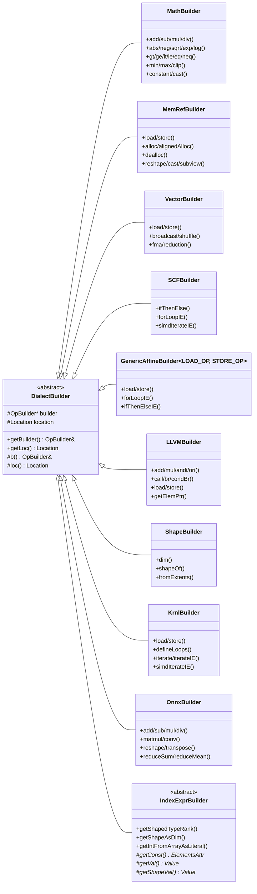
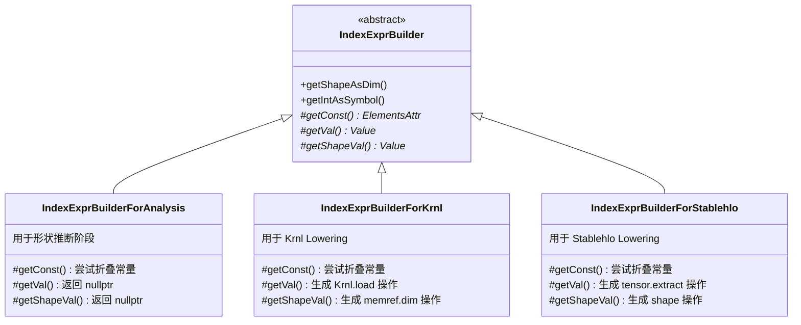

> 本文深入剖析 onnx-mlir 项目中的 DialectBuilder 设计模式，帮助开发者理解如何优雅地构建 MLIR 操作。

## 1. 引言

在 MLIR 编译器开发中，我们经常需要创建大量的 IR 操作。直接使用 `OpBuilder` 虽然灵活，但代码往往冗长且容易出错。onnx-mlir 项目设计了 **DialectBuilder** 模式，提供了一套类型安全、简洁易用的 API 来构建各种方言的操作。

### 1.1 设计目标

DialectBuilder 的核心设计目标：

1. **简化 API**：将复杂的操作创建封装为简单的方法调用
2. **类型安全**：在编译时捕获类型错误
3. **可组合性**：支持多种 Builder 组合使用
4. **双模式支持**：同时支持分析（无代码生成）和代码生成模式

## 2. 架构总览



说明：

- GenericAffineBuilder 是模板类，通过不同的模板参数生成 AffineBuilder 和 AffineBuilderKrnlMem
- IndexExprBuilder 是抽象类，有三个纯虚方法需要子类实现

## 3. 基类设计

### 3.1 DialectBuilder 基类

所有 Builder 的基类，封装了 OpBuilder 和 Location：

```cpp
struct DialectBuilder {
// 分析模式构造函数（无代码生成，builder 为空）
DialectBuilder(mlir::Location loc) : builder(nullptr), location(loc) {}

// 代码生成模式构造函数
DialectBuilder(mlir::OpBuilder &b, mlir::Location loc)
	: builder(&b), location(loc) {}

// 拷贝构造函数（从其他 Builder 继承上下文）
DialectBuilder(const DialectBuilder &db)
	: builder(db.builder), location(db.location) {}

virtual ~DialectBuilder() {}

// 公开接口
mlir::OpBuilder &getBuilder() const { return b(); }
mlir::OpBuilder *getBuilderPtr() const { return builder; }  // 可能为 null
mlir::Location getLoc() const { return loc(); }

protected:
mlir::OpBuilder &b() const {
  assert(builder);  // 分析模式下调用会触发断言
  return *builder;
}
mlir::Location loc() const { return location; }

private:
mlir::OpBuilder *builder;
mlir::Location location;
};
```

### 3.2 双模式设计

DialectBuilder 支持两种使用模式：

| 模式         | 构造函数                     | builder 状态 | 用途                    |
| ------------ | ---------------------------- | ------------ | ----------------------- |
| 分析模式     | DialectBuilder(loc)          | nullptr      | 形状推断，不生成代码    |
| 代码生成模式 | DialectBuilder(builder, loc) | 有效指针     | Lowering 时生成实际操作 |

## 4. 核心 Builder 详解

### 4.1 MathBuilder - 算术运算构建器

封装 arith 方言，提供类型推断和自动广播：

```cpp
struct MathBuilder final : DialectBuilder {
// === 基本算术 ===
mlir::Value add(mlir::Value lhs, mlir::Value rhs) const;      // B
mlir::Value sub(mlir::Value lhs, mlir::Value rhs) const;      // B
mlir::Value mul(mlir::Value lhs, mlir::Value rhs) const;      // B
mlir::Value div(mlir::Value lhs, mlir::Value rhs) const;      // B
mlir::Value rem(mlir::Value lhs, mlir::Value rhs) const;      // B
mlir::Value ceilDiv(mlir::Value lhs, mlir::Value rhs) const;  // B, 仅整数
mlir::Value floorDiv(mlir::Value lhs, mlir::Value rhs) const; // B, 仅整数

// === 数学函数 ===
mlir::Value abs(mlir::Value val) const;
mlir::Value neg(mlir::Value val) const;
mlir::Value sqrt(mlir::Value val) const;   // 仅浮点
mlir::Value exp(mlir::Value val) const;    // 仅浮点
mlir::Value exp2(mlir::Value val) const;   // 仅浮点
mlir::Value log(mlir::Value val) const;    // 仅浮点
mlir::Value log2(mlir::Value val) const;   // 仅浮点
mlir::Value ceil(mlir::Value val) const;   // 仅浮点
mlir::Value floor(mlir::Value val) const;  // 仅浮点
mlir::Value round(mlir::Value val) const;  // 仅浮点
mlir::Value tanh(mlir::Value val) const;   // 仅浮点
mlir::Value cos(mlir::Value val) const;
mlir::Value erf(mlir::Value val) const;
mlir::Value pow(mlir::Value base, mlir::Value exp) const;  // B, 仅浮点

// === 比较操作 ===
mlir::Value gt(mlir::Value lhs, mlir::Value rhs) const;   // B
mlir::Value ge(mlir::Value lhs, mlir::Value rhs) const;   // B
mlir::Value lt(mlir::Value lhs, mlir::Value rhs) const;   // B
mlir::Value le(mlir::Value lhs, mlir::Value rhs) const;   // B
mlir::Value eq(mlir::Value lhs, mlir::Value rhs) const;   // B
mlir::Value neq(mlir::Value lhs, mlir::Value rhs) const;  // B

// === 位运算（仅整数）===
mlir::Value andi(mlir::Value lhs, mlir::Value rhs) const;  // B
mlir::Value ori(mlir::Value lhs, mlir::Value rhs) const;   // B
mlir::Value xori(mlir::Value lhs, mlir::Value rhs) const;  // B
mlir::Value shli(mlir::Value lhs, mlir::Value rhs) const;  // B
mlir::Value shri(mlir::Value lhs, mlir::Value rhs) const;  // B

// === 选择和裁剪 ===
mlir::Value select(mlir::Value cmp, mlir::Value trueVal, mlir::Value falseVal) const; // B
mlir::Value clip(mlir::Value val, mlir::Value lb, mlir::Value ub) const;  // B
mlir::Value min(mlir::Value lhs, mlir::Value rhs) const;  // B
mlir::Value max(mlir::Value lhs, mlir::Value rhs) const;  // B

// === 常量和类型转换 ===
mlir::Value constant(mlir::Type type, double val) const;
mlir::Value constantIndex(int64_t val) const;
mlir::Value cast(mlir::Type destType, mlir::Value val) const;  // B
mlir::Value castToIndex(mlir::Value val) const;

// === 特殊常量 ===
mlir::Value negativeInf(mlir::Type type) const;
mlir::Value positiveInf(mlir::Type type) const;

// === FMA ===
mlir::Value fma(mlir::Value lhs, mlir::Value rhs, mlir::Value acc) const;  // B
};
```

注：标注 "B" 的方法支持自动广播——当一个操作数是向量而另一个是标量时，自动将标量 splat 为向量。

### 4.2 MemRefBuilder - 内存操作构建器

封装 memref 方言，提供内存分配和访问：

```cpp
struct MemRefBuilder final : DialectBuilder {
// === 常量 ===
static const int64_t defaultAlign;  // 默认对齐 16 字节

// === 加载/存储（支持 IndexExpr 和偏移）===
mlir::Value load(mlir::Value memref, mlir::ValueRange indices = {},
	mlir::ValueRange offsets = {}) const;
mlir::Value loadIE(mlir::Value memref, mlir::ArrayRef<IndexExpr> indices = {},
	mlir::ValueRange offsets = {}) const;
void store(mlir::Value val, mlir::Value memref, mlir::ValueRange indices = {},
	mlir::ValueRange offsets = {}) const;
void storeIE(mlir::Value val, mlir::Value memref,
	mlir::ArrayRef<IndexExpr> indices = {}, mlir::ValueRange offsets = {}) const;

// === 内存分配 ===
mlir::memref::AllocOp alloc(mlir::MemRefType type) const;
mlir::memref::AllocOp alloc(mlir::MemRefType type, mlir::ValueRange dynSymbols) const;
mlir::memref::AllocOp alloc(mlir::MemRefType type, DimsExprRef dims) const;

// === 对齐分配 ===
mlir::memref::AllocOp alignedAlloc(mlir::MemRefType type,
	int64_t align = defaultAlign) const;
mlir::memref::AllocOp alignedAlloc(mlir::MemRefType type,
	mlir::ValueRange dynSymbols, int64_t align = defaultAlign) const;
mlir::memref::AllocOp alignedAlloc(mlir::MemRefType type,
	DimsExprRef dims, int64_t align = defaultAlign) const;

// === SIMD 友好分配（带填充）===
mlir::Value alignedAllocWithSimdPadding(mlir::MemRefType type,
	int64_t VL = 1, int64_t align = defaultAlign) const;
mlir::Value alignedAllocWithSimdPadding(mlir::MemRefType type,
	mlir::ValueRange dynSymbols, int64_t VL = 1, int64_t align = defaultAlign) const;
mlir::Value alignedAllocWithSimdPadding(mlir::MemRefType type,
	DimsExprRef dims, int64_t VL = 1, int64_t align = defaultAlign) const;

// === 栈分配（慎用，应避免在循环中使用）===
mlir::memref::AllocaOp alloca(mlir::MemRefType type) const;
mlir::memref::AllocaOp alignedAlloca(mlir::MemRefType type,
	int64_t align = defaultAlign) const;

// === 释放 ===
mlir::memref::DeallocOp dealloc(mlir::Value val) const;

// === 形状变换 ===
mlir::memref::ReshapeOp reshape(mlir::MemRefType outputType,
	mlir::Value valToReshape, mlir::Value outputShapeStoredInMem) const;
mlir::memref::ReshapeOp reshape(DimsExpr &outputDims, mlir::Value valToReshape) const;
mlir::Value reshapeToFlatInnermost(mlir::Value valToReshape, DimsExprRef dims,
	DimsExpr &flattenDims, int64_t dimsToFlatten) const;
mlir::Value reshapeToFlat2D(mlir::Value valToReshape, DimsExprRef dims,
	DimsExpr &flattenDims, int64_t axis) const;

// === 视图和子视图 ===
mlir::memref::ViewOp view(mlir::Value input, int64_t byteOffset,
	mlir::MemRefType outputType, mlir::ValueRange outputDynSymbols) const;
mlir::memref::SubViewOp subview(mlir::Value val,
	mlir::ArrayRef<int64_t> offsets, mlir::ArrayRef<int64_t> sizes,
	mlir::ArrayRef<int64_t> strides) const;
mlir::memref::SubViewOp subview(mlir::Value val,
	mlir::ArrayRef<IndexExpr> offsets, mlir::ArrayRef<IndexExpr> sizes,
	mlir::ArrayRef<IndexExpr> strides) const;

// === 类型转换 ===
mlir::memref::CastOp cast(mlir::Value input, mlir::MemRefType outputType) const;
mlir::Value reinterpretCast(mlir::Value input, DimsExpr &outputDims) const;

// === 查询 ===
mlir::Value dim(mlir::Value val, int64_t index) const;
mlir::Value dim(mlir::Value val, mlir::Value index) const;
static bool isNoneValue(mlir::Value value);
};
```

### 4.3 VectorBuilder - 向量操作构建器

封装 vector 方言，支持 SIMD 操作：

```cpp
struct VectorBuilder final : DialectBuilder {
enum CombiningKind { ADD, MUL, MAX, MIN, AND, OR, XOR };

// === 查询 ===
int64_t getArchVectorLength(const mlir::Type &elementType) const;
int64_t getArchVectorLength(const mlir::VectorType &vecType) const;
static bool compatibleShapes(const mlir::Type t1, const mlir::Type t2);
static bool compatibleTypes(const mlir::Type t1, const mlir::Type t2);

// === 向量加载/存储 ===
mlir::Value load(mlir::VectorType vecType, mlir::Value memref,
	mlir::ValueRange indices = {}, mlir::ValueRange offsets = {}) const;
mlir::Value loadIE(mlir::VectorType vecType, mlir::Value memref,
	mlir::ArrayRef<IndexExpr> indices = {}, mlir::ValueRange offsets = {}) const;
void store(mlir::Value val, mlir::Value memref,
	mlir::ValueRange indices = {}, mlir::ValueRange offsets = {}) const;
void storeIE(mlir::Value val, mlir::Value memref,
	mlir::ArrayRef<IndexExpr> indices = {}, mlir::ValueRange offsets = {}) const;

// === 向量操作 ===
mlir::Value broadcast(mlir::VectorType vecType, mlir::Value val) const;
mlir::Value shuffle(mlir::Value lhs, mlir::Value rhs,
	llvm::SmallVectorImpl<int64_t> &mask) const;
mlir::Value fma(mlir::Value lhs, mlir::Value rhs, mlir::Value acc) const;

// === 归约操作 ===
mlir::Value reduction(CombiningKind kind, mlir::Value value) const;

// === 向量组合 ===
mlir::Value mergeHigh(mlir::Value lhs, mlir::Value rhs, int64_t step) const;
mlir::Value mergeLow(mlir::Value lhs, mlir::Value rhs, int64_t step) const;

// === 形状转换 ===
mlir::Value shapeCast(mlir::VectorType newType, mlir::Value vector) const;
mlir::Value typeCast(mlir::Type resTy, mlir::Value val) const;

// === 元素操作 ===
mlir::Value extractElement(mlir::Value vector, int64_t position) const;
mlir::Value insertElement(mlir::Value vector, mlir::Value element, int64_t position) const;
mlir::Value extractFrom2D(mlir::Value vector2D, int64_t position) const;
mlir::Value insertInto2D(mlir::Value vector, mlir::Value vector2D, int64_t position) const;
};
```

### 4.4 SCFBuilder - 结构化控制流构建器

封装 scf 方言，提供控制流结构：

```cpp
struct SCFBuilder final : DialectBuilder {
// === 类型别名 ===
using SCFThenElseBodyFn = mlir::function_ref<void(const SCFBuilder &)>;
using SCFLoopBodyFn = mlir::function_ref<void(const SCFBuilder &, mlir::ValueRange)>;
using SCFSimdIterateBodyFn = std::function<mlir::Value(
	const SCFBuilder &b, mlir::ArrayRef<mlir::Value> inputVals, int64_t VL)>;

// === 条件分支 ===
void ifThenElse(mlir::Value cond, SCFThenElseBodyFn thenFn,
	SCFThenElseBodyFn elseFn = nullptr) const;

// === 循环（支持 IndexExpr）===
void forLoopIE(IndexExpr lb, IndexExpr ub, int64_t step,
	bool useParallel, SCFLoopBodyFn bodyFn) const;
void forLoopsIE(mlir::ArrayRef<IndexExpr> lbs, mlir::ArrayRef<IndexExpr> ubs,
	mlir::ArrayRef<int64_t> steps, mlir::ArrayRef<bool> useParallel,
	SCFLoopBodyFn builderFn) const;

// === 基本循环 ===
void forLoop(mlir::Value lb, mlir::Value ub, int64_t step,
	SCFLoopBodyFn bodyFn) const;
void parallelLoops(mlir::ValueRange lbs, mlir::ValueRange ubs,
	mlir::ValueRange steps, SCFLoopBodyFn bodyFn) const;

// === SIMD 循环 ===
void simdIterateIE(IndexExpr lb, IndexExpr ub, int64_t VL, bool fullySimd,
	bool useParallel, mlir::ArrayRef<mlir::Value> inputs,
	mlir::ArrayRef<DimsExpr> inputAFs, mlir::ArrayRef<mlir::Value> outputs,
	mlir::ArrayRef<DimsExpr> outputAFs,
	mlir::ArrayRef<SCFSimdIterateBodyFn> simdIterateBodyList) const;

void yield() const;
};
```

### 4.5 GenericAffineBuilder - 仿射操作构建器

模板化的仿射方言构建器：

```cpp
template <class LOAD_OP, class STORE_OP>
struct GenericAffineBuilder final : DialectBuilder {
// === 类型别名 ===
using GenericAffineLoopBodyFn = mlir::function_ref<void(
	const GenericAffineBuilder &, mlir::ValueRange)>;
using GenericAffineThenElseBodyFn = mlir::function_ref<void(
	const GenericAffineBuilder<LOAD_OP, STORE_OP> &)>;

// === 加载/存储 ===
mlir::Value load(mlir::Value memref, mlir::ValueRange indices = {},
	mlir::ValueRange offsets = {}) const;
mlir::Value loadIE(mlir::Value memref, mlir::ArrayRef<IndexExpr> indices = {},
	mlir::ValueRange offsets = {}) const;
void store(mlir::Value val, mlir::Value memref, mlir::ValueRange indices = {},
	mlir::ValueRange offsets = {}) const;
void storeIE(mlir::Value val, mlir::Value memref,
	mlir::ArrayRef<IndexExpr> indices = {}, mlir::ValueRange offsets = {}) const;

// === 循环 ===
void forLoopIE(IndexExpr lb, IndexExpr ub, int64_t step,
	bool useParallel, GenericAffineLoopBodyFn builderFn) const;
void forLoopsIE(mlir::ArrayRef<IndexExpr> lbs, mlir::ArrayRef<IndexExpr> ubs,
	mlir::ArrayRef<int64_t> steps, mlir::ArrayRef<bool> useParallel,
	GenericAffineLoopBodyFn builderFn) const;

// === 条件 ===
void ifThenElseIE(IndexExprScope &scope, mlir::ArrayRef<IndexExpr> conditions,
	GenericAffineThenElseBodyFn thenFn,
	GenericAffineThenElseBodyFn elseFn) const;

// === 仿射应用 ===
mlir::Value apply(mlir::AffineMap map, mlir::ValueRange operands) const;

void yield() const;
};

// 使用标准 Affine 加载/存储
using AffineBuilder = GenericAffineBuilder<
  mlir::affine::AffineLoadOp, mlir::affine::AffineStoreOp>;

// 使用 Krnl 加载/存储（在 Krnl Lowering 时使用）
using AffineBuilderKrnlMem = GenericAffineBuilder<
  mlir::KrnlLoadOp, mlir::KrnlStoreOp>;
```

### 4.6 LLVMBuilder - LLVM 方言构建器

封装 llvm 方言，用于最终代码生成：

```cpp
struct LLVMBuilder final : DialectBuilder {
// === 算术运算 ===
mlir::Value add(mlir::Value lhs, mlir::Value rhs) const;
mlir::Value mul(mlir::Value lhs, mlir::Value rhs) const;
mlir::Value andi(mlir::Value lhs, mlir::Value rhs) const;
mlir::Value ori(mlir::Value lhs, mlir::Value rhs) const;
mlir::Value lshr(mlir::Value lhs, mlir::Value rhs) const;
mlir::Value shl(mlir::Value lhs, mlir::Value rhs) const;

// === 内存操作 ===
mlir::Value load(mlir::Type elementType, mlir::Value addr) const;
void store(mlir::Value val, mlir::Value addr) const;
mlir::Value _alloca(mlir::Type resultType, mlir::Type elementType,
	mlir::Value size, int64_t alignment) const;
mlir::Value getElemPtr(mlir::Type resultType, mlir::Type elemType,
	mlir::Value base, mlir::ArrayRef<mlir::LLVM::GEPArg> indices) const;

// === 控制流 ===
void br(mlir::ArrayRef<mlir::Value> destOperands, mlir::Block *destBlock) const;
void condBr(mlir::Value cond, mlir::Block *trueBlock,
	mlir::ArrayRef<mlir::Value> trueOperands, mlir::Block *falseBlock,
	mlir::ArrayRef<mlir::Value> falseOperands) const;

// === 函数调用 ===
mlir::Value call(mlir::ArrayRef<mlir::Type> resultTypes,
	llvm::StringRef funcName, mlir::ArrayRef<mlir::Value> inputs,
	bool isVarArg = false) const;

// === 类型转换 ===
mlir::Value bitcast(mlir::Type type, mlir::Value val) const;
mlir::Value sext(mlir::Type type, mlir::Value val) const;
mlir::Value zext(mlir::Type type, mlir::Value val) const;
mlir::Value trunc(mlir::Type type, mlir::Value val) const;
mlir::Value inttoptr(mlir::Type type, mlir::Value val) const;
mlir::Value ptrtoint(mlir::Type type, mlir::Value val) const;

// === 常量和比较 ===
mlir::Value constant(mlir::Type type, int64_t val) const;
mlir::Value constant(mlir::Type type, double val) const;
mlir::Value null(mlir::Type type) const;
mlir::Value icmp(mlir::LLVM::ICmpPredicate cond, mlir::Value lhs, mlir::Value rhs) const;
mlir::Value select(mlir::Value cmp, mlir::Value lhs, mlir::Value rhs) const;

// === 全局符号 ===
mlir::Value addressOf(mlir::LLVM::GlobalOp op) const;
mlir::LLVM::GlobalOp globalOp(mlir::Type resultType, bool isConstant,
	mlir::LLVM::Linkage, llvm::StringRef name, mlir::Attribute attr,
	uint64_t alignment = 0, bool uniqueName = true) const;
mlir::LLVM::LLVMFuncOp func(llvm::StringRef name, mlir::Type type,
	bool createUniqueFunc = false) const;

// === 辅助函数 ===
mlir::FlatSymbolRefAttr getOrInsertSymbolRef(mlir::ModuleOp module,
	llvm::StringRef symName, mlir::Type resultType,
	mlir::ArrayRef<mlir::Type> operandTypes, bool isVarArg = false) const;

void _return() const;
void _return(mlir::Value val) const;
};
```

### 4.7 KrnlBuilder - Krnl 方言构建器

专为 onnx-mlir 的 Krnl 方言设计：

```cpp
struct KrnlBuilder : public DialectBuilder {
// === 类型别名 ===
using KrnlLoopBodyFn = mlir::function_ref<void(const KrnlBuilder &, mlir::ValueRange)>;
using KrnlSimdIterateBodyFn = std::function<mlir::Value(
	const KrnlBuilder &b, mlir::ArrayRef<mlir::Value> inputVals, int64_t VL)>;

// === 加载/存储 ===
mlir::Value load(mlir::Value memref, mlir::ValueRange indices = {},
	mlir::ValueRange offsets = {}) const;
mlir::Value loadIE(mlir::Value memref, mlir::ArrayRef<IndexExpr> indices = {},
	mlir::ValueRange offsets = {}) const;
void store(mlir::Value val, mlir::Value memref, mlir::ValueRange indices = {},
	mlir::ValueRange offsets = {}) const;
void storeIE(mlir::Value val, mlir::Value memref,
	mlir::ArrayRef<IndexExpr> indices, mlir::ValueRange offsets = {}) const;

// === 循环定义和优化 ===
mlir::ValueRange defineLoops(int64_t originalLoopNum) const;
mlir::ValueRange block(mlir::Value loop, int64_t blockSize) const;
void permute(mlir::ValueRange loops, mlir::ArrayRef<int64_t> map) const;
void unroll(mlir::Value loop) const;
void parallel(mlir::ValueRange loops) const;
mlir::ValueRange getInductionVarValue(mlir::ValueRange loops) const;

// === 循环迭代 ===
void iterate(mlir::ValueRange originalLoops, mlir::ValueRange optimizedLoops,
	mlir::ValueRange lbs, mlir::ValueRange ubs, KrnlLoopBodyFn bodyBuilderFn) const;
void iterateIE(mlir::ValueRange originalLoops, mlir::ValueRange optimizedLoops,
	mlir::ArrayRef<IndexExpr> lbs, mlir::ArrayRef<IndexExpr> ubs,
	KrnlLoopBodyFn bodyBuilderFn) const;

// === 通用循环接口（与 SCF/Affine 兼容）===
void forLoopIE(IndexExpr lb, IndexExpr ub, int64_t step,
	bool useParallel, KrnlLoopBodyFn builderFn) const;
void forLoopsIE(mlir::ArrayRef<IndexExpr> lbs, mlir::ArrayRef<IndexExpr> ubs,
	mlir::ArrayRef<int64_t> steps, mlir::ArrayRef<bool> useParallel,
	KrnlLoopBodyFn builderFn) const;

// === SIMD 迭代 ===
void simdIterateIE(IndexExpr lb, IndexExpr ub, int64_t VL, bool fullySimd,
	bool useParallel, mlir::ArrayRef<mlir::Value> inputs,
	mlir::ArrayRef<DimsExpr> inputAFs, mlir::ArrayRef<mlir::Value> outputs,
	mlir::ArrayRef<DimsExpr> outputAFs,
	mlir::ArrayRef<KrnlSimdIterateBodyFn> bodyBuilderFnList) const;

// === 其他 ===
mlir::Value getLinearOffsetIndexIE(mlir::Value memref, mlir::ArrayRef<IndexExpr> indices) const;
mlir::Value vectorTypeCast(mlir::Value sourceMemref, int64_t vectorLen) const;
void region(mlir::function_ref<void(const KrnlBuilder &)> bodyBuilderFn) const;
};
```

### 4.8 OnnxBuilder - ONNX 方言构建器

用于创建 ONNX 操作并自动推断形状：

```cpp
struct OnnxBuilder : DialectBuilder {
// === 通用创建方法（自动形状推断）===
template <typename OnnxOpType, typename... Args>
OnnxOpType createOpAndInferShapes(Args &&... args) const;

template <typename OnnxOpType, typename... Args>
OnnxOpType createTypedOpAndInferShapes(mlir::Type result_ty, Args &&... args) const;

// === 算术运算 ===
mlir::Value add(mlir::Value A, mlir::Value B) const;
mlir::Value sub(mlir::Value A, mlir::Value B) const;
mlir::Value mul(mlir::Value A, mlir::Value B) const;
mlir::Value div(mlir::Value A, mlir::Value B) const;
mlir::Value pow(mlir::Value input, mlir::Value exp) const;

// === 数学函数 ===
mlir::Value abs(mlir::Value input) const;
mlir::Value ceil(mlir::Value input) const;
mlir::Value round(mlir::Value input, bool scalarType = false) const;
mlir::Value reciprocal(mlir::Value input) const;
mlir::Value gelu(mlir::Value input, mlir::StringAttr approximateAttr) const;

// === 矩阵运算 ===
mlir::Value matmul(mlir::Type Y, mlir::Value A, mlir::Value B, bool useGemm = false) const;
mlir::Value conv(mlir::Type Y, mlir::Value X, mlir::Value W, mlir::Value B,
	llvm::StringRef autoPad, mlir::ArrayRef<int64_t> dilations, int64_t group,
	mlir::ArrayRef<int64_t> kernelShape, mlir::ArrayRef<int64_t> pads,
	mlir::ArrayRef<int64_t> strides) const;

// === 形状操作 ===
mlir::Value reshape(mlir::Type outputType, mlir::Value input, mlir::Value shape) const;
mlir::Value reshapeToNDim(mlir::Value val, int64_t N, bool collapseMostSignificant) const;
mlir::Value expand(mlir::Type outputType, mlir::Value input, mlir::Value shape) const;
mlir::Value shape(mlir::Value input) const;
mlir::Value concat(mlir::Type outputType, mlir::ValueRange inputs, int64_t axis) const;

// === 归约操作 ===
mlir::Value reduceSum(mlir::Type outputType, mlir::Value data,
	mlir::Value axes, bool keepDims = true, bool noop_with_empty_axes = false) const;
mlir::Value reduceMean(mlir::Type outputType, mlir::Value data,
	mlir::Value axes, bool keepDims = true, bool noop_with_empty_axes = false) const;
mlir::Value reduceMax(mlir::Type outputType, mlir::Value data,
	mlir::Value axes, bool keepDims = true, bool noop_with_empty_axes = false) const;
mlir::Value reduceMin(mlir::Type outputType, mlir::Value data,
	mlir::Value axes, bool keepDims = true, bool noop_with_empty_axes = false) const;

// === 类型转换 ===
mlir::Value cast(mlir::Value input, mlir::TypeAttr to) const;
mlir::Value cast(mlir::Value input, mlir::Type to) const;
mlir::Value clip(mlir::Value input, mlir::Value min, mlir::Value max,
	bool scalarType = false) const;

// === 常量 ===
mlir::Value constant(mlir::Attribute denseAttr) const;
mlir::Value constantInt64(const mlir::ArrayRef<int64_t> intVals) const;
mlir::Value constantFloat32(const mlir::ArrayRef<float> floatVals) const;
mlir::Value none() const;

// === 归一化 ===
mlir::Value layerNorm(mlir::Type outputType, mlir::Value input, mlir::Value scale,
	mlir::Value bias, int64_t axis, mlir::FloatAttr epsilon) const;
mlir::Value RMSLayerNorm(mlir::Type outputType, mlir::Value input, mlir::Value scale,
	mlir::Value bias, int64_t axis, mlir::FloatAttr epsilon) const;

// === 量化 ===
mlir::Value dequantizeLinear(mlir::Type resType, mlir::Value X,
	mlir::Value scale, mlir::Value zeroPoint, int axis = 1) const;
mlir::Value qlinearMatMul(mlir::Type outputType, mlir::Value a,
	mlir::Value aScale, mlir::Value aZeroPoint, mlir::Value b,
	mlir::Value bScale, mlir::Value bZeroPoint, mlir::Value yScale,
	mlir::Value yZeroPoint) const;
};
```

### 4.9 IndexExprBuilder - 索引表达式构建器

用于从 MLIR 值中提取 IndexExpr：

```cpp
struct IndexExprBuilder : DialectBuilder {
using IndexExprList = llvm::SmallVectorImpl<IndexExpr>;

// === 类型信息查询 ===
bool hasShapeAndRank(mlir::Value value);
void assertHasShapeAndRank(mlir::Value value);
uint64_t getShapedTypeRank(mlir::Value value);
int64_t getArraySize(mlir::ArrayAttr arrayAttr);
int64_t getArraySize(mlir::Value arrayVal, bool staticSizeOnly = false);

// === 从属性获取字面量 ===
IndexExpr getIntFromArrayAsLiteral(mlir::ArrayAttr intAttrArray, uint64_t i);
IndexExpr getIntFromArrayAsLiteral(mlir::ArrayAttr intAttrArray, uint64_t i,
	int64_t outOfBoundVal);
void getIntFromArrayAsLiterals(mlir::ArrayAttr intAttrArray,
	IndexExprList &list, int64_t len = -1);

// === 从值获取符号/维度 ===
IndexExpr getIntAsSymbol(mlir::Value value);
IndexExpr getIntAsDim(mlir::Value value);
IndexExpr getFloatAsNonAffine(mlir::Value value);
IndexExpr getIntFromArrayAsSymbol(mlir::Value intArray, uint64_t i,
	int64_t arraySize = -1);
IndexExpr getIntFromArrayAsDim(mlir::Value intArray, uint64_t i,
	int64_t arraySize = -1);

// === 从形状获取维度 ===
IndexExpr getShapeAsDim(mlir::Value tensorOrMemref, uint64_t i);
IndexExpr getShapeAsSymbol(mlir::Value tensorOrMemref, uint64_t i);
void getShapeAsDims(mlir::Value tensorOrMemref, DimsExpr &list);
void getShapeAsSymbols(mlir::Value tensorOrMemref, DimsExpr &list);

protected:
// === 纯虚方法（由子类实现）===
// 从值中提取常量属性
virtual mlir::ElementsAttr getConst(mlir::Value value) = 0;
// 从数组值中加载第 i 个元素
virtual mlir::Value getVal(mlir::Value arrayVal, uint64_t i) = 0;
// 获取张量/MemRef 第 i 维的大小
virtual mlir::Value getShapeVal(mlir::Value tensorOrMemrefValue, uint64_t i) = 0;
};
```

IndexExprBuilder 子类



| 子类                         | 用途               | getVal 行为            | getShapeVal 行为       |
| ---------------------------- | ------------------ | ---------------------- | ---------------------- |
| IndexExprBuilderForAnalysis  | 形状推断阶段       | 返回 nullptr（生成 ?） | 返回 nullptr（生成 ?） |
| IndexExprBuilderForKrnl      | Krnl Lowering      | 生成 krnl.load         | 生成 memref.dim        |
| IndexExprBuilderForStablehlo | Stablehlo Lowering | 生成 tensor.extract    | 生成 shape 方言操作    |

## 5. MultiDialectBuilder - 组合模式

当需要同时使用多个 Builder 时，可以使用 MultiDialectBuilder：

### 5.1 传统方式 vs MultiDialectBuilder

传统方式（繁琐）：

```cpp
KrnlBuilder createKrnl(rewriter, loc);
MathBuilder createMath(createKrnl);
MemRefBuilder createMemRef(createKrnl);

createKrnl.defineLoops(1);
createMath.add(i1, i2);
createMemRef.alloca(type);
```

使用 MultiDialectBuilder（简洁）：

```cpp
MultiDialectBuilder<KrnlBuilder, MathBuilder, MemRefBuilder> create(rewriter, loc);

create.krnl.defineLoops(1);
create.math.add(i1, i2);
create.mem.alloca(type);
```

### 5.2 实现原理

通过模板递归继承实现：

```cpp
// 锚点类（终止递归）
template <class... Ts>
struct MultiDialectBuilder {
MultiDialectBuilder(mlir::OpBuilder &b, mlir::Location loc)
	: builder(&b), location(loc) {}
MultiDialectBuilder(const DialectBuilder &db)
	: builder(db.getBuilderPtr()), location(db.getLoc()) {}

mlir::OpBuilder &getBuilder() const { assert(builder); return *builder; }
mlir::OpBuilder *getBuilderPtr() const { return builder; }
mlir::Location getLoc() const { return location; }

private:
mlir::OpBuilder *builder;
mlir::Location location;
};

// 递归特化（以 MathBuilder 为例）
template <class... Ts>
struct MultiDialectBuilder<MathBuilder, Ts...> : MultiDialectBuilder<Ts...> {
MultiDialectBuilder(mlir::OpBuilder &b, mlir::Location loc)
	: MultiDialectBuilder<Ts...>(b, loc), math(b, loc) {}
MultiDialectBuilder(const DialectBuilder &db)
	: MultiDialectBuilder<Ts...>(db), math(db) {}
MathBuilder math;  // 通过 .math 访问
};

// 其他 Builder 的特化类似...
```

### 5.3 可用的访问字段

| Builder 类型            | 访问字段    | 定义位置                |
| ----------------------- | ----------- | ----------------------- |
| MathBuilder             | .math       | DialectBuilder.hpp      |
| MemRefBuilder           | .mem        | DialectBuilder.hpp      |
| ShapeBuilder            | .shape      | DialectBuilder.hpp      |
| VectorBuilder           | .vec        | DialectBuilder.hpp      |
| SCFBuilder              | .scf        | DialectBuilder.hpp      |
| AffineBuilder           | .affine     | DialectBuilder.hpp      |
| LLVMBuilder             | .llvm       | DialectBuilder.hpp      |
| KrnlBuilder             | .krnl       | Krnl/DialectBuilder.hpp |
| AffineBuilderKrnlMem    | .affineKMem | Krnl/DialectBuilder.hpp |
| IndexExprBuilderForKrnl | .krnlIE     | Krnl/DialectBuilder.hpp |
| OnnxBuilder             | .onnx       | ONNX/DialectBuilder.hpp |

## 6. 实战示例

### 6.1 矩阵乘法 Lowering（简化示例）

```cpp
LogicalResult matchAndRewrite(ONNXMatMulOp matMulOp, OpAdaptor adaptor,
  ConversionPatternRewriter &rewriter) const {
Location loc = matMulOp.getLoc();

// 创建组合 Builder
MultiDialectBuilder<IndexExprBuilderForKrnl, MathBuilder, MemRefBuilder, KrnlBuilder>
	create(rewriter, loc);

// 使用 ShapeHelper 计算输出形状
ONNXMatMulOpShapeHelper shapeHelper(matMulOp, adaptor.getOperands(), &create.krnlIE);
shapeHelper.computeShapeAndAssertOnFailure();

// 获取输出维度
DimsExpr &outputDims = shapeHelper.getOutputDims();
int64_t outputRank = outputDims.size();

// 分配输出内存（省略类型构建细节）
Type elementType = ...;
MemRefType outputType = ...;
Value alloc = create.mem.alignedAlloc(outputType, outputDims);

// 初始化为零
Value zero = create.math.constant(elementType, 0.0);

// 定义循环（输出维度 + 归约维度）
int64_t numLoops = outputRank + 1;
ValueRange loopDef = create.krnl.defineLoops(numLoops);

// 构建循环边界（省略细节）
SmallVector<IndexExpr> lbs(numLoops, LiteralIndexExpr(0));
SmallVector<IndexExpr> ubs = ...;

// 迭代循环
create.krnl.iterateIE(loopDef, loopDef, lbs, ubs,
	[&](const KrnlBuilder &kb, ValueRange loopIndices) {
	  MultiDialectBuilder<KrnlBuilder, MathBuilder> create(kb);

	  // 计算访问索引（省略广播处理细节）
	  SmallVector<Value> aIndices = ...;
	  SmallVector<Value> bIndices = ...;
	  SmallVector<Value> outputIndices = ...;

	  // 加载 A 和 B
	  Value a = create.krnl.load(adaptor.getA(), aIndices);
	  Value b = create.krnl.load(adaptor.getB(), bIndices);

	  // 乘加操作
	  Value product = create.math.mul(a, b);
	  Value current = create.krnl.load(alloc, outputIndices);
	  Value accumulated = create.math.add(current, product);

	  // 存储结果
	  create.krnl.store(accumulated, alloc, outputIndices);
	});

rewriter.replaceOp(matMulOp, alloc);
return success();
}
```

### 6.2 SIMD 向量化循环

```cpp
void generateSimdLoop(const KrnlBuilder &kb, Value input, Value output,
  DimsExpr &dims, int64_t VL) {

IndexExpr lb = LiteralIndexExpr(0);
IndexExpr ub = dims[0];

// 输入输出的访问函数（在最内层维度迭代）
DimsExpr inputAF = {lb};   // input[i]
DimsExpr outputAF = {lb};  // output[i]

// SIMD 循环
kb.simdIterateIE(lb, ub, VL,
	/*fullySimd=*/false,    // 处理非 VL 倍数的尾部
	/*useParallel=*/true,   // 启用并行
	/*inputs=*/{input},
	/*inputAFs=*/{inputAF},
	/*outputs=*/{output},
	/*outputAFs=*/{outputAF},
	/*bodyFnList=*/{
	  [](const KrnlBuilder &kb, ArrayRef<Value> inputVals, int64_t VL) -> Value {
		// inputVals[0] 是加载的输入（标量或向量，取决于 VL）
		MultiDialectBuilder<MathBuilder> create(kb);
		// ReLU: max(0, x)
		Value zero = create.math.constant(inputVals[0].getType(), 0.0);
		return create.math.max(inputVals[0], zero);
	  }
	});
}
```

### 6.3 条件分支

```cpp
void generateConditional(OpBuilder &builder, Location loc,
  Value condition, Value input, Value output) {

SCFBuilder scf(builder, loc);

scf.ifThenElse(condition,
	/*thenFn=*/[&](const SCFBuilder &scf) {
	  MultiDialectBuilder<MemRefBuilder, MathBuilder> create(scf);
	  Value val = create.mem.load(input);
	  Value result = create.math.exp(val);
	  create.mem.store(result, output);
	},
	/*elseFn=*/[&](const SCFBuilder &scf) {
	  MultiDialectBuilder<MemRefBuilder, MathBuilder> create(scf);
	  Value val = create.mem.load(input);
	  Value result = create.math.log(val);
	  create.mem.store(result, output);
	});
}
```

### 6.4 使用 OnnxBuilder 创建 ONNX 操作

```cpp
void createOnnxOps(OpBuilder &builder, Location loc,
  Value inputA, Value inputB) {

OnnxBuilder onnx(builder, loc);

// 创建矩阵乘法
Type outputType = ...;
Value matmulResult = onnx.matmul(outputType, inputA, inputB);

// 创建 ReLU（通过 clip 实现）
Value zero = onnx.constantFloat32({0.0f});
Value none = onnx.none();
Value reluResult = onnx.clip(matmulResult, zero, none);

// 创建 reshape
Value newShape = onnx.constantInt64({-1, 64});
Type reshapedType = ...;
Value reshapedResult = onnx.reshape(reshapedType, reluResult, newShape);
}
```

## 7. 最佳实践

### 7.1 优先使用 MultiDialectBuilder

```cpp
// ✅ 推荐：组合多个 Builder
MultiDialectBuilder<KrnlBuilder, MathBuilder, MemRefBuilder> create(rewriter, loc);

// ❌ 不推荐：分别创建多个 Builder
KrnlBuilder krnl(rewriter, loc);
MathBuilder math(rewriter, loc);
MemRefBuilder mem(rewriter, loc);
```

### 7.2 使用 IE 后缀的方法处理 IndexExpr

```cpp
// ✅ 推荐：直接使用 IndexExpr
create.krnl.iterateIE(loops, loops, lbs, ubs, bodyFn);
create.mem.loadIE(memref, indices);

// ❌ 不推荐：手动将 IndexExpr 转换为 Value
SmallVector<Value> indicesAsValues;
for (auto &ie : indices)
indicesAsValues.push_back(ie.getValue());
create.mem.load(memref, indicesAsValues);
```

### 7.3 在 Lambda 中重建 Builder

```cpp
create.krnl.iterateIE(loops, loops, lbs, ubs,
  [&](const KrnlBuilder &kb, ValueRange indices) {
	// ✅ 在 lambda 中从 kb 重建需要的 Builder
	MultiDialectBuilder<KrnlBuilder, MathBuilder> create(kb);
	create.math.add(...);
  });
```

### 7.4 利用自动广播

```cpp
// MathBuilder 的许多操作会自动处理标量-向量广播
Value scalar = create.math.constant(f32Type, 1.0);
Value vector = ...;  // vector<8xf32>
Value result = create.math.add(scalar, vector);  // 自动 splat scalar 到 <8xf32>
```

### 7.5 选择正确的 IndexExprBuilder 子类

```cpp
// 形状推断阶段（不生成代码）
IndexExprBuilderForAnalysis ieBuilder(loc);

// Krnl Lowering 阶段
MultiDialectBuilder<IndexExprBuilderForKrnl, ...> create(rewriter, loc);
// 使用 create.krnlIE 获取 IndexExpr

// Stablehlo Lowering 阶段
IndexExprBuilderForStablehlo ieBuilder(rewriter, loc);
```

### 7.6 统一的加载存储接口

多个 Builder 提供统一的 load/store 接口，便于切换：

```cpp
// 以下 Builder 都支持相同的接口：
// - MemRefBuilder
// - KrnlBuilder
// - GenericAffineBuilder (AffineBuilder / AffineBuilderKrnlMem)
// - VectorBuilder (向量版本)

Value val = create.krnl.load(memref, indices);
// 或
Value val = create.mem.load(memref, indices);
// 或
Value val = create.affine.load(memref, indices);
```

## 8. 总结

DialectBuilder 模式是 onnx-mlir 的核心设计之一，它：

| 特性           | 说明                                          |
| -------------- | --------------------------------------------- |
| 简化 API       | 隐藏底层 OpBuilder 细节，提供语义化方法       |
| 类型安全       | 编译期类型检查，减少运行时错误                |
| 灵活组合       | 通过 MultiDialectBuilder 任意组合多个 Builder |
| 双模式支持     | 同一套 API 适用于分析和代码生成场景           |
| IndexExpr 集成 | 无缝支持编译时和运行时的维度计算              |
| 统一接口       | 多个 Builder 提供相同的 load/store 等接口     |
| SIMD 支持      | 内置 SIMD 循环和自动广播支持                  |

### 文件位置

| 文件                                              | 内容                                                     |
| ------------------------------------------------- | -------------------------------------------------------- |
| src/Dialect/Mlir/DialectBuilder.hpp               | 基础 Builder（Math/MemRef/Vector/SCF/Affine/LLVM/Shape） |
| src/Dialect/Mlir/IndexExpr.hpp                    | IndexExpr 系统                                           |
| src/Dialect/Mlir/IndexExprBuilder.hpp             | IndexExprBuilder 基类                                    |
| src/Dialect/Krnl/DialectBuilder.hpp               | KrnlBuilder、IndexExprBuilderForKrnl                     |
| src/Dialect/ONNX/DialectBuilder.hpp               | OnnxBuilder                                              |
| src/Conversion/ONNXToStablehlo/DialectBuilder.hpp | IndexExprBuilderForStablehlo                             |

---
