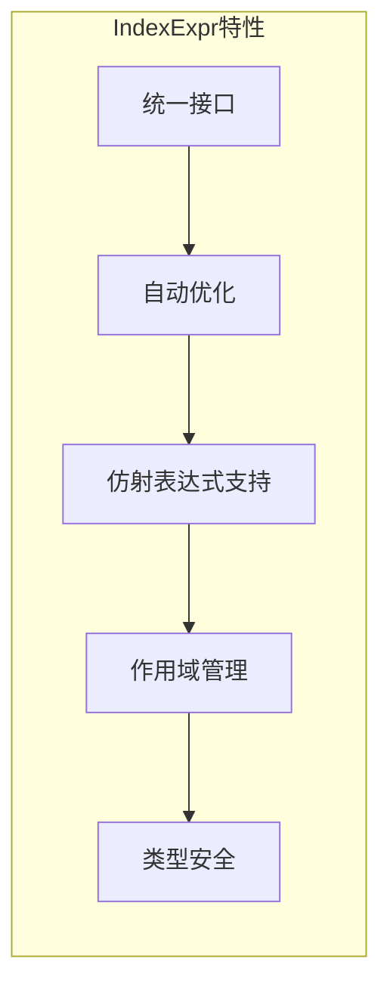
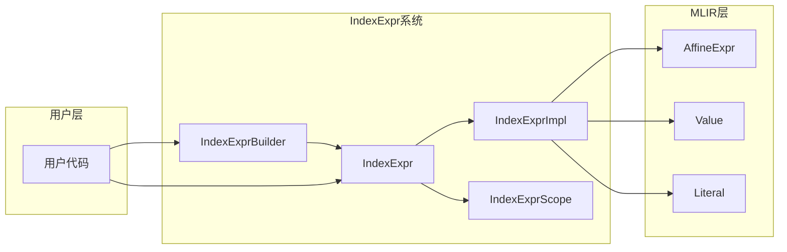
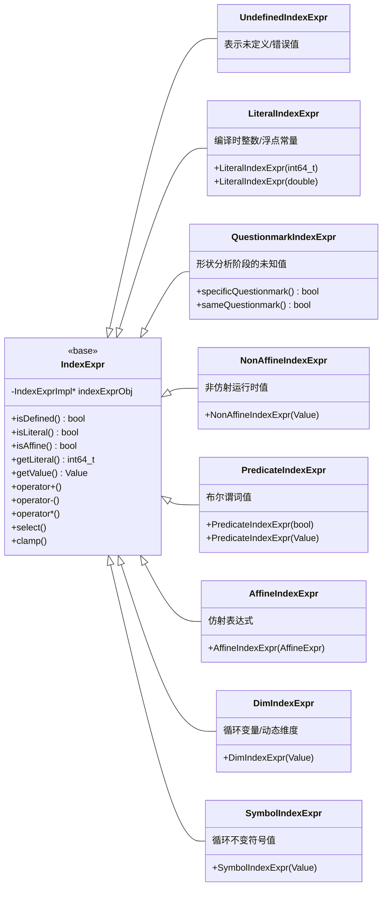
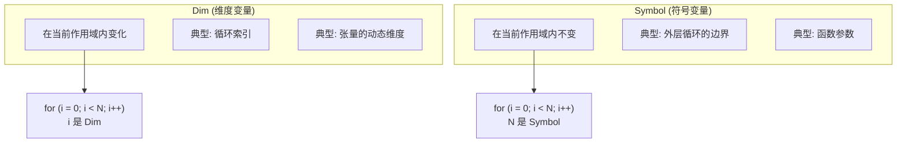
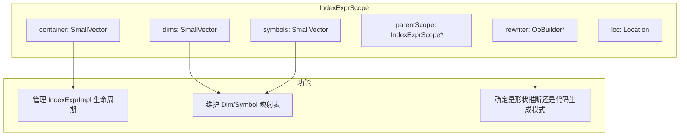
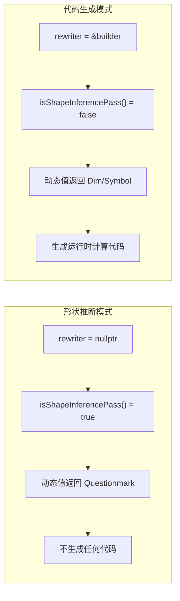
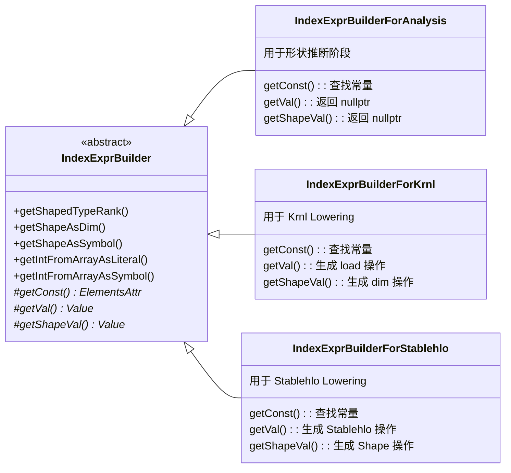

< IndexExpr 是 onnx-mlir 项目的核心基础设施之一，它提供了一套统一的接口来处理编译时常量和运行时动态值，是形状推断和代码生成的关键组件。

## 1. 引言

### 1.1 设计动机

在深度学习编译器中，索引计算无处不在：

- 形状推断：计算输出张量的维度
- 循环边界：确定迭代范围
- 内存访问：计算加载/存储的地址偏移

这些计算面临一个核心挑战：某些值在编译时已知（静态），而另一些只能在运行时确定（动态）。

传统做法需要编写两套代码：

```cpp
// 静态情况
int64_t outputDim = inputDim * 2;

// 动态情况
Value outputDim = builder.create<arith::MulIOp>(inputDim, two);
```

IndexExpr 的设计目标是统一这两种情况，使用同一套代码处理静态和动态计算。

### 1.2 核心特性



| 特性       | 说明                                     |
| ---------- | ---------------------------------------- |
| 统一接口   | 同一套 API 处理编译时常量和运行时值      |
| 自动优化   | 尽可能保持为仿射表达式以启用更多优化     |
| 作用域管理 | 通过 IndexExprScope 管理生命周期和符号表 |
| 类型安全   | 区分 Dim、Symbol、Predicate 等不同类型   |
| 运算符重载 | 支持 +, -, *, /, %, 比较运算符等         |

## 2. 架构总览

### 2.1 核心组件关系



### 2.2 类型层次结构



### 2.3 IndexExprKind 枚举

```cpp
enum class IndexExprKind {
  NonAffine    = 0x00,  // 非仿射动态值 (index 类型)
  Questionmark = 0x01,  // 形状推断阶段的未知值 (index 类型)
  Predicate    = 0x02,  // 比较结果 (1-bit 整数)
  Affine       = 0x10,  // 仿射表达式
  Dim          = 0x11,  // 仿射维度标识符
  Symbol       = 0x12   // 仿射符号标识符
};
```

## 3. IndexExpr 子类详解

### 3.1 子类用途对照表

| 子类                  | 用途                 | 典型场景                 | 示例                          |
| --------------------- | -------------------- | ------------------------ | ----------------------------- |
| UndefinedIndexExpr    | 表示无效/错误值      | 错误处理、越界访问       | 解析失败时返回                |
| LiteralIndexExpr      | 编译时常量           | 已知的维度大小、常数偏移 | LiteralIndexExpr(64)          |
| QuestionmarkIndexExpr | 形状分析阶段的动态值 | 形状推断时的未知维度     | 动态批量大小                  |
| NonAffineIndexExpr    | 非仿射运行时值       | 复杂计算结果、浮点转换   | dim1 * dim2（两个动态值相乘） |
| PredicateIndexExpr    | 比较结果             | 条件选择                 | a < b 的结果                  |
| AffineIndexExpr       | 仿射表达式           | 线性索引计算             | 2*i + 3                       |
| DimIndexExpr          | 仿射维度变量         | 循环索引、动态维度       | 循环迭代变量 iv               |
| SymbolIndexExpr       | 仿射符号变量         | 循环不变量               | 外层作用域的维度              |

### 3.2 Dim vs Symbol

在 MLIR 仿射方言中，Dim 和 Symbol 有明确的语义区分：



示例代码：

```cpp
// 外层作用域
IndexExprScope outerScope;
DimIndexExpr batchSize = createIE->getShapeAsDim(input, 0);  // 动态维度作为 Dim

{
  // 内层循环作用域
  IndexExprScope innerScope;
  SymbolIndexExpr batchSym(batchSize);  // 在内层作为 Symbol（循环不变）
  DimIndexExpr loopIdx(inductionVar);   // 循环索引作为 Dim

  IndexExpr offset = loopIdx * batchSym;  // 仍然是仿射表达式
}
```

### 3.3 仿射性传播规则

IndexExpr 会尽可能保持仿射性，以启用 MLIR 仿射优化：

| 操作  | 仿射性条件            | 结果类型  |
| ----- | --------------------- | --------- |
| a + b | a 和 b 都是仿射       | Affine    |
| a - b | a 和 b 都是仿射       | Affine    |
| a * b | a 仿射且 b 是字面量   | Affine    |
| a / b | a 仿射且 b 是正字面量 | Affine    |
| a % b | a 仿射且 b 是正字面量 | Affine    |
| a * b | a 和 b 都是动态值     | NonAffine |

```cpp
// 仿射示例
DimIndexExpr i(loopVar);
IndexExpr expr1 = i * 4 + 3;        // 仿射: 4*d0 + 3

// 非仿射示例
DimIndexExpr i(loopVar);
SymbolIndexExpr n(dynamicSize);
IndexExpr expr2 = i * n;            // 非仿射: 两个动态值相乘
```

## 4. IndexExprScope 作用域管理

### 4.1 作用域的作用

IndexExprScope 管理 IndexExpr 的生命周期和符号/维度映射：



### 4.2 两种模式



### 4.3 嵌套作用域

```cpp
// 外层作用域 - 形状计算
IndexExprScope outerScope(&rewriter, loc);

DimIndexExpr dim0 = createIE->getShapeAsDim(input, 0);
DimIndexExpr dim1 = createIE->getShapeAsDim(input, 1);
IndexExpr outputSize = dim0 * dim1;

// 内层作用域 - 循环内部
{
  IndexExprScope innerScope(&rewriter, &outerScope);

  // 外层的 dim0 在内层变成 Symbol
  SymbolIndexExpr dim0Sym(dim0);

  // 循环索引作为新的 Dim
  DimIndexExpr iv(inductionVar);

  // 计算访问索引
  IndexExpr accessIdx = iv * dim0Sym;
}  // innerScope 销毁，恢复 outerScope
```

### 4.4 作用域使用规则

```cpp
// ✅ 正确：同一作用域内的 IndexExpr 可以一起运算
IndexExprScope scope(&builder, loc);
DimIndexExpr a = ...;
DimIndexExpr b = ...;
IndexExpr c = a + b;

// ✅ 正确：字面量可以在任何作用域使用
IndexExprScope outerScope(&builder, loc);
LiteralIndexExpr lit(42);
{
  IndexExprScope innerScope(&builder, &outerScope);
  IndexExpr x = lit + DimIndexExpr(someValue);  // OK
}

// ✅ 正确：NonAffine 值可以在嵌套作用域使用
IndexExprScope outerScope(&builder, loc);
NonAffineIndexExpr nonAff(someValue);
{
  IndexExprScope innerScope(&builder, &outerScope);
  IndexExpr x = nonAff + LiteralIndexExpr(1);  // OK
}

// ❌ 错误：Dim/Symbol/Affine 不能跨作用域直接使用
IndexExprScope outerScope(&builder, loc);
DimIndexExpr dim = ...;
{
  IndexExprScope innerScope(&builder, &outerScope);
  // IndexExpr bad = dim + something;  // 会断言失败!

  // ✅ 需要转换为 Symbol
  SymbolIndexExpr dimSym(dim);
  IndexExpr good = dimSym + something;
}
```

## 5. IndexExprBuilder 体系

### 5.1 类继承关系



### 5.2 纯虚方法

```cpp
struct IndexExprBuilder : DialectBuilder {
// === 纯虚方法（子类必须实现）===

// 1. 获取常量属性
// 从定义 value 的操作中获取 ElementsAttr 常量
virtual mlir::ElementsAttr getConst(mlir::Value value) = 0;

// 2. 获取数组元素值
// 从 arrayVal 数组中获取索引 i 处的值
virtual mlir::Value getVal(mlir::Value arrayVal, uint64_t i) = 0;

// 3. 获取形状维度值
// 从 tensor/memref 的形状中获取索引 i 处的维度值
virtual mlir::Value getShapeVal(
	mlir::Value tensorOrMemrefValue, uint64_t i) = 0;
};
```

### 5.3 子类实现差异

| 方法        | IndexExprBuilderForAnalysis | IndexExprBuilderForKrnl        |
| ----------- | --------------------------- | ------------------------------ |
| getConst    | 查找常量折叠结果            | 同左                           |
| getVal      | 返回 nullptr → Questionmark | 生成 krnl.load 获取运行时值    |
| getShapeVal | 返回 nullptr → Questionmark | 生成 memref.dim 获取运行时维度 |

### 5.4 常用 API

```cpp
struct IndexExprBuilder : DialectBuilder {
//=== 形状查询 ===
uint64_t getShapedTypeRank(mlir::Value value);
bool isLiteralShape(mlir::Value tensorOrMemref, uint64_t i);
int64_t getShape(mlir::Value tensorOrMemref, uint64_t i);

//=== 从属性获取字面量 ===
IndexExpr getIntFromArrayAsLiteral(mlir::ArrayAttr array, uint64_t i);
void getIntFromArrayAsLiterals(mlir::ArrayAttr array, IndexExprList &list);

//=== 从值获取 Symbol/Dim ===
IndexExpr getIntFromArrayAsSymbol(mlir::Value array, uint64_t i);
IndexExpr getIntFromArrayAsDim(mlir::Value array, uint64_t i);

//=== 从形状获取 Symbol/Dim ===
IndexExpr getShapeAsLiteral(mlir::Value tensorOrMemref, uint64_t i);
IndexExpr getShapeAsSymbol(mlir::Value tensorOrMemref, uint64_t i);
IndexExpr getShapeAsDim(mlir::Value tensorOrMemref, uint64_t i);

//=== 批量获取 ===
void getShapeAsSymbols(mlir::Value tensorOrMemref, IndexExprList &list);
void getShapeAsDims(mlir::Value tensorOrMemref, IndexExprList &list);
};
```

## 6. IndexExpr 运算操作

### 6.1 算术运算

```cpp
// 加法
IndexExpr c = a + b;
IndexExpr c = a + 10;       // 与字面量运算
IndexExpr c = 10 + a;       // 字面量在前也支持

// 减法
IndexExpr c = a - b;
IndexExpr c = a - 10;

// 乘法
IndexExpr c = a * b;
IndexExpr c = a * 4;

// 除法（整数）
IndexExpr c = a.floorDiv(b);   // 向下取整: floor(a/b)
IndexExpr c = a.ceilDiv(b);    // 向上取整: ceil(a/b)
IndexExpr c = a.floorDiv(4);

// 取模
IndexExpr c = a % b;
IndexExpr c = a % 8;

// 浮点运算
IndexExpr floatExpr = intExpr.convertToFloat();
IndexExpr result = floatExpr / anotherFloat;
IndexExpr backToInt = result.convertToIndex();
```

### 6.2 比较运算

```cpp
// 比较运算返回 PredicateIndexExpr
IndexExpr pred1 = (a == b);
IndexExpr pred2 = (a != b);
IndexExpr pred3 = (a < b);
IndexExpr pred4 = (a <= b);
IndexExpr pred5 = (a > b);
IndexExpr pred6 = (a >= b);

// 与字面量比较
IndexExpr pred = (dim < 0);
IndexExpr pred = (dim >= 64);

// 谓词逻辑运算
IndexExpr bothTrue = pred1 & pred2;   // 算术与
IndexExpr eitherTrue = pred1 | pred2; // 算术或
IndexExpr notPred = !pred1;           // 取反
```

### 6.3 条件选择

```cpp
// select: cond ? trueVal : falseVal
IndexExpr result = IndexExpr::select(condition, trueVal, falseVal);

// 与字面量混合
IndexExpr result = IndexExpr::select(dim < 0, dim + size, dim);
IndexExpr result = IndexExpr::select(pred, 0, dim);
IndexExpr result = IndexExpr::select(pred, dim, 1);

// selectOrSelf: cond ? trueVal : *this
IndexExpr result = baseVal.selectOrSelf(cond, newVal);
// 等价于: IndexExpr::select(cond, newVal, baseVal)
```

### 6.4 Clamp 操作

```cpp
// clamp: 将值限制在 [min, max] 范围内
IndexExpr clamped = val.clamp(min, max);

// 等价于:
IndexExpr clamped = IndexExpr::select(val < min, min,
					IndexExpr::select(val > max, max, val));

// 与字面量混合
IndexExpr clamped = startPos.clamp(0, dimSize - 1);
```

### 6.5 Min/Max 操作

```cpp
// 两个值的 min/max
IndexExpr minVal = IndexExpr::min(a, b);
IndexExpr maxVal = IndexExpr::max(a, b);

// 与字面量
IndexExpr minVal = IndexExpr::min(dim, 64);
IndexExpr maxVal = IndexExpr::max(dim, 0);

// 多个值的 min/max
SmallVector<IndexExpr, 4> vals = {a, b, c, d};
IndexExpr minVal = IndexExpr::min(vals);
IndexExpr maxVal = IndexExpr::max(vals);
```

## 7. 实际使用示例

### 7.1 形状推断示例（Slice 操作）

```cpp
LogicalResult ONNXSliceOpShapeHelper::computeShape() {
ONNXSliceOpAdaptor operandAdaptor(operands);
Value data = operandAdaptor.getData();
uint64_t dataRank = cast<ShapedType>(data.getType()).getShape().size();

// 获取输入参数
for (uint64_t i = 0; i < sliceRank; i++) {
  int ii = axesIntLit[i];

  // 从输入数组获取 start, end, step
  SymbolIndexExpr startInput =
	  createIE->getIntFromArrayAsSymbol(operandAdaptor.getStarts(), i);
  SymbolIndexExpr endInput =
	  createIE->getIntFromArrayAsSymbol(operandAdaptor.getEnds(), i);
  SymbolIndexExpr stepInput =
	  createIE->getIntFromArrayAsSymbol(operandAdaptor.getSteps(), i);

  // 获取输入维度
  DimIndexExpr dimInput = createIE->getShapeAsDim(data, ii);

  // 处理负数索引: start < 0 ? start + dim : start
  IndexExpr startPos =
	  IndexExpr::select(startInput < 0, startInput + dimInput, startInput);

  // 根据 step 方向 clamp 到合法范围
  IndexExpr neg = startPos.clamp(0, dimInput - 1);
  IndexExpr pos = startPos.clamp(0, dimInput);
  IndexExpr startFinal = IndexExpr::select(stepInput < 0, neg, pos);

  // 处理 end 的特殊值 (-inf, +inf)
  int64_t negInf = std::numeric_limits<int32_t>::min();
  int64_t posInf = std::numeric_limits<int32_t>::max();
  IndexExpr endPos =
	  IndexExpr::select(endInput < 0, endInput + dimInput, endInput);
  endPos = endPos.selectOrSelf(endInput <= negInf, -1);
  endPos = endPos.selectOrSelf(endInput >= posInf, dimInput);

  // Clamp end
  neg = endPos.clamp(-1, dimInput);
  pos = endPos.clamp(0, dimInput);
  IndexExpr endFinal = IndexExpr::select(stepInput < 0, neg, pos);

  // 计算输出维度
  IndexExpr dimOutputFinal = (endFinal - startFinal).ceilDiv(stepInput);
  dimOutputFinal = dimOutputFinal.selectOrSelf(dimOutputFinal < 0, 0);

  // 保存结果
  starts[ii] = startFinal;
  steps[ii] = stepInput;
  ends[ii] = endFinal;
  outputDims[ii] = dimOutputFinal;
}

setOutputDims(outputDims);
return success();
}
```

### 7.2 Lowering 示例（带循环）

```cpp
struct SomeOpLowering : public OpConversionPattern<SomeOp> {
LogicalResult matchAndRewrite(SomeOp op, OpAdaptor adaptor,
	ConversionPatternRewriter &rewriter) const final {

  Location loc = op.getLoc();

  // 创建 MultiDialectBuilder
  MultiDialectBuilder<IndexExprBuilderForKrnl, KrnlBuilder, MemRefBuilder>
	  create(rewriter, loc);

  // === 外层作用域：计算输出形状 ===
  IndexExprScope outerScope(&rewriter, loc);

  Value input = adaptor.getInput();
  DimsExpr outputDims;
  create.krnlIE.getShapeAsDims(input, outputDims);

  // 分配输出内存
  MemRefType outputType = ...;
  Value output = create.mem.alignedAlloc(outputType, outputDims);

  // 定义循环
  int64_t rank = outputDims.size();
  ValueRange loopDef = create.krnl.defineLoops(rank);

  // 设置循环边界
  SmallVector<IndexExpr, 4> lbs(rank, LiteralIndexExpr(0));
  SmallVector<IndexExpr, 4> ubs;
  for (int i = 0; i < rank; i++)
	ubs.push_back(outputDims[i]);

  // 创建循环体
  create.krnl.iterateIE(loopDef, loopDef, lbs, ubs,
	  [&](const KrnlBuilder &kb, ValueRange loopInd) {

		// === 内层作用域：循环体内 ===
		IndexExprScope innerScope(kb);

		// 将循环索引转为 DimIndexExpr
		SmallVector<IndexExpr, 4> accessIndices;
		for (Value iv : loopInd) {
		  accessIndices.push_back(DimIndexExpr(iv));
		}

		// 计算复杂的访问模式
		// 例如: 转置访问
		SmallVector<IndexExpr, 4> inputIndices;
		for (int i = rank - 1; i >= 0; i--) {
		  inputIndices.push_back(accessIndices[i]);
		}

		// 加载和存储
		Value val = create.krnl.loadIE(input, inputIndices);
		create.krnl.storeIE(val, output, accessIndices);
	  });

  rewriter.replaceOp(op, output);
  return success();
}
};
```

### 7.3 广播索引计算

```cpp
// 计算广播访问索引
LogicalResult ONNXBroadcastOpShapeHelper::getAccessExprs(
  Value operand, int64_t operandIndex,
  const SmallVectorImpl<IndexExpr> &loopAccessExprs,
  SmallVectorImpl<IndexExpr> &operandAccessExprs) {

DimsExpr &operandDims = inputsDims[operandIndex];
int64_t operandRank = operandDims.size();

operandAccessExprs.clear();

for (int64_t i = 0; i < operandRank; i++) {
  IndexExpr loopIndex = loopAccessExprs[i];
  IndexExpr operandDim = operandDims[i];

  // 广播规则: 如果操作数维度是1，访问索引始终是0
  if (operandDim.isLiteralAndIdenticalTo(1)) {
	operandAccessExprs.push_back(LiteralIndexExpr(0));
  } else {
	// 否则使用循环索引
	operandAccessExprs.push_back(loopIndex);
  }
}

return success();
}
```

### 7.4 复杂索引计算（矩阵乘法）

```cpp
// 在 MatMul 中计算填充和广播
template <typename OP_TYPE>
LogicalResult ONNXGenericMatMulOpShapeHelper<OP_TYPE>::computeShape() {
Value A = operandAdaptor.getA();
Value B = operandAdaptor.getB();

uint64_t aRank = createIE->getShapedTypeRank(A);
uint64_t bRank = createIE->getShapedTypeRank(B);

// 计算填充后的秩
int paddedRank = std::max({aRank, bRank, 2UL});

aDims.resize(paddedRank);
bDims.resize(paddedRank);
aPadDims.resize(paddedRank);
bPadDims.resize(paddedRank);

// 填充 A 的维度（前置补1）
LiteralIndexExpr one(1);
int aOffset = paddedRank - aRank;
for (int i = 0; i < aOffset; ++i) {
  aDims[i] = one;
  aPadDims[i] = true;
}
for (int i = 0; i < aRank; ++i) {
  aDims[i + aOffset] = createIE->getShapeAsDim(A, i);
  aPadDims[i + aOffset] = false;
}

// 计算输出维度（批量维度广播 + M x N）
DimsExpr outputDims;
for (int i = 0; i < paddedRank - 2; ++i) {
  // 广播逻辑
  if (aDims[i].isLiteralAndIdenticalTo(1)) {
	outputDims.push_back(bDims[i]);
  } else if (bDims[i].isLiteralAndIdenticalTo(1)) {
	outputDims.push_back(aDims[i]);
  } else {
	outputDims.push_back(aDims[i]);
  }
}

// 添加 M 和 N
int aN = paddedRank - 2;
int bM = paddedRank - 1;
if (!aPadDims[aN]) outputDims.push_back(aDims[aN]);
if (!bPadDims[bM]) outputDims.push_back(bDims[bM]);

setOutputDims(outputDims);
return success();
}
```

## 8. 辅助类型和宏

### 8.1 类型别名

```cpp
// 常用的简短别名
using LitIE = LiteralIndexExpr;
using PredIE = PredicateIndexExpr;
using SymIE = SymbolIndexExpr;
using DimIE = DimIndexExpr;

// IndexExpr 列表类型
using DimsExpr = llvm::SmallVector<IndexExpr, 4>;
using DimsExprRef = mlir::ArrayRef<IndexExpr>;
```

### 8.2 静态辅助方法

```cpp
// 检查列表中所有元素是否都是字面量
static bool IndexExpr::isLiteral(ArrayRef<IndexExpr> list);
static bool IndexExpr::isNonNegativeLiteral(ArrayRef<IndexExpr> list);

// 批量获取字面量值
static void IndexExpr::getLiteral(ArrayRef<IndexExpr> list,
  SmallVectorImpl<int64_t> &intList);

// 批量获取形状值（用于创建 TensorType）
static void IndexExpr::getShape(ArrayRef<IndexExpr> list,
  SmallVectorImpl<int64_t> &shapeList);

// 批量获取 MLIR Values
static void IndexExpr::getValues(ArrayRef<IndexExpr> list,
  SmallVectorImpl<Value> &valueList);

// 获取 OpFoldResult（用于 memref.alloc 等）
static void IndexExpr::getOpOrFoldResults(ArrayRef<IndexExpr> list,
  SmallVectorImpl<OpFoldResult> &resultList);
```

## 9. 调试技巧

### 9.1 启用调试输出

```cpp
# 运行时启用 IndexExpr 调试信息
onnx-mlir --debug-only=index-expr model.onnx
```

### 9.2 代码中的调试

```cpp
IndexExpr dim = createIE->getShapeAsDim(input, 0);

// 打印单个 IndexExpr
dim.debugPrint("Input dimension 0");

// 打印 IndexExpr 列表
DimsExpr outputDims = ...;
IndexExpr::debugPrint("Output dimensions", outputDims);

// 打印作用域信息
IndexExprScope::getCurrentScope().debugPrint("Current scope");
```

### 9.3 查询方法

```cpp
IndexExpr expr = ...;

// 类型查询
if (expr.isLiteral()) {
int64_t val = expr.getLiteral();
llvm::errs() << "Literal value: " << val << "\n";
}

if (expr.isQuestionmark()) {
llvm::errs() << "Dynamic (unknown at compile time)\n";
}

if (expr.isAffine()) {
AffineExpr affine = expr.getAffineExpr();
llvm::errs() << "Affine expression: " << affine << "\n";
}

// 作用域查询
if (expr.isShapeInferencePass()) {
llvm::errs() << "In shape inference mode\n";
}
```

## 10. 最佳实践

### 10.1 选择正确的 IndexExpr 子类

```cpp
// ✅ 从张量形状获取维度
DimIndexExpr dim = createIE->getShapeAsDim(tensor, i);

// ✅ 从数组参数获取值
SymbolIndexExpr param = createIE->getIntFromArrayAsSymbol(array, i);

// ✅ 创建常量
LiteralIndexExpr one(1);
LiteralIndexExpr blockSize(64);

// ✅ 比较结果
IndexExpr pred = (dim < 0);  // 自动返回 PredicateIndexExpr 或 LiteralIndexExpr

// ✅ 循环索引
DimIndexExpr iv(inductionVar);

// ✅ 外层值在内层使用
SymbolIndexExpr outerDimAsSymbol(outerDim);
```

### 10.2 保持仿射性

```cpp
// ✅ 好：乘以常量保持仿射性
IndexExpr offset = dim * 4 + 3;

// ⚠️ 注意：两个动态值相乘变为非仿射
IndexExpr area = dim0 * dim1;  // NonAffine

// ✅ 好：如果可能，先检查是否为字面量
if (dim1.isLiteral()) {
// 结果仍然是仿射的
IndexExpr offset = dim0 * dim1.getLiteral();
}
```


### 10.3 正确处理作用域

```cpp
// ✅ 好：显式创建作用域
IndexExprScope scope(&rewriter, loc);
// ... 使用 IndexExpr ...
// scope 析构时自动清理

// ✅ 好：嵌套作用域
{
IndexExprScope innerScope(&rewriter, &outerScope);
SymbolIndexExpr sym(outerDim);  // 将外层 Dim 转为内层 Symbol
// ...
}  // innerScope 析构，恢复 outerScope

// ❌ 错误：跨作用域使用 Dim/Symbol
IndexExprScope scope1(...);
DimIndexExpr dim = ...;
{
IndexExprScope scope2(...);
// IndexExpr bad = dim + something;  // 断言失败!
}
```

### 10.4 检查有效性

```cpp
// ✅ 总是检查从外部输入获取的 IndexExpr
SymbolIndexExpr param = createIE->getIntFromArrayAsSymbol(array, i);
if (param.isUndefined()) {
return op->emitError("Failed to get parameter");
}

// ✅ 检查是否为字面量后再调用 getLiteral()
if (expr.isLiteral()) {
int64_t val = expr.getLiteral();
}

// ✅ 使用 isLiteralAndIdenticalTo 进行安全比较
if (dim.isLiteralAndIdenticalTo(1)) {
// 维度是常量 1
}
```

## 11. 总结

IndexExpr 系统是 onnx-mlir 的核心基础设施，提供了强大而灵活的索引计算能力：

| 特性       | 说明                                 |
| ---------- | ------------------------------------ |
| 统一接口   | 同一套代码处理静态和动态计算         |
| 自动优化   | 尽可能保持仿射性以启用更多优化       |
| 作用域管理 | IndexExprScope 自动管理生命周期      |
| 丰富的运算 | 支持算术、比较、选择、clamp、min/max |
| 类型安全   | 8 种子类区分不同的语义               |
| 两阶段支持 | 形状推断和代码生成使用同一套 API     |

#### 文件位置

| 文件                                  | 内容                        |
| ------------------------------------- | --------------------------- |
| src/Dialect/Mlir/IndexExpr.hpp        | IndexExpr 类定义和文档      |
| src/Dialect/Mlir/IndexExpr.cpp        | IndexExpr 运算实现          |
| src/Dialect/Mlir/IndexExprDetail.hpp  | IndexExprImpl 内部实现      |
| src/Dialect/Mlir/IndexExprBuilder.hpp | IndexExprBuilder 基类       |
| src/Dialect/ONNX/DialectBuilder.hpp   | IndexExprBuilderForAnalysis |
| src/Dialect/Krnl/DialectBuilder.hpp   | IndexExprBuilderForKrnl     |
