> 本文深入剖析 onnx-mlir 项目中的 ShapeHelper 基础设施，帮助开发者理解如何在编译时和运行时计算 ONNX 操作的输出形状。

## 1. 引言

在深度学习编译器中，**形状推断（Shape Inference）** 是核心功能之一。准确的形状信息可以：

- 在编译时优化内存分配
- 消除不必要的动态检查
- 启用更多的编译期优化

onnx-mlir 设计了 **ShapeHelper** 基础设施，统一处理编译时形状分析和运行时形状计算两个阶段。

### 1.1 设计目标

ShapeHelper 的核心设计目标：

1. **统一接口**：同一套代码同时用于形状推断和 Lowering 阶段
2. **支持动态形状**：优雅处理编译时未知的维度
3. **与 IndexExpr 集成**：利用 IndexExpr 系统表示维度计算
4. **可扩展性**：便于为新操作添加形状推断支持

### 1.2 两阶段使用模式

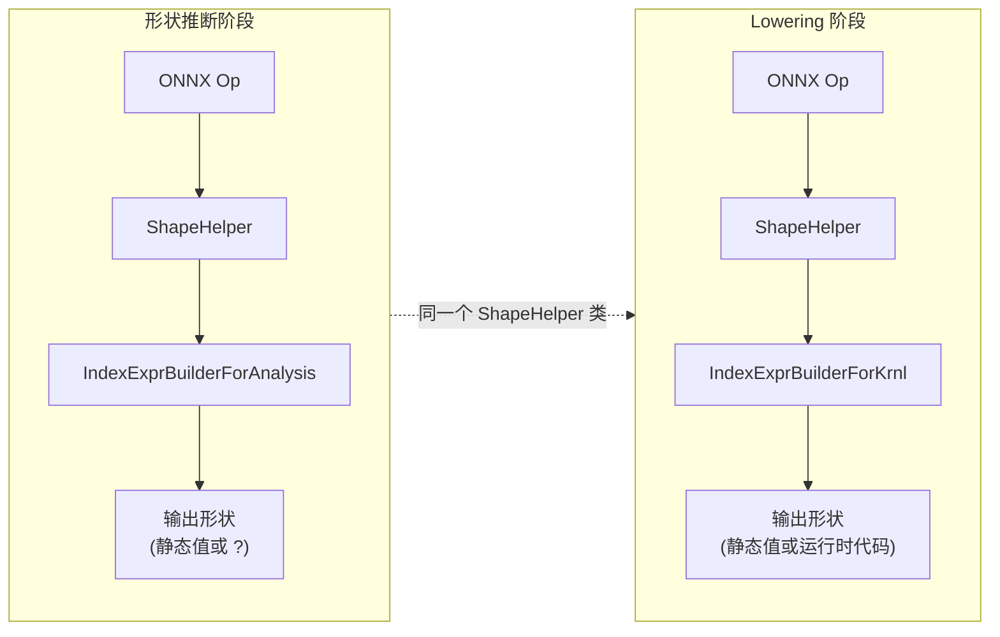

## 2. 架构总览

### 2.1 类继承体系

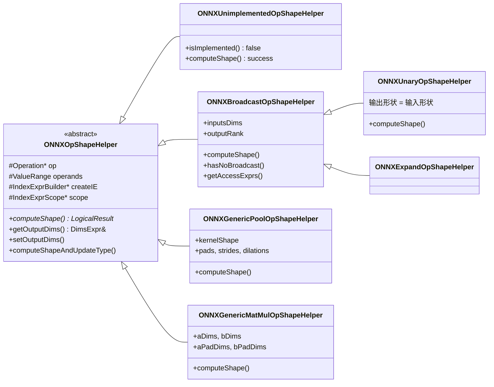

### 2.2 ShapeHelper 与其他组件的关系

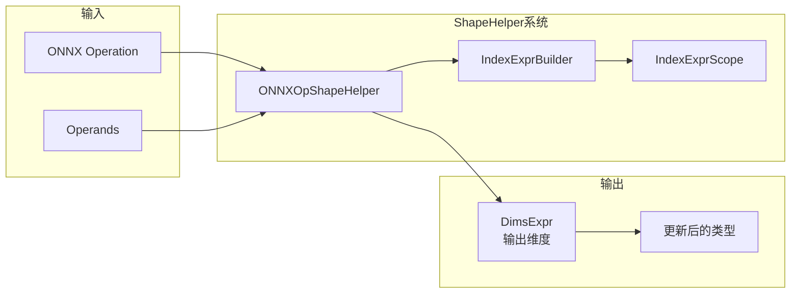

### 2.3 IndexExpr 类型系统

ShapeHelper 使用 IndexExpr 系统表示维度值，支持编译时常量和运行时计算。

#### IndexExpr 类型层次

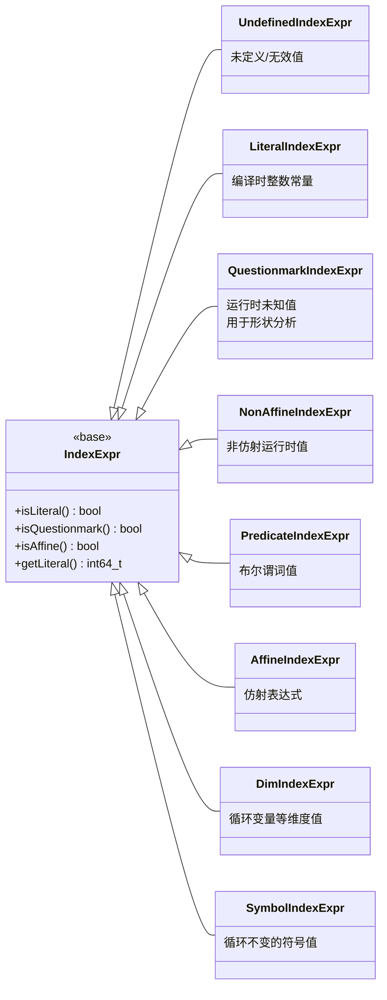

#### IndexExpr 类型说明

| 类型                  | 用途                         | 示例                 |
| --------------------- | ---------------------------- | -------------------- |
| UndefinedIndexExpr    | 表示未定义或无效的索引表达式 | 越界访问时返回       |
| LiteralIndexExpr      | 编译时已知的整数常量         | LiteralIndexExpr(64) |
| QuestionmarkIndexExpr | 形状分析阶段的运行时未知值   | 动态维度 ?           |
| NonAffineIndexExpr    | 非仿射的运行时值             | 浮点数转换、复杂计算 |
| PredicateIndexExpr    | 布尔谓词表达式               | 条件判断结果         |
| AffineIndexExpr       | 仿射表达式                   | 2*i + 3              |
| DimIndexExpr          | 循环迭代变量等维度值         | 循环索引 iv          |
| SymbolIndexExpr       | 循环不变的符号值             | 批量大小 batch_size  |

#### 在 ShapeHelper 中的使用

```cpp
// 形状推断阶段：动态维度返回 QuestionmarkIndexExpr
IndexExpr dim = createIE->getShapeAsDim(input, 0);
// 如果 input 的第0维是动态的，dim.isQuestionmark() == true

// Lowering 阶段：动态维度返回 SymbolIndexExpr（生成运行时代码）
IndexExpr dim = createIE->getShapeAsDim(input, 0);
// 如果 input 的第0维是动态的，dim.isSymbol() == true
// 并且 dim 包含生成的运行时值

// 编译时常量总是返回 LiteralIndexExpr
IndexExpr dim = createIE->getShapeAsDim(input, 0);
// 如果 input 的第0维是 64，dim.isLiteral() == true
// dim.getLiteral() == 64
```

### 2.4 IndexExprBuilder 体系

IndexExprBuilder 是连接 ShapeHelper 和 IndexExpr 系统的桥梁，负责从 MLIR 值中提取索引表达式。

类继承关系

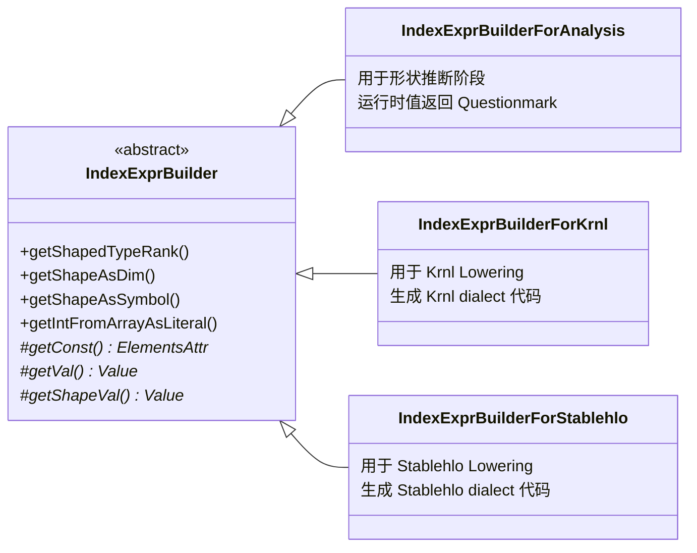

#### 纯虚方法详解

IndexExprBuilder 定义了3个纯虚方法，子类必须实现：

```cpp
struct IndexExprBuilder : DialectBuilder {
// ... 其他方法 ...

// === 纯虚方法（子类必须实现）===

// 1. 获取常量属性
// 从定义 value 的操作中获取 ElementsAttr 常量
// 返回 nullptr 如果不是常量
virtual mlir::ElementsAttr getConst(mlir::Value value) = 0;

// 2. 获取数组元素值
// 从 arrayVal 数组中获取索引 i 处的值
// 返回 nullptr 如果无法获取
virtual mlir::Value getVal(mlir::Value arrayVal, uint64_t i) = 0;

// 3. 获取形状维度值
// 从 tensor/memref 的形状中获取索引 i 处的维度值
// 返回 nullptr 如果无法获取
virtual mlir::Value getShapeVal(
	mlir::Value tensorOrMemrefValue, uint64_t i) = 0;
};
```

#### 子类实现差异

| 方法        | IndexExprBuilderForAnalysis       | IndexExprBuilderForKrnl            |
| ----------- | --------------------------------- | ---------------------------------- |
| getConst    | 查找常量折叠结果                  | 同左                               |
| getVal      | 返回 nullptr（生成 Questionmark） | 生成 Krnl.load 操作获取运行时值    |
| getShapeVal | 返回 nullptr（生成 Questionmark） | 生成 memref.dim 操作获取运行时维度 |

#### 使用示例

```cpp
// 形状推断阶段
IndexExprBuilderForAnalysis ieBuilder(loc);
IndexExpr dim = ieBuilder.getShapeAsDim(tensor, 0);
// 动态维度 → QuestionmarkIndexExpr
// 静态维度 → LiteralIndexExpr

// Lowering 阶段
IndexExprBuilderForKrnl ieBuilder(rewriter, loc);
IndexExpr dim = ieBuilder.getShapeAsDim(tensor, 0);
// 动态维度 → SymbolIndexExpr（包含 memref.dim 操作的结果）
// 静态维度 → LiteralIndexExpr
```

## 3. 基类设计

### 3.1 ONNXOpShapeHelper 基类

所有 ShapeHelper 的基类，定义了核心接口和数据结构：

```cpp
struct ONNXOpShapeHelper {
// === 构造函数 ===
// @param op: 待分析的操作
// @param operands: 操作数（空则从 op 获取，用于形状推断；
//                  非空则使用提供的值，用于 Lowering）
// @param ieBuilder: 索引表达式构建器（null 则使用 IndexExprBuilderForAnalysis）
// @param scope: 索引表达式作用域（null 则创建本地作用域）
ONNXOpShapeHelper(mlir::Operation *op,
	mlir::ValueRange operands,
	IndexExprBuilder *ieBuilder,
	IndexExprScope *scope);

virtual ~ONNXOpShapeHelper();

// === 核心虚方法 ===
// 检查是否有实现（用于 DimAnalysis 跳过未实现的操作）
virtual bool isImplemented() { return true; }

// 计算输出形状，由子类实现
virtual mlir::LogicalResult computeShape() = 0;

// 计算形状并断言成功（用于 Lowering）
void computeShapeAndAssertOnFailure();

// === 形状更新方法 ===
// 计算形状并更新操作的输出类型（所有输出共享同一类型）
mlir::LogicalResult computeShapeAndUpdateType(
	mlir::Type elementType, mlir::Attribute encoding = nullptr);

// 计算形状并更新操作的输出类型（每个输出有独立类型）
mlir::LogicalResult computeShapeAndUpdateTypes(
	mlir::TypeRange elementTypeRange,
	mlir::ArrayRef<mlir::Attribute> encodingList = {});

// === 输出维度访问 ===
// 获取第 n 个输出的维度列表
DimsExpr &getOutputDims(int n = 0);

// 设置第 n 个输出的维度列表
void setOutputDims(const DimsExpr &inferredDims, int n = 0, bool refineShape = true);

// === 辅助方法 ===
// 获取第 n 个输出值
mlir::Value getOutput(int n = 0) { return op->getResult(n); }

// 获取作用域和操作
IndexExprScope *getScope() { return scope; }
mlir::Operation *getOp() { return op; }

// 更新输入张量的指定轴维度（用于传播已知的维度信息）
void updateInputDimAt(mlir::Value inputVal, uint64_t dimSize, int64_t axis);

protected:
// === 辅助设置方法 ===
// 从操作数类型设置输出维度
mlir::LogicalResult setOutputDimsFromOperand(
	mlir::Value operand, int n = 0, bool refineShape = true);

// 从字面量设置输出维度
mlir::LogicalResult setOutputDimsFromLiterals(
	llvm::SmallVector<int64_t, 4> shape, int n = 0, bool refineShape = true);

// 从具有常量形状的类型设置输出维度
mlir::LogicalResult setOutputDimsFromTypeWithConstantShape(
	mlir::Type type, int n = 0, bool refineShape = true);

// === 成员变量 ===
mlir::Operation *op;           // 待分析的操作
mlir::ValueRange operands;     // 操作数
IndexExprBuilder *createIE;    // 索引表达式构建器
IndexExprScope *scope;         // 索引表达式作用域

private:
llvm::SmallVector<DimsExpr, 1> privateOutputsDims;  // 输出维度列表
llvm::SmallVector<mlir::Value> privateOperandsCache; // 操作数缓存
bool ownScope, ownBuilder;     // 是否拥有作用域/构建器的所有权
};
```

### 3.2 构造函数参数详解

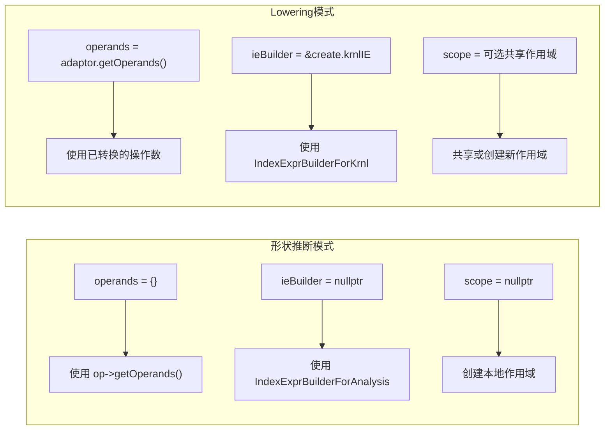

| 参数      | 形状推断阶段                               | Lowering 阶段                                     |
| --------- | ------------------------------------------ | ------------------------------------------------- |
| operands  | 空 {} → 使用 op 的原始操作数               | adaptor.getOperands() → 使用已转换的操作数        |
| ieBuilder | nullptr → 使用 IndexExprBuilderForAnalysis | &create.krnlIE → 使用 IndexExprBuilderForKrnl     |
| scope     | nullptr → 创建本地作用域                   | 可选共享作用域（多个 ShapeHelper 共享时必须提供） |


## 4. 核心 ShapeHelper 详解

### 4.1 ONNXBroadcastOpShapeHelper - 广播操作

处理支持 NumPy 风格广播的二元/多元操作（Add、Mul、Where 等）：

```cpp
struct ONNXBroadcastOpShapeHelper : public ONNXOpShapeHelper {
// === 构造函数 ===
ONNXBroadcastOpShapeHelper(mlir::Operation *op, mlir::ValueRange operands,
	IndexExprBuilder *ieBuilder = nullptr, IndexExprScope *scope = nullptr,
	bool hasUniBroadcasting = false);  // 是否使用单向广播（如 BatchNorm）

// === 计算形状 ===
mlir::LogicalResult computeShape() override;

// 自定义计算（可添加额外操作数，如 Expand 的 shape 输入）
mlir::LogicalResult customComputeShape(
	mlir::ValueRange initialOperands, DimsExpr *additionalOperand = nullptr);

// === 广播查询 ===
// 检查是否无广播发生
virtual bool hasNoBroadcast(DimAnalysis *dimAnalysis = nullptr);

// 检查是否有可管理的内层广播（用于 SIMD 优化）
virtual bool hasManageableBroadcastForInnerDims(
	int64_t &collapsedInnermostLoops, int64_t &collapsedLiteralSize,
	IndexExpr &collapsedDynamicSize, DimAnalysis *dimAnalysis);

// === 访问函数生成 ===
// 获取操作数的访问表达式（处理广播时的索引映射）
virtual mlir::LogicalResult getAccessExprs(
	mlir::Value operand, int64_t i,
	const llvm::SmallVectorImpl<IndexExpr> &loopAccessExprs,
	llvm::SmallVectorImpl<IndexExpr> &operandAccessExprs,
	bool flattenedInnerDims = false, bool ruledOutBroadcast = false);

// === 成员变量 ===
llvm::SmallVector<DimsExpr, 2> inputsDims;  // 所有输入的维度（已对齐）
uint64_t outputRank;                         // 输出秩
};
```

#### 广播计算流程

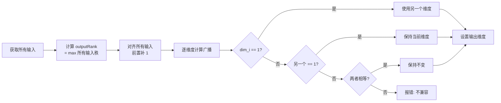

#### 广播示例

```cpp
输入 A: tensor<2x1x4xf32>
输入 B: tensor<3x4xf32>

1. 计算 outputRank = max(3, 2) = 3

2. 对齐（前置补 1）:
 A: [2, 1, 4]
 B: [1, 3, 4]  ← 补 1

3. 逐维度广播:
 dim 0: 2 vs 1 → 2
 dim 1: 1 vs 3 → 3
 dim 2: 4 vs 4 → 4

输出: tensor<2x3x4xf32>
```

### 4.2 ONNXUnaryOpShapeHelper - 一元操作

处理输出形状与输入完全相同的操作（Relu、Sigmoid、Abs 等）：

```cpp
struct ONNXUnaryOpShapeHelper : public ONNXBroadcastOpShapeHelper {
ONNXUnaryOpShapeHelper(mlir::Operation *op, mlir::ValueRange operands,
	IndexExprBuilder *ieBuilder = nullptr, IndexExprScope *scope = nullptr)
	: ONNXBroadcastOpShapeHelper(op, operands, ieBuilder, scope) {}

mlir::LogicalResult computeShape() override;

// 总是返回 true（无广播）
bool hasNoBroadcast(DimAnalysis *dimAnalysis = nullptr) override;

// 访问表达式直接透传
mlir::LogicalResult getAccessExprs(...) override;
};
```

### 4.3 ONNXGenericMatMulOpShapeHelper - 矩阵乘法

处理 MatMul、MatMulInteger、QLinearMatMul 等矩阵乘法操作：

```cpp
template <typename OP_TYPE>
struct ONNXGenericMatMulOpShapeHelper : public ONNXOpShapeHelper {
ONNXGenericMatMulOpShapeHelper(mlir::Operation *op, mlir::ValueRange operands,
	IndexExprBuilder *ieBuilder = nullptr, IndexExprScope *scope = nullptr);

mlir::LogicalResult computeShape() final;

// === 成员变量（填充后的维度信息）===
llvm::SmallVector<IndexExpr, 4> aDims;  // A 的维度（已填充到 paddedRank）
llvm::SmallVector<IndexExpr, 4> bDims;  // B 的维度（已填充到 paddedRank）
llvm::BitVector aPadDims;  // A 的哪些维度是填充的
llvm::BitVector bPadDims;  // B 的哪些维度是填充的
};

// 类型别名
using ONNXMatMulOpShapeHelper = ONNXGenericMatMulOpShapeHelper<ONNXMatMulOp>;
using ONNXMatMulIntegerOpShapeHelper = ONNXGenericMatMulOpShapeHelper<ONNXMatMulIntegerOp>;
using ONNXQLinearMatMulOpShapeHelper = ONNXGenericMatMulOpShapeHelper<ONNXQLinearMatMulOp>;
```

#### MatMul 形状计算详解

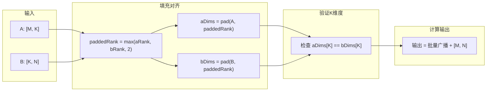

MatMul 计算规则

```cpp
// 对于 A[...batch..., M, K] × B[...batch..., K, N] → C[...batch..., M, N]

LogicalResult ONNXGenericMatMulOpShapeHelper<OP_TYPE>::computeShape() {
  // 1. 获取输入
  Value A = operandAdaptor.getA();
  Value B = operandAdaptor.getB();

  uint64_t aRank = createIE->getShapedTypeRank(A);
  uint64_t bRank = createIE->getShapedTypeRank(B);

  // 2. 计算填充后的秩（至少为 2）
  int paddedRank = std::max({aRank, bRank, 2UL});

  // 3. 填充 A 的维度（前置补 1）
  // 例如: A[M,K] → [1,...,1, M, K]
  int aOffset = paddedRank - aRank;
  for (int i = 0; i < aOffset; ++i) {
	  aDims[i] = LiteralIndexExpr(1);
	  aPadDims[i] = true;
  }
  for (int i = 0; i < aRank; ++i) {
	  aDims[i + aOffset] = createIE->getShapeAsDim(A, i);
	  aPadDims[i + aOffset] = false;
  }

  // 4. 填充 B 的维度（特殊处理 1D 情况）
  // 1D: B[K] → [1,...,1, K, 1]（右边也补 1）
  // nD: B[...,K,N] → [1,...,1, ..., K, N]

  // 5. 批量维度广播
  for (int i = 0; i < paddedRank - 2; ++i) {
	  // 与 BroadcastOpShapeHelper 类似的广播逻辑
	  outputDims[i] = broadcast(aDims[i], bDims[i]);
  }

  // 6. 验证并设置 K 维度
  int aK = paddedRank - 1;  // A 的 K 在最后
  int bK = paddedRank - 2;  // B 的 K 在倒数第二
  if (aDims[aK].isLiteral() && bDims[bK].isLiteral()) {
	  if (aDims[aK].getLiteral() != bDims[bK].getLiteral())
		  return emitError("K 维度不匹配");
  }

  // 7. 添加 M 和 N 维度（如果不是填充的）
  int aN = paddedRank - 2;
  int bM = paddedRank - 1;
  if (!aPadDims[aN]) outputDims.push_back(aDims[aN]);  // M
  if (!bPadDims[bM]) outputDims.push_back(bDims[bM]);  // N

  setOutputDims(outputDims);
  return success();
}
```

MatMul 示例

```cpp
示例 1: 标准 2D 矩阵乘法
A: [3, 4]  (M=3, K=4)
B: [4, 5]  (K=4, N=5)
输出: [3, 5]

示例 2: 批量矩阵乘法
A: [2, 3, 4]  (batch=2, M=3, K=4)
B: [2, 4, 5]  (batch=2, K=4, N=5)
输出: [2, 3, 5]

示例 3: 带广播的批量矩阵乘法
A: [2, 1, 3, 4]  (batch=[2,1], M=3, K=4)
B: [1, 5, 4, 6]  (batch=[1,5], K=4, N=6)
输出: [2, 5, 3, 6]

示例 4: 向量-矩阵乘法
A: [4]      (K=4, 1D)
B: [4, 5]   (K=4, N=5)
填充后: A=[1,4], B=[4,5]
输出: [5]  (M 维度被省略因为是填充的)

示例 5: 向量-向量内积
A: [4]  (K=4)
B: [4]  (K=4)
填充后: A=[1,4], B=[4,1]
输出: []  (标量)
```

### 4.4 ONNXGenericPoolOpShapeHelper - 池化/卷积操作

处理 Conv、AveragePool、MaxPool 等操作：

```cpp
template <typename OP_TYPE, typename OP_ADAPTOR>
struct ONNXGenericPoolOpShapeHelper : public ONNXOpShapeHelper {
ONNXGenericPoolOpShapeHelper(mlir::Operation *op, mlir::ValueRange operands,
	IndexExprBuilder *ieBuilder, IndexExprScope *scope,
	bool hasFilter, bool ceilMode);

mlir::LogicalResult computeShape() final;

// === 成员变量 ===
llvm::SmallVector<IndexExpr, 2> kernelShape;   // 核大小
llvm::SmallVector<IndexExpr, 4> pads;          // 填充 [begin..., end...]
llvm::SmallVector<int64_t, 2> strides;         // 步长
llvm::SmallVector<int64_t, 2> dilations;       // 膨胀率
bool hasFilter;   // 是否有卷积核（Conv vs Pool）
bool ceilMode;    // 使用 ceil 还是 floor 计算输出大小
};
```

池化/卷积输出尺寸公式

```cpp
output_size = floor((input_size + pad_begin + pad_end -
				   ((kernel_size - 1) * dilation + 1)) / stride) + 1

如果 ceilMode = true:
output_size = ceil(...) + 1
```

### 4.5 ONNXGenericReductionOpShapeHelper - 归约操作

处理 ReduceSum、ReduceMean、ReduceMax 等操作：

```cpp
template <typename OP_TYPE>
struct ONNXGenericReductionOpShapeHelper : public ONNXOpShapeHelper {
ONNXGenericReductionOpShapeHelper(mlir::Operation *op, mlir::ValueRange operands,
	IndexExprBuilder *ieBuilder = nullptr, IndexExprScope *scope = nullptr);

mlir::LogicalResult computeShape() final;

// === 成员变量 ===
llvm::SmallVector<bool, 4> isReductionAxis;  // 每个轴是否被归约
};
```

### 4.6 ONNXGenericRNNShapeHelper - RNN 操作

处理 LSTM、GRU、RNN 等循环神经网络操作：

```cpp
template <typename OP_TYPE>
struct ONNXGenericRNNShapeHelper : public ONNXOpShapeHelper {
ONNXGenericRNNShapeHelper(mlir::Operation *op, mlir::ValueRange operands,
	IndexExprBuilder *ieBuilder = nullptr, IndexExprScope *scope = nullptr);

mlir::LogicalResult computeShape() final;

// 自定义计算方法，gates 参数指定门的数量
// LSTM: gates = 4 (i, o, f, c)
// GRU:  gates = 3 (z, r, h)
// RNN:  gates = 1
mlir::LogicalResult customComputeShape(int gates);
};

// 类型别名
using ONNXLSTMOpShapeHelper = ONNXGenericRNNShapeHelper<mlir::ONNXLSTMOp>;
using ONNXGRUOpShapeHelper = ONNXGenericRNNShapeHelper<mlir::ONNXGRUOp>;
using ONNXRNNOpShapeHelper = ONNXGenericRNNShapeHelper<mlir::ONNXRNNOp>;
```

RNN 输出形状计算

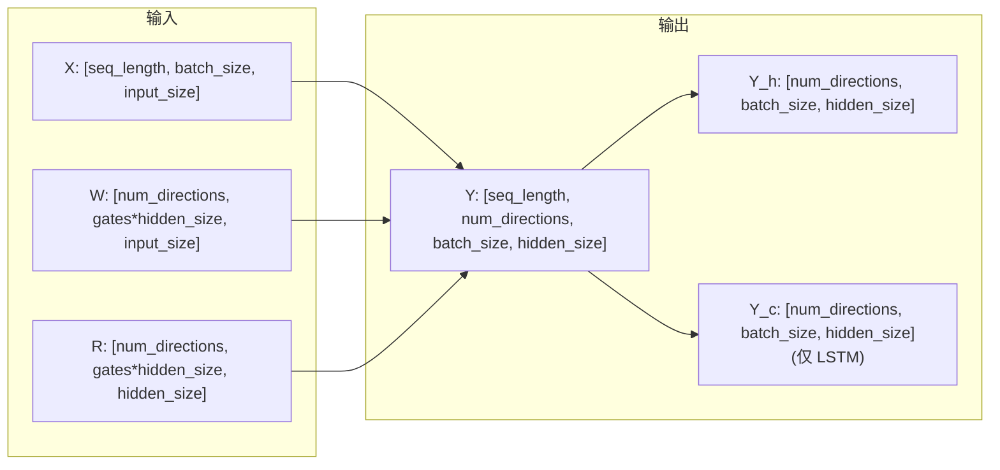

| 操作 | gates | 输出数量        |
| ---- | ----- | --------------- |
| LSTM | 4     | 3 (Y, Y_h, Y_c) |
| GRU  | 3     | 2 (Y, Y_h)      |
| RNN  | 1     | 2 (Y, Y_h)      |


### 4.7 特殊操作的 ShapeHelper

```cpp
ONNXSliceOpShapeHelper

struct ONNXSliceOpShapeHelper : public ONNXOpShapeHelper {
mlir::LogicalResult computeShape() final;

// 切片参数
llvm::SmallVector<IndexExpr, 4> starts;
llvm::SmallVector<IndexExpr, 4> ends;
llvm::SmallVector<IndexExpr, 4> steps;
};

ONNXGemmOpShapeHelper

struct ONNXGemmOpShapeHelper : public ONNXOpShapeHelper {
mlir::LogicalResult computeShape() final;

llvm::SmallVector<IndexExpr, 4> aDims;  // 转置后的 A 维度
llvm::SmallVector<IndexExpr, 4> bDims;  // 转置后的 B 维度
llvm::SmallVector<IndexExpr, 4> cDims;  // 广播后的 C 维度
bool hasBias;
int cRank;
};

ONNXReshapeOpShapeHelper

struct ONNXReshapeOpShapeHelper : public ONNXOpShapeHelper {
mlir::LogicalResult computeShape() final;
// 处理 -1（推断）和 0（保持原值）的特殊语义
};

ONNXConcatOpShapeHelper

struct ONNXConcatOpShapeHelper : public ONNXOpShapeHelper {
mlir::LogicalResult computeShape() final;
// 在 axis 维度累加，其他维度必须相等
};
```

## 5. ShapeHelper 操作映射

### 5.1 完整的操作映射关系

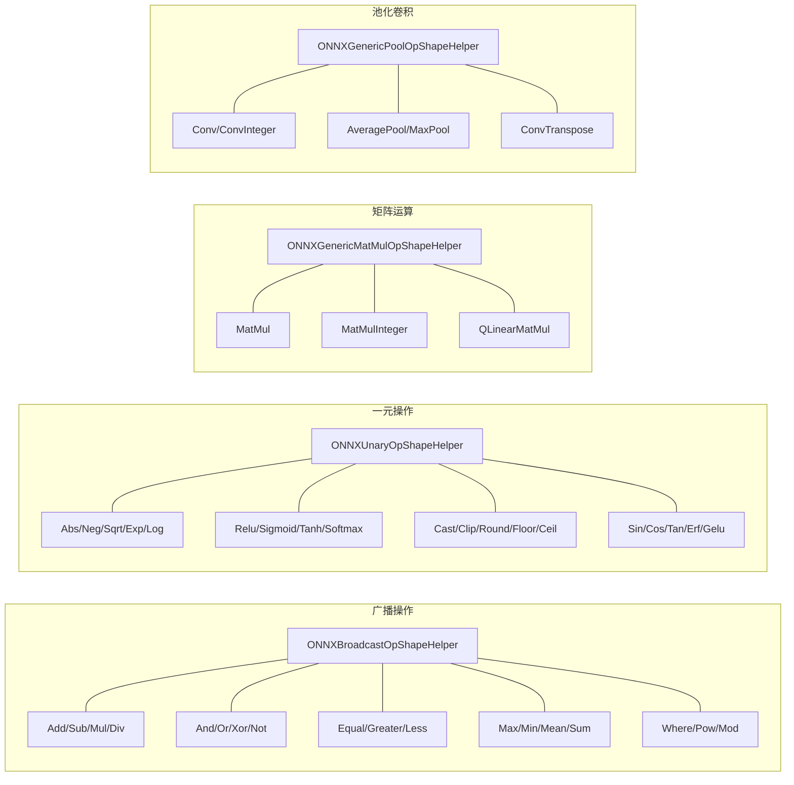

### 5.2 按类别分类的完整表格

| 类别      | ShapeHelper                        | 支持的操作                                                   |
| --------- | ---------------------------------- | ------------------------------------------------------------ |
| 广播操作  | ONNXBroadcastOpShapeHelper         | Add, Sub, Mul, Div, Pow, Mod, And, Or, Xor, Equal, Greater, Less, Max, Min, Mean, Sum, Where |
| 一元操作  | ONNXUnaryOpShapeHelper             | Abs, Neg, Sqrt, Exp, Log, Relu, Sigmoid, Tanh, Softmax, Cast, Clip, Round, Floor, Ceil, Sin, Cos, Erf, Gelu, Reciprocal, ... |
| 矩阵运算  | ONNXGenericMatMulOpShapeHelper     | MatMul, MatMulInteger, QLinearMatMul                         |
| Gemm      | ONNXGemmOpShapeHelper              | Gemm                                                         |
| 池化/卷积 | ONNXGenericPoolOpShapeHelper       | Conv, ConvInteger, AveragePool, MaxPool                      |
| 全局池化  | ONNXGenericGlobalPoolOpShapeHelper | GlobalAveragePool, GlobalMaxPool, GlobalLpPool               |
| 归约操作  | ONNXGenericReductionOpShapeHelper  | ReduceSum, ReduceMean, ReduceMax, ReduceMin, ReduceL1, ReduceL2, ReduceProd |
| RNN 操作  | ONNXGenericRNNShapeHelper          | LSTM, GRU, RNN                                               |
| 形状变换  | 各自的 ShapeHelper                 | Reshape, Transpose, Concat, Gather, Slice, Split, Squeeze, Unsqueeze, Flatten, Tile, Expand |

## 6. 使用方式详解

### 6.1 形状推断中使用

在 ONNX 操作的 inferShapes 方法中使用：

```cpp
LogicalResult ONNXMatMulOp::inferShapes(
  std::function<void(Region &)> doShapeInference) {
// 1. 检查输入是否有形状信息
if (!hasShapeAndRank(getA()) || !hasShapeAndRank(getB()))
  return success();  // 等待后续推断

// 2. 获取输出元素类型
Type elementType = mlir::cast<ShapedType>(getA().getType()).getElementType();

// 3. 创建 ShapeHelper（使用默认参数，即分析模式）
ONNXMatMulOpShapeHelper shapeHelper(getOperation(), {});

// 4. 计算形状并更新操作的输出类型
return shapeHelper.computeShapeAndUpdateType(elementType);
}
```

形状推断流程

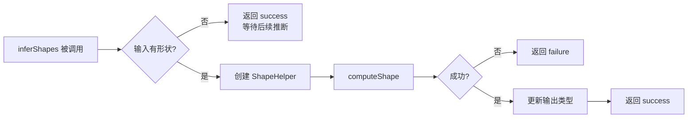

### 6.2 Lowering 中使用

在转换模式中使用已计算的形状分配内存：

```cpp
struct ONNXMatMulOpLowering : public OpConversionPattern<ONNXMatMulOp> {
LogicalResult matchAndRewrite(ONNXMatMulOp matMulOp, OpAdaptor adaptor,
	ConversionPatternRewriter &rewriter) const final {

  Operation *op = matMulOp.getOperation();
  Location loc = ONNXLoc<ONNXMatMulOp>(op);

  // 1. 创建 MultiDialectBuilder
  MultiDialectBuilder<IndexExprBuilderForKrnl, MathBuilder, MemRefBuilder>
	  create(rewriter, loc);

  // 2. 创建 ShapeHelper，使用已转换的操作数和 Krnl IndexExprBuilder
  ONNXMatMulOpShapeHelper shapeHelper(op, adaptor.getOperands(), &create.krnlIE);

  // 3. 计算形状
  shapeHelper.computeShapeAndAssertOnFailure();

  // 4. 获取输出维度
  DimsExpr outputDims = shapeHelper.getOutputDims();

  // 5. 分配输出内存
  MemRefType outputMemRefType = ...;
  Value alloc = create.mem.alignedAlloc(outputMemRefType, outputDims);

  // 6. 使用 shapeHelper 中的中间结果
  DimsExpr &aDims = shapeHelper.aDims;
  DimsExpr &bDims = shapeHelper.bDims;
  llvm::BitVector &aPadDims = shapeHelper.aPadDims;
  llvm::BitVector &bPadDims = shapeHelper.bPadDims;

  // 7. 生成计算代码...

  rewriter.replaceOp(matMulOp, alloc);
  return success();
}
};
```

### 6.3 共享作用域的使用

当需要分析多个操作的形状且它们相互依赖时：

```cpp
void analyzeMultipleOps(Operation *op1, Operation *op2, OpBuilder &builder, Location loc) {
// 创建共享的 IndexExprScope
IndexExprScope scope(&builder, loc);

// 创建共享的 IndexExprBuilder
IndexExprBuilderForKrnl ieBuilder(builder, loc);

// 两个 ShapeHelper 共享同一个 scope
ONNXMatMulOpShapeHelper shapeHelper1(op1, {}, &ieBuilder, &scope);
shapeHelper1.computeShapeAndAssertOnFailure();

// 第二个 ShapeHelper 可以引用第一个的输出
ONNXReluOpShapeHelper shapeHelper2(op2, {op1->getResult(0)}, &ieBuilder, &scope);
shapeHelper2.computeShapeAndAssertOnFailure();
}
```

### 6.4 与 DimAnalysis 配合使用

利用 DimAnalysis 优化广播检测：

```cpp
void optimizeWithDimAnalysis(Operation *op, DimAnalysis &dimAnalysis) {
ONNXBroadcastOpShapeHelper shapeHelper(op, {});
shapeHelper.computeShapeAndAssertOnFailure();

// 检查是否有广播（利用 DimAnalysis 的动态维度相等信息）
bool noBroadcast = shapeHelper.hasNoBroadcast(&dimAnalysis);

if (noBroadcast) {
  // 可以生成更简单的代码，无需广播处理
  generateSimpleCode();
} else {
  // 检查是否有可管理的广播（用于 SIMD 优化）
  int64_t collapsedLoops, literalSize;
  IndexExpr dynamicSize;
  bool manageable = shapeHelper.hasManageableBroadcastForInnerDims(
	  collapsedLoops, literalSize, dynamicSize, &dimAnalysis);

  if (manageable) {
	generateSimdOptimizedCode(collapsedLoops);
  } else {
	generateGeneralBroadcastCode();
  }
}
}
```

## 7. 辅助函数和工具

### 7.1 类型更新函数

```cpp
// 更新操作输出的类型
void updateType(Operation *op, Value val, ArrayRef<int64_t> shape,
  Type elementType = nullptr, Attribute encoding = nullptr,
  bool refineShape = true);

// 将形状重置为全动态（用于某些转换）
void resetTypesShapeToQuestionmarks(Operation *op);
```

### 7.2 常量保存函数

```cpp
// 将常量值保存到操作的操作数中
void SaveOnnxConstInOp(Operation *op, MutableOperandRange operand,
  const SmallVectorImpl<int64_t> &vals);
```

### 7.3 一元操作的快捷函数

```cpp
// 一元操作的形状推断（输出形状 = 输入形状）
LogicalResult inferShapeForUnaryOps(Operation *op);
LogicalResult inferShapeForUnaryOps(Operation *op, Type elementType);
LogicalResult inferShapeForUnaryOps(Operation *op, Type elementType, Attribute encoding);
```

## 8. 实现新操作的 ShapeHelper

### 8.1 实现步骤


### 8.2 示例：实现 MyCustomOp 的 ShapeHelper

```cpp
// 在 ShapeHelper.hpp 中声明
struct ONNXMyCustomOpShapeHelper : public ONNXOpShapeHelper {
ONNXMyCustomOpShapeHelper(mlir::Operation *op, mlir::ValueRange operands,
	IndexExprBuilder *ieBuilder = nullptr, IndexExprScope *scope = nullptr)
	: ONNXOpShapeHelper(op, operands, ieBuilder, scope) {}

mlir::LogicalResult computeShape() final;

// 自定义成员变量（如果需要）
llvm::SmallVector<IndexExpr, 4> customDims;
};

// 在对应的 .cpp 文件中实现
LogicalResult ONNXMyCustomOpShapeHelper::computeShape() {
ONNXMyCustomOpAdaptor operandAdaptor(operands, op->getAttrDictionary());

// 1. 获取输入
Value input = operandAdaptor.getInput();
if (!hasShapeAndRank(input))
  return failure();

// 2. 获取输入维度
uint64_t rank = createIE->getShapedTypeRank(input);
DimsExpr inputDims;
createIE->getShapeAsDims(input, inputDims);

// 3. 计算输出维度
DimsExpr outputDims;
for (uint64_t i = 0; i < rank; ++i) {
  // 自定义计算逻辑
  outputDims.emplace_back(inputDims[i] * LiteralIndexExpr(2));
}

// 4. 设置输出
setOutputDims(outputDims);
return success();
}

// 在 MyCustomOp.cpp 中使用
LogicalResult ONNXMyCustomOp::inferShapes(
  std::function<void(Region &)> doShapeInference) {
if (!hasShapeAndRank(getInput()))
  return success();

Type elementType = mlir::cast<ShapedType>(getInput().getType()).getElementType();
ONNXMyCustomOpShapeHelper shapeHelper(getOperation(), {});
return shapeHelper.computeShapeAndUpdateType(elementType);
}
```

## 9. 最佳实践

### 9.1 选择正确的基类

```cpp
// 输出形状 = 输入形状（一元操作）
→ 继承 ONNXUnaryOpShapeHelper 或使用 inferShapeForUnaryOps

// 需要广播的多输入操作
→ 继承 ONNXBroadcastOpShapeHelper

// 有特殊计算逻辑
→ 直接继承 ONNXOpShapeHelper
```

### 9.2 正确处理动态维度

```cpp
LogicalResult computeShape() {
// ✅ 正确：使用 IndexExpr 处理动态维度
IndexExpr dim = createIE->getShapeAsDim(input, 0);
IndexExpr newDim = dim + LiteralIndexExpr(1);

// ❌ 错误：假设维度是静态的
int64_t dimVal = inputType.getDimSize(0);  // 可能是 ShapedType::kDynamic
}
```

### 9.3 验证输入有效性

```cpp
LogicalResult computeShape() {
// 总是先检查输入是否有形状信息
if (!hasShapeAndRank(input))
  return failure();

// 对于可选输入，检查是否存在
if (!isNoneValue(optionalInput)) {
  // 处理可选输入
}
}
```


### 9.4 共享作用域

```cpp
// 当分析相互依赖的操作时，必须共享作用域
// 否则 IndexExpr 引用可能失效
IndexExprScope sharedScope(&builder, loc);
ShapeHelper1 sh1(op1, {}, &ieBuilder, &sharedScope);
ShapeHelper2 sh2(op2, {}, &ieBuilder, &sharedScope);  // 共享同一个 scope
```

## 10. 总结

ShapeHelper 是 onnx-mlir 形状推断基础设施的核心组件：

| 特性             | 说明                                       |
| ---------------- | ------------------------------------------ |
| 统一接口         | 同一套代码用于形状推断和 Lowering          |
| IndexExpr 集成   | 自然处理静态和动态维度                     |
| 丰富的基类       | 覆盖广播、一元、矩阵乘法、池化等常见模式   |
| 中间结果暴露     | 子类可以暴露计算的中间结果供 Lowering 使用 |
| DimAnalysis 集成 | 支持更精确的动态维度分析                   |
| 可扩展性         | 易于为新操作添加支持                       |

### 文件位置

| 文件                                     | 内容                            |
| ---------------------------------------- | ------------------------------- |
| src/Interface/ShapeHelperOpInterface.hpp | ONNXOpShapeHelper 基类定义      |
| src/Dialect/ONNX/ONNXOps/ShapeHelper.hpp | 各种 ShapeHelper 子类声明       |
| src/Dialect/ONNX/ONNXOps/ShapeHelper.cpp | 通用 ShapeHelper 实现           |
| src/Dialect/ONNX/ONNXOps/Math/*.cpp      | 数学操作的 ShapeHelper 实现     |
| src/Dialect/ONNX/ONNXOps/NN/*.cpp        | 神经网络操作的 ShapeHelper 实现 |
| src/Dialect/ONNX/ONNXOps/Tensor/*.cpp    | 张量操作的 ShapeHelper 实现     |
| src/Dialect/ONNX/ONNXOps/RNN/*.cpp       | RNN 操作的 ShapeHelper 实现     |
