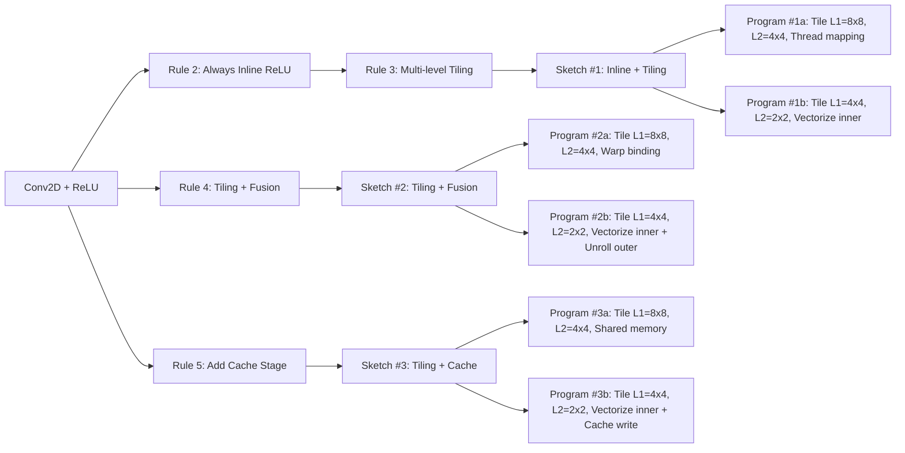

> 声明：本文纯手写

## 2. 第二代：Ansor - 高性能算子自动生成框架

资料：[2020 Ansor: Generating High-Performance Tensor Programs for Deep Learning](https://arxiv.org/abs/2006.06762)

### 2.1 背景

当时，在自动生成高性能算子（当然主要是针对融合算子）领域，主要有两类代表：

#### 2.1.1 Halide auto-scheduler

引入了schedule原语表示算子的计算逻辑，基于规则自动生成搜索空间。规则是由人工指定的schedule操作顺序（比如loop nest、tiling、split、reorder等），具体参数动态搜索。

由于搜索空间非常大，其采取了一种**激进的剪枝策略**，也就是按照操作顺序**逐层评估选优**。比如先选择最优的loop层数，确定好之后再选择tiling大小。此时因为只确定了部分schedule操作，所以其评估算法（分析代价模型）的输入就是**不完整的算子逻辑**。这种方法存在的问题：

* 搜索空间有限：激进的剪枝策略，固定的schedule逻辑，导致搜索空间非常受限。
* 代价模型不准：人工建模硬件性能，难度大、灵活性差而且误差大。
* 不完整输入影响效果：中途评估性能非常容易误杀组合优化。

#### 2.1.2 TVM

仿照Halide，引入schedule原语表示计算逻辑，通过人工设计schedule模板、数据驱动的ML代价模型以及实测反馈调优的方式来寻优， 避免或缓解了上述3个问题。但是依然存在一个问题：需要人工写好算子级的schedule模板，通用性差，依然存在搜索空间有限的问题。

面对上述问题，如何设计一款：

* 自动构造完备搜索空间
* 搜索效率高

的深度学习编译器框架呢？

### 2.2 方案

#### 2.2.1 Program Sampler - 自动构造分层搜索空间

Ansor把搜索空间拆成两层：

* 高层（structure），比如fusion、compute_at、多级tiling等；
* 底层（detail），比如tiling size具体大小、unroll多少、vectorize哪层、thread binding多大等。

然后针对每个算子自动组合上述所有的高层和底层操作，也就是从**手写模板**优化成了**预定义操作**，理论上只要操作足够丰富，参数足够全面，则自动生成的搜索空间一定包含最优解。

在Ansor中，这个模块称为**Program Sampler**，主要包括两部分：**Sketch Generation**（自动生成结构搜索空间）和**Random Annotation**（随机补全具体参数）。

#### 2.2.2 Performance Tuner - 进化搜索高效寻优

如果真的生成完备的搜索空间，那搜索效率再高也无事于补。所以Ansor设计了基于进化的搜索算法+基于学习的代价模型，通过采样+进化调优的方式近似找到最优解，这个模块称为**Performance Tunner**。

* 初始化种群
  * 用Program Sampler随机生成一小部分个体
  * 实测优质的个体（首次没有）

* 用进化搜索算法+代价模型+实测反馈来迭代调优
  * 用代价模型评估每个个体性能，然后将性能作为概率进行挑选
  * 用进化算法生成一批后代个体
  * 用代价模型评估，选出TopK个“优质”个体
  * “优质”个体上板实测，获得真实执行耗时
  * 根据真实数据重训练代价模型
  * （实测优质个体加入种群，对应初始化种群的第2点）

* 迭代执行上述流程

#### 2.2.3 Task Scheduler - 自动识别调优全链路性能瓶颈

Ansor不仅考虑单算子的性能，还综合考虑整个模型端到端的性能。目标是整个模型端到端耗时最优，因此需要识别出端到端链路中的性能瓶颈。在有限的时间资源下，重点解决性能瓶颈，实现收益最大化。因此Ansor专门设计了一个模块：Task Scheduler。

Task Scheduler首先对问题进行数学建模，定义为如何分配调优资源（给哪个算子/task）才能最小化端到端耗时。最常见的求解方法当然是梯度下降算法，然而这个梯度是不可直接计算的（无法数学化上述函数且调优资源是离散的），只能将其转换为近似梯度下降问题解决。大致思路为：

* **参考历史效果**，最近一段时间，这个task的优化效果如何？
* **乐观估计**，$\alpha(历史趋势) + (1-\alpha)(潜力预测)$，$\alpha$部分：最近效果好就继续分配资源；$1-\alpha$部分：距离优化上限是多少？不能过度乐观。
* **任务相似性**，潜力预测可以参考相似任务的最好表现

简单一句话就是：如果再给task $i$ 一次调优机会，值不值得？

### 2.3 具体实现

#### 2.3.1 Program Sampler

**阶段一：生成Sketch**

（1）首先，算法输入是算子DAG图，按照拓扑排序遍历图中每一个节点（算子）进行生成动作。Ansor把算子分成两类：**计算复杂类**（比如matmul）和**Elementwise类**。

* 计算复杂类，通常的处理操作是对其应用切分和融合操作作为骨架。
* Elementwise类，通常将其inline到相邻的复杂类算子中。

（2）然后论文提出了一种Derivation-based的状态枚举方法，递归的应用预定义的规则，生成所有可能的骨架。逻辑如下：

* 初始化状态是原始DAG，倒序（从output->input）遍历每个节点。
* 针对每个节点，遍历所有规则，每个规则可以产生0个或多个状态，累积起来。
* 前进一步，遍历下一个节点（父节点），当遍历到input节点时（index=0）结束，此时会产生一个完整的sketch。

这个方法会产生一组多叉树，每一条路径是一个sketch。

（3）介绍下预定义的规则：

| No   | Rule Name                      | Condition                                     | Application                                           |
| ---- | ------------------------------ | --------------------------------------------- | ----------------------------------------------------- |
| 1    | Skip                           | !IsStrictInlinable(S,i)                       | $S' = S;i' = i−1$                                     |
| 2    | Always Inline                  | IsStrictInlinable(S,i)                        | $S' = Inline(S,i); i' = i−1$                          |
| 3    | Multi-level Tiling             | HasDataReuse(S,i)                             | $S' = MultiLevelTiling(S,i);i' = i−1$                 |
| 4    | Multi-level Tiling with Fusion | HasDataReuse(S,i) && HasFusibleConsumer(S,i)  | $S' = FuseConsumer(MultiLevelTiling(S,i),i);i' = i−1$ |
| 5    | Add Cache Stage                | HasDataReuse(S,i) && !HasFusibleConsumer(S,i) | $S' = AddCacheWrite(S,i);i = i'$                      |
| 6    | Reduction Factorization        | HasMoreReductionParallel(S,i)                 | $S' = AddR factor(S,i);i' = i−1$                      |
| ...  | User Defined Rule              | ...                                           | ...                                                   |

规则解释：

（1）No.1和No.2是对立的规则，每次只会命中其中1个。含义是判断当前节点能否安全inline到其他节点中，也就是之前说的算子通常分成两类。如果遇到可以inline的节点，直接将其inline掉，继续处理下一个节点（$i'=i-1$）。

（2）No.3/4/5是并列的3个规则，可以同时产生不同的结果。

* HasDataReuse，判断当前节点是否是计算敏感性且适合切分产生数据复用，比如matmul等。如果支持就增加MultiLevelTiling操作，也就是切分，这样不同的Sketch的切分方案就不同了。
* HasFusibleConsumer，判断当前节点是否能够被其子节点（消费者）融合起来，比如matmul遇到了bias_add、conv遇到了relu等。如果支持融合，就增加一个FuseConsumer操作，这样不同的Sketch图结构和融合范围就不同了。
* HasMoreReductionParallel，判断当前节点是否包含可并行的reduce操作。如果支持的话，则添加Rfactor操作，此操作增加reduce的并行度，当然要处理好最终结果正确性。

另外，还支持用户自定义规则。

简单演示一下生成的Sketch：

**阶段二：随机填充Annotation**

流程比较简单，为上一步产生的Sketch骨架随机填充具体参数。参数类型包括：

* Tile size，每个标记tiling的轴具体切分大小
* Parallelize，选择最外层的N个轴并行化
* Vectorize，选择最内层的M个轴进行向量化
* Unroll，选择最内层的K个轴进行循环展开，以及展开因子
* Compute location，随机调整部分节点的计算位置，在满足数据依赖的前提下可以把计算往内层循环放，增加并行度。

#### 2.3.2 Performance Tuner

**进化搜索**

（1）初始化种群在之前介绍过，主要来源有两个，这里不再赘述。

（2）进化算法要先从种群中挑选部分个体进行衍生。挑选方法是根据每个个体的评估结果作为挑选概率，性能越高，选中的概率越大。同时为了保持多样性，还会随机从种群中挑选少量个体，最终组成候选个体作为父代。

（3）针对每个选中的父代个体，随机挑选一种基因变异操作，生成新的子代个体。而每个父代个体可能被多次选中。

（4）所有子代个体经过代价模型预测选中TopK进行硬件实测

（5）获得K个实测数据后，更新代价模型，并挑选性能优质的个体作为下一次迭代的初始种群。

接下来要介绍下基因是什么。在Ansor的视角，每个个体（Program）是由一系列变换步骤组成，每一步视为一组基因。变异操作就是随机改变这一系列变换中的某一步。

变换步骤都有哪些呢？就是Program Sampler组成每个Program时的所有动作，比如tile、parallel等。

所有的变异操作分为两类：

（1）Mutation（单亲局部扰动）：针对一个父代个体进行邻近扰动生成一个新的子代个体。

* Tile size扰动，随机挑选一个标记为Tile的轴，然后随机选两个tiling level，随机生成一个因子factor，其中一个tiling除以factor，另外一个tiling乘以factor，确保最终循环长度不变。
* Parallel扰动，随机挑选一个标记为Parallel的轴，从两种操作中随机挑选一个：
  * Fuse，与相邻loop融合
  * Split，拆分成两个loop
* Pragma扰动，随机选中一个pragma，随机变成另外一个合法值。典型的progma包括：
  * unroll深度
  * vectorize宽度
  * cache hint
* Computation location扰动，随机选择一个没有多级tiling的节点，随机改变它的计算位置到一个合理的位置。

（2）Crossover（多亲重组）：以节点为单元，将多个父代个体重组出一个子代个体。其中个体Program是DAG，DAG是由多个node节点组成。

* 随机选择两个或多个父代个体，这些个体由相同的node组成（不同的融合范围生成的node不同）。
* 为每个node随机选择一个父代，最终可以组合出一个子代个体。

**基于学习的代价模型**

代价模型针对最内层循环的循环无关的计算原语进行建模和评估得分，然后把program中所有的计算原语的评估得分累加求和作为program的评估值。

构建特征向量：针对计算原语提取上下文特征，主要包括**统计类特征**和**内存访问类**特征。举例：

* 浮点型操作节点数
* 整型操作节点数
* 向量化相关的特征：向量化循环长度、所有向量化循环长度乘积等
* 内存访问相关特征：访问类型、访问量、数据复用类型等。

损失函数：平方差的加权和

模型选择：GBDT

label：每个Program的的吞吐量归一化到0~1，即预测值是每个Program的吞吐量。

#### 2.3.3 Task Scheduler

**问题定义**
$$
minimize \ f( \ g_1(t), g_2(t), ..., g_n(t)  \  )
$$
$t$：n维向量，$t_i$表示第$i$个任务（节点）分配的资源单位；

$g_i(t)$：按照$t$这样的资源分配，节点$i$最短延迟；

$f(·)$：整个计算图端到端的延迟

为了最小化单图的端到端延迟，最简单的一种$f$的定义就是每个节点出现次数*每个节点最短延迟的求和。这种定义是把所有节点执行视为串行，是一种近似。

而面对多图（多个DNN模型）时，可以设计多种目标函数以满足不同的任务目标，比如：

* Pipeline总延迟最小：$f_1 = \sum_{j=1}^{m} \sum_{i \in S(j)} g_i$，假设多个DNN串行执行，最小化端到端总耗时。
* 延迟满足即可：$f_2 = \sum_{j=1}^{m} \max(0, \text{latency}_j - L_j)$，如果 DNN j 已经满足延迟要求，就不必继续优化它，更关心满足 SLA，而不是单图极限性能。
* 均衡优化（Speedup against reference latency）：$f_3 = \left(\prod_{j=1}^{m} \frac{B_j}{\text{latency}_j}\right)^{1/m}$，提升各计算图相对于参考延迟的加速比，均衡优化多个图，不让某个图拖慢全局。
* Early stopping per task：$f_4 = \sum_{i} ES(g_i, t)$，对已经收敛的任务提前停止优化。

**近似梯度下降求解**

思想：使用梯度信息指导资源分配给最关键的任务
$$
i = \arg\max_i \left| \frac{\partial f}{\partial t_i} \right|
$$
但是因为真实梯度无法直接计算，所以采用历史数据+任务相似性来近似：
$$
\frac{\partial f}{\partial t_i} \approx (\alpha + (1-\alpha) \cdot \underbrace{\max_{k \in N(i)} V_k \frac{\min(\beta, g_i(t_i)) - g_i(t_i-\Delta t)}{\Delta t}}_{\text{利用历史延迟变化 + 相似任务信息}}) \cdot C_i
$$
其中：

- $(\Delta t)$ = 小的历史窗口
- $(g_i(t_i))$ 和 $(g_i(t_i - \Delta t))$ = 历史延迟信息
- $(N(i))$ = 与任务$ i $相似的任务集合
- $(C_i)$ = 任务$ i $的 FLOPs
- $(V_k)$ = 任务$ k $可达到的每秒 FLOPs
- $(\alpha, \beta)$ = 控制梯度可信度的权重参数

算法流程：

（1）初始化：t的所有分量全为1，作为冷启动，表示每个任务至少调优一次。

（2）迭代：

* 对每个任务计算近似梯度$ \frac{\partial f}{\partial t_i}$
* 选择潜力最大的任务$i$，公式(2)
* 为第$i$个任务资源分配+1：$t_i \gets t_i + 1$
* 更新历史信息，继续下一轮

（3）探索：使用ε-greedy思想随机选任务，防止陷入局部最优。
$$
i =
\begin{cases}
\text{随机选择任务} & \text{概率 } \varepsilon \\
\arg\max_i \left| \frac{\partial f}{\partial t_i} \right| & \text{概率 } (1-\varepsilon)
\end{cases}
$$
（4）终止条件：当资源分配达到上限停止。

### 2.4 总结

Ansor的创新可以概括为三个一：

* 一种机制：自动化生成多层搜索空间。
* 一种进化策略：基于学习的代价模型迭代寻优策略。
* 一个调度算法：基于梯度下降的多图端到端性能优化调度算法。
